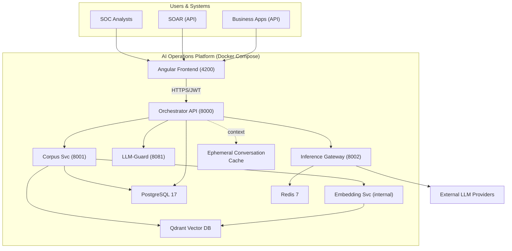

# AI Operations Platform - Project Overview

**Version:** 2.1
**Date:** June 3, 2026
**Document Owner:** Project maintainer
**Purpose:** Executive summary and project navigation hub

---

## Executive Summary

**AI Operations Platform (AIOP)** is a **security-first** enterprise platform that breaks generative AI down into discrete, governed execution units we call **AI Operations**. Each AI Operation is a purposeful, constrained unit — validated inputs, scanned outputs, audited execution, structured results — wrapped in a **deterministic shell around a stochastic core**. The platform serves any enterprise domain that requires controlled, auditable AI — from Security Operations Centers (SOCs) and IT service management to compliance, legal, HR, and beyond.

### **What is an AI Operation?**

An AI Operation is a **tight, self-contained execution unit** with a specific purpose. Unlike raw LLM calls or unconstrained chat, each operation enforces input validation, output schema contracts, security scanning, and audit logging as non-negotiable steps in every invocation.

AI Operations are designed for composability:

- **Called individually** — a single API call for a specific task
- **Run sequentially** — chained in order by an external workflow
- **Orchestrated externally** — composed by SOAR platforms, scripts, or agentic systems
- **Fully independent** — no shared state; each operation is self-contained

```text
┌─────────────────────────┐    ┌─────────────────────────┐
│   AI Operation A        │    │   AI Operation B        │
│  ┌───────────────────┐  │    │  ┌───────────────────┐  │
│  │ Input Validation  │  │    │  │ Input Validation  │  │
│  │ LLM-Guard Scan    │  │    │  │ LLM-Guard Scan    │  │
│  │ ┌───────────────┐ │  │    │  │ ┌───────────────┐ │  │
│  │ │  LLM Call     │ │  │──▶ │  │ │  LLM Call     │ │  │
│  │ └───────────────┘ │  │    │  │ └───────────────┘ │  │
│  │ Output Validation │  │    │  │ Output Validation │  │
│  │ Audit Log         │  │    │  │ Audit Log         │  │
│  └───────────────────┘  │    │  └───────────────────┘  │
└─────────────────────────┘    └─────────────────────────┘
        ▲                              ▲
        │         Compose              │
        └──────── via API ─────────────┘
              (SOAR, scripts,
            agents, orchestrators)
```

This is the core philosophy: **every interaction with an LLM passes through the same governance shell**, whether invoked by a human analyst through the UI, a SOAR playbook through the API, or an AI agent through MCP.

### **Where This Fits: AI Operations vs. Agentic AI**

The industry is moving toward agentic AI — autonomous systems that plan, reason, and act independently. AIOP takes a deliberate position in this landscape:

| | Ungoverned Chat | **AI Operations (AIOP)** | Full Agentic AI |
|---|---|---|---|
| **Control** | None | Deterministic shell | Agent-decided |
| **Scope** | Open-ended | Constrained per operation | Autonomous |
| **Audit** | Optional | Mandatory, immutable | Varies |
| **Security** | Bolt-on | By design (security-first) | Emerging |
| **Enterprise ready** | No | Yes | Not yet |

**AIOP provides the secure foundation that agentic systems need.** Rather than waiting for agentic security to mature, enterprises can deploy governed AI Operations today and extend toward agentic workflows as the infrastructure matures. AIOP can serve as an **MCP server** — allowing AI agents to invoke validated, audited AI Operations as secure tools rather than making unconstrained LLM calls directly.

### **What Makes This Different**

**Not Ungoverned AI** ✅ **Security-First by Design**

- Every AI interaction — AIOps execution or authorized conversation — passes through the governance shell
- LLM-Guard input/output scanning on every call
- RBAC at AIOps(use case) level; authorized users may also hold governed conversations
- Full audit trail: model, version, parameters, user, timestamps
- Security is not a feature; it is the architecture

**Not Cloud-Only** ✅ **Air-Gapped Capable**

- Runs standalone on powerful laptop (MacBook Pro M4 Max 128GB)
- Can connect to remote LLMaaS (Mistral, Llama, etc.)
- Offline tokenizer bundling (no external dependencies)
- Docker-based deployment (fully containerized)

**Not Code Integration Only** ✅ **100% OpenAPI Driven**

- RESTful API for all functionality
- Integrate with SOAR, ITSM, ERP, or any API-capable platform
- Consumable as an MCP server by AI agents
- Script/automation friendly
- Both human users (UI) and systems (API) use same backend

---

## Value Proposition

### **For Enterprise Teams**

**1. Low-Friction, Governed AI Adoption** 🤖

- Enables AI adoption for teams without dedicated AI or ML engineering resources
- Guided creation via wizards, templates, and patterns.
- Governance built in by default: validation, scanning, audit logging, and RBAC
- Supports safe AI integration into core business functions while meeting policy and audit requirements
- Applicable to SOC, IT operations, compliance, legal, HR, and similar enterprise teams

**2. Governed AI Usage** 🛡️

Every AI Operation executes inside the deterministic governance shell described above. This is what the shell guarantees — and what it does not.

**What We Guarantee:**

- ✅ Outputs pass JSON schema validation (structure/format)
- ✅ Only allowlisted tools are invoked
- ✅ All LLM calls audited (model, version, params, user)
- ✅ High consistency within preset/model/version combination
- ✅ Idempotent actions (no duplicate tickets/alerts)

**What We Don't Guarantee:**

- ❌ Byte-identical outputs across runs
- ❌ Factual accuracy (LLM may hallucinate)
- ❌ Semantic correctness (reasoning may be flawed)

**→ Human verification required for operational decisions**

**Governance Mechanisms:**

- Template-driven AI Operations (achieving high consistency within LLM constraints)
- Guardrails via LLM-Guard (input/output scanning on every call)
- Role-based access control (who can use what — including governed conversations)
- Immutable audit trail for all AI interactions
- **Journey:** Secure AI Operations today → governed agentic workflows as the infrastructure matures

**See:** [`docs/architecture/CONSISTENCY_MODEL.md`](architecture/CONSISTENCY_MODEL.md) for full pattern

**3. Enterprise Integration** 🔗

- **100% OpenAPI-driven architecture** - Every feature has a REST endpoint
- Integrate with **SOAR platforms** (Cortex XSOAR, Splunk SOAR)
- Integrate with **ITSM/ERP systems** (ServiceNow, Jira, SAP, custom)
- Embed in any business application with API access
- Script and automation friendly (CLI-compatible)

**4. Air-Gapped Deployment** 🔒

- Classified environment capable
- No data exfiltration (all processing local)
- Offline operation with bundled models
- Certificate and HSM integration ready

**5. Stateless Architecture** 🔐

**Zero Server-Side PII Storage (ADR-030)**

AI Operations Platform (AIOP) eliminates 80% of security scope through stateless design:

```text
┌─────────────────────────────────────────┐
│  CLIENT EDGE (Browser)                  │
│  ┌───────────────────────────────────┐  │
│  │  IndexedDB                        │  │
│  │  • Full conversation history      │  │
│  │  • TTL: 24 hours (configurable)   │  │
│  │  • Export on-demand (JSON/MD)     │  │
│  │  • Same-origin policy protected   │  │
│  └───────────────────────────────────┘  │
└─────────────────────────────────────────┘
            ↕ (query + session_id only)
┌─────────────────────────────────────────┐
│  BACKEND (Stateless + Ephemeral Cache)  │
│  ┌───────────────────────────────────┐  │
│  │  Encrypted Cache (In-Memory)      │  │
│  │  • AES-GCM-256 encryption         │  │
│  │  • Process-ephemeral keys         │  │
│  │  • Lost on restart (by design)    │  │
│  │  • 24hr TTL + 15min idle timeout  │  │
│  └───────────────────────────────────┘  │
│  ┌───────────────────────────────────┐  │
│  │  PostgreSQL                       │  │
│  │  • Run Manifests (PII-free)       │  │
│  │  • Metrics, AIOps, users          │  │
│  │  • ZERO conversation storage      │  │
│  └───────────────────────────────────┘  │
└─────────────────────────────────────────┘
```

**Security Benefits:**

✅ **No Encryption Complexity:** No field-level encryption, no key rotation, no HSM
✅ **No Data Breach Risk:** Server compromise = zero conversation data exposed
✅ **Simplified Compliance:** No server-side PII = reduced regulatory burden
✅ **Air-Gapped Ready:** Zero external dependencies for conversation storage
✅ **Secure Logging:** Configurable redaction for production (ADR-048)
✅ **Privacy by Design:** Client owns data, server provides compute only

**See:** [`docs/development/migration/STATELESS_MIGRATION_GUIDE.md`](development/migration/STATELESS_MIGRATION_GUIDE.md)

### **For Corpus Managers (Document Librarians)**

**6. Intelligent Document Management** 📚

**Metrics-Driven Corpus Health:**

- **Hot Data Analytics:** Track which documents/chunks are most queried
- **Optimization Targets:** Identify hot chunks for performance tuning
- **Feedback Loops:** Dynamically improve corpus through iteration
- **Never Guessing:** All decisions backed by usage metrics

**Document Lifecycle:**

- **States:** Draft → Published → Archived
- **Metadata Management:** Library-style cataloging
- **Reprocessing:** Update embeddings when better models available
- **Quality Control:** Test queries against documents before publishing

**Collection-Based Organization:**

- **Flexible Grouping:** Organize documents into collections
- **AIOps Targeting:** Configure which collections each AIOp searches
- **Embedding Model Binding:** Each collection uses optimal embedding model
- **Search Precision:** Targeted search improves relevance

**Document Testing Interface:**

- **Semantic Search Tool:** Verify embeddings respond correctly to test queries
- **Metric-Driven:** Quantify document search quality
- **Model Comparison:** Test different embedding models to find best fit
- **Access:** Available to Admin, Corpus Manager, Developer roles

**Default:** Lightweight all-MiniLM-L6-v2 embedding (fast, efficient, offline-capable)

### **For AIOps(Use Case) Developers**

**7. Template-Driven AIOps Creation** 🎯

**Creation Wizard (ADR-065):**

- 5-step guided process (no coding required)
- Step 1: Identity (name, category, intent type)
- Step 2: Starting Point (blank, pattern, or clone)
- Step 3: User Experience (input fields, prompt templates, output format, visualization)
- Step 4: AI Engine (prompts, model config, RAG, tools, policies)
- Step 5: Review & Publish (summary, validation, lifecycle)

**Authoring Features:**

- Prompt engineering patterns library (15+ patterns with examples)
- Multi-role prompts (system, developer, fewshots)
- User prompt templates with parameter injection (ADR-062)
- Structured output pipeline with JSON schema contracts (ADR-063)
- Domain-neutral visualization templates via Vega-Lite (ADR-066/068)
- Per-intent model and temperature configuration (ADR-069)
- Dynamic categories with intent capability profiles (ADR-067)

**Governance & Lifecycle:**

- **States:** Draft → Published (workflow approval)
- **RBAC:** Control who can create/edit/use (ADR-060 two-tier system)
- **Versioning:** Track changes, rollback capability
- **Cloning:** Reuse existing AIOps as templates

**Tool Integration (MCP Protocol — ADR-056/057/058):**

- Tool Registration Wizard with security classification
- Connect to authorized knowledge stores (Elasticsearch, databases)
- Execute authorized tools and scripts (constrained)
- Docker socket access for STDIO-based MCP servers
- Security boundary enforcement per tool classification

**Organization:**

- **Categories:** Dynamic, configurable per deployment (ADR-067)
- **Grouping:** Manually assign IDs to group related AI Ops
- **Case Association:** Link to tickets, incidents, or cases from external systems

### **For Integrators & End Users**

**8. API-First Conversational Intelligence** 💬

**Integration Model:**

AI Operations is a backend platform. Businesses integrate its capabilities into their own applications, workflows, and products via REST API. The bundled web UI serves as a management, development, and demonstration interface — not the primary delivery channel.

**API Capabilities:**

- **Multi-Turn Conversations:** Context-preserving sessions your application manages via API
- **Use Case Execution:** Invoke any published use case programmatically with structured input/output
- **Semantic Search:** Query your knowledge corpus by meaning from any client
- **RAG Q&A:** Retrieve grounded, citation-backed answers for your users
- **Real-Time Streaming:** SSE-based token streaming for responsive integrations
- **Case/Ticket Association:** Link conversations to external system IDs (incidents, tickets, cases)
- **Context Compression:** Automatic management of long-running conversation context

**Response Formats (API & UI):**

- **Structured JSON:** Machine-readable output for downstream automation
- **Markdown:** Clean, formatted text for human-facing integrations
- **Mermaid Diagrams:** Flowcharts, sequence diagrams, architecture visuals
- **LaTeX Math:** Complex formulas and equations
- **Source Citations:** Every claim backed by document references

### **For Administrators**

**9. Comprehensive Governance** ⚙️

**Usage Analytics:**

- **AIOps Performance:** Track response times, success rates
- **Token Economics:** Cost matrix against token usage
- **Subscription Forecasting:** Predict LLMaaS costs
- **RAG Metrics:** Confidence scores, similarity scores

**LLM Management:**

- **Inference Gateway:** Centralized provider management (OpenAI, Mistral, Azure, Local)
- **Model Configuration:** Enable/disable LLMs via UI
- **Cost Analysis:** Track usage by model and provider
- **Rate Limiting:** Monitor tokens-per-minute and request limits
- **Circuit Breakers:** Automatic failover for unhealthy providers

**Embedding Management:**

- **Model Selection:** Enable/disable embedding models per collection
- **Performance Tuning:** Optimize for speed vs accuracy

**Security & Audit:**

- **Audit Logging:** All user actions tracked
- **Security Events:** Real-time monitoring
- **Compliance:** JWT authentication, RBAC, RLS policies
- **CSP & Headers:** Enterprise security standards

---

## System Architecture

### **High-Level Components**



```mermaid
flowchart TB
  %% Entry points
  subgraph USERS["USERS & SYSTEMS"]
    SOC["SOC Analysts (Browser)"]
    SOAR["SOAR (API)"]
    BIZ["Business Apps (API)"]
  end

  %% Core platform
  subgraph AIOP["AI Operations Platform (Docker Compose)"]
    FE["Angular 21 Frontend - ui-webapp (4200)<br/>• Auth + Role-based UI<br/>• Query/Conversations<br/>• AIOps Wizard + Authoring<br/>• Docs + Collections<br/>• Admin + Analytics"]

    ORCH["Orchestrator API - orchestrator-api (8000)<br/>• JWT Auth + RBAC (ADR-060)<br/>• RAG orchestration (use-case driven)<br/>• MCP tool integration (ADR-056/057/058)<br/>• SSE streaming + structured output pipeline"]

    CORPUS["Corpus Service (8001)<br/>• Document ingest<br/>• RAG retrieval<br/>• Collection management"]

    GUARD["LLM-Guard (8081)<br/>• Input/output scanning"]

    GW["Inference Gateway (8002)<br/>• Provider routing<br/>• Rate limiting<br/>• Circuit breaking<br/>• Usage tracking<br/>• Cost calculation"]

    EMB["Embedding Service (internal)<br/>• Vector generation"]

    PG["PostgreSQL 17<br/>• Users/RBAC<br/>• AIOps<br/>• Documents<br/>• Metrics<br/>• Run manifests (zero PII)"]

    QD["Qdrant Vector Store<br/>• Embeddings<br/>• Collections<br/>• Semantic search"]

    REDIS["Redis 7<br/>• Rate-limit state<br/>• Circuit-breaker state"]

    CACHE["Ephemeral Conversation Cache (in-memory)<br/>• AES-GCM-256 encrypted<br/>• TTL: 24h abs/15m idle<br/>• Model-aware token limits<br/>• Lost on restart (by design)"]
  end

  EXT["External LLM Providers<br/>(OpenAI, Mistral, Azure, etc.)"]

  %% Flows
  SOC --> FE
  SOAR --> FE
  BIZ --> FE

  FE -->|HTTPS/JWT| ORCH
  ORCH -->|HTTPS| CORPUS
  ORCH -->|HTTPS| GUARD
  ORCH -->|HTTPS| GW

  CORPUS --> EMB
  CORPUS --> PG
  CORPUS --> QD
  EMB --> QD

  ORCH --> PG
  GW --> REDIS
  GW --> EXT

  ORCH -. encrypted ephemeral conversation context .-> CACHE
  ```

```mermaid
sequenceDiagram
    autonumber
    actor User as SOC Analyst / API Client
    participant FE as Angular Frontend (4200)
    participant ORCH as Orchestrator API (8000)
    participant PG as PostgreSQL 17
    participant CACHE as Ephemeral Cache (AES-GCM-256)
    participant CORPUS as Corpus Svc (8001)
    participant EMB as Embedding Svc (Internal)
    participant QD as Qdrant Vector Store
    participant GUARD as LLM-Guard (8081)
    participant GW as Inference Gateway (8002)
    participant REDIS as Redis 7
    participant LLM as External LLM Provider

    User->>FE: Submit query / prompt
    FE->>ORCH: HTTPS + JWT request

    ORCH->>ORCH: Validate JWT + RBAC (ADR-060)
    ORCH->>PG: Load user/use-case/config metadata
    PG-->>ORCH: Metadata

    alt Retrieval needed (RAG)
        ORCH->>CORPUS: Retrieve context for query
        CORPUS->>EMB: Generate query embedding
        EMB-->>CORPUS: Vector
        CORPUS->>QD: Semantic search
        QD-->>CORPUS: Top-k passages
        CORPUS-->>ORCH: Retrieved context
    else No retrieval needed
        ORCH->>ORCH: Continue without context
    end

    ORCH->>GUARD: Scan composed prompt/context
    GUARD-->>ORCH: Safety verdict / sanitized payload

    ORCH->>GW: Inference request (model + payload)
    GW->>REDIS: Check/update rate limits & circuit state
    REDIS-->>GW: Allow/deny + state
    GW->>LLM: Provider-routed completion request
    LLM-->>GW: Model response (stream/chunks)
    GW-->>ORCH: Routed response stream

    ORCH->>GUARD: Scan output chunks/final response
    GUARD-->>ORCH: Output safety verdict

    ORCH->>CACHE: Store encrypted ephemeral conversation state
    ORCH->>PG: Persist run manifest/metrics (zero PII)
    ORCH-->>FE: SSE streamed structured response
    FE-->>User: Render final answer + traceable output
```

### **Technology Stack**

| Layer | Technology | Purpose |
|-------|------------|---------|
| **Frontend** | Angular 21, TypeScript | Modern enterprise UI |
| **UI Framework** | Material + Tailwind (ADR-012) | Hybrid CSS strategy |
| **State Management** | RxJS, Reactive Forms | Real-time data handling |
| **Client Storage** | IndexedDB (idb library) | Client-side conversation history (TTL-based) |
| **Backend** | FastAPI, Python 3.12 | High-performance API server |
| **Gateway** | FastAPI, Redis 7 | Inference routing and rate limiting |
| **Database** | PostgreSQL 17 | Configuration, users, metrics (zero PII) |
| **Conversation Cache** | In-memory AES-GCM | Ephemeral context preservation (24hr TTL) |
| **Vector Store** | Qdrant | Document embeddings, semantic search |
| **LLM Security** | LLM-Guard | Input/output scanning |
| **Secure Logging** | Configurable redaction | Production log security (REDACT_LOGS) |
| **Authentication** | JWT tokens | Stateless auth with refresh |
| **Deployment** | Docker Compose | Air-gapped capable |
| **Embedding** | all-MiniLM-L6-v2 (default) | Lightweight, offline-capable |
| **API Protocol** | OpenAPI 3.x | 100% spec-driven |

### **Key Architectural Decisions**

**Foundation & Core (Phases 1-3):**

- **ADR-012:** Hybrid CSS Strategy (Material + Tailwind + Component SCSS)
- **ADR-018:** Use Case Owned Architecture (use cases = sovereign entities)
- **ADR-019:** Offline Tokenizer Strategy (air-gapped deployment)
- **ADR-021:** Collection-Based Document Management (flexible organization)

**Stateless & Security (Phases 4-4.5):**

- **ADR-030:** No Transcripts; Run Manifests Only (Stateless Core v1)
- **ADR-033:** Provider Interfaces for History/Evidence/Crypto
- **ADR-037:** UUID Primary Keys (secure, non-enumerable identifiers)
- **ADR-039:** Row-Level Security Model (database-enforced data isolation)
- **ADR-043:** Conversations as QUERY Pattern (conversation = reference QUERY implementation)
- **ADR-044:** Use Cases as Bounded Iterative Refinement Spaces
- **ADR-045:** Query Developer Tools Architecture
- **ADR-047:** Ephemeral Conversation Cache with Observability (metrics, SLIs/SLOs)
- **ADR-048:** Secure Logging with Configurable Redaction (production log security)
- **ADR-049:** Unified Authentication and Security Implementation (JWT, RBAC, multi-layer security)

**Inference Gateway (Phase 4.5):**

- **ADR-050:** Inference Gateway and Responsibility Split (centralized provider access)
- **ADR-051:** Provider Secrets and Service-to-Service Authentication
- **ADR-052:** Model Aliasing, Routing, and Provider Fallback
- **ADR-053:** Rate Limiting and Usage Tracking (Gateway enforcement)
- **ADR-054:** OpenAI Compatibility and Error Taxonomy
- **ADR-055:** Observability, Metering, and Cost Accounting

**MCP Tools & Infrastructure (Phase 5):**

- **ADR-056:** MCP Tool Registration Workflow
- **ADR-057:** MCP Tool Security Classification
- **ADR-058:** MCP Docker Socket Access for STDIO-based Servers
- **ADR-059:** Client-Side Conversation Session Management UX
- **ADR-060:** Corrected RBAC Architecture (two-tier system with team-based development)
- **ADR-061:** HashiCorp Vault Secrets Integration

**AI Ops Authoring (Phase 4bis):**

- **ADR-062:** User Prompt Templates with Parameter Injection
- **ADR-063:** Structured Output End-to-End Pipeline
- **ADR-064:** User Interaction Combined Panel (input fields + prompt template)
- **ADR-065:** Wizard Step Restructuring (UX contract vs engine configuration)
- **ADR-066:** Domain-Neutral Visualization Template Architecture
- **ADR-067:** Dynamic Categories, Intent Capability Profiles, and Auto-Presets
- **ADR-068:** Portable Visualization Specification (Vega-Lite)
- **ADR-069:** Intent Model Configuration System

**Configuration & Cleanup:**

- **ADR-070:** is_active Gates Discovery, Not Execution
- **ADR-071:** Centralized Configuration Gateway (shared/config)
- **ADR-072:** Remove Deprecated Intent Model and Temperature Env Config

**LLM Guard:**

- **ADR-073:** LLM-Guard Model Selection & Storage (LLG-04 — Option B: Presidio + GLiNER)

**Build System & Bootstrap:**

- **ADR-074:** Multi-Profile Container Build & Reproducible Bootstrap (local / enterprise profiles; offline wheelhouse via `OFFLINE=1`)

[→ Complete ADR List](development/adrs/) | [→ ADR Index](development/adrs/README.md)

---

## Current Status

**Project Phase:** Phase 6 of 8 (Stabilization & Validation — 55%)
**Overall Completion:** ~90% of total planned work
**Active Work:** Phase 6 stabilization, AI Ops Authoring polish (Phase 4bis/5)
**Production Status:** Beta — not yet deployed to or validated in a production environment. Backend services functional locally; Inference Gateway active (local profile), RBAC V2 deployed.
**Last Major Milestone:** M4 bootstrap documentation complete (June 2026) — GETTING_STARTED.md, bootstrap troubleshooting guide, service READMEs, all broken doc links fixed, ADR index fully reconciled

### **What Works Today** ✅

**Phase 1: Foundation (100% Complete)**

- Angular 21 project with enterprise tooling
- JWT authentication with role-based access
- Responsive layout with navigation
- API integration with type safety
- Security headers and CSP
- Docker air-gapped deployment

**Phase 2: Core Features (100% Complete)**

- ✅ **Developer Tools (Query Tools):** Semantic search, RAG Q&A testing and tuning
- ✅ **Document Management:** Upload, metadata, processing status, collections
- ✅ **Conversations:** Multi-turn threads with context preservation (role-gated: conversations_privileged)
- ✅ **Use Case Execution:** Template-driven execution with metrics
- ✅ **Analytics:** Usage dashboards, performance metrics, token usage, Mermaid/LaTeX rendering
- ✅ **SSE Streaming:** Real-time response streaming

**Phase 2 Enhancements (100% Complete)**

- ✅ **ADR-012 CSS Strategy:** Material + Tailwind + SCSS hybrid
- ✅ **UX Refinements:** Authentication, breadcrumbs, search improvements
- ✅ **Model Pricing (Backend):** Per-model effective-dated pricing (ADR-046), cost estimation, analytics and cost prediction

**Phase 3: Use Case Management (100% Complete)**

- ✅ **Dynamic Form Generator:** JSON-driven form system for AI Ops configuration
- ✅ **AI Ops CRUD:** Full lifecycle management (create, read, update, delete)
- ✅ **5-Step Wizard:** Guided AIOps creation with pattern library
- ✅ **Multi-Role Prompts:** System, developer, and few-shot prompt engineering
- ✅ **Pattern Library:** 15+ prompt engineering patterns with examples
- ✅ **Page Layout Normalization:** ADR-012 compliant UI across 9 pages
- ✅ **Output Formatting:** Markdown, Mermaid, LaTeX rendering engine
- ✅ **AI Ops Testing:** Validation and testing framework

**Phase 4: Security & Enterprise (100% Complete)**

- ✅ **Stateless Architecture (ADR-030):** Client-side conversation storage, zero server-side PII
- ✅ **Ephemeral Cache (ADR-047):** AES-GCM-256 encrypted, model-aware context preservation
- ✅ **Secure Logging (ADR-048):** Configurable redaction for production security
- ✅ **Conversation Pattern (ADR-043):** QUERY AIOps follow conversation model
- ✅ **Admin Essentials:** User Management, Role Management, System Configuration, Audit Logs
- ✅ **Query Developer Tools:** Semantic Search, RAG Q&A, Parameter Injection
- ✅ **Inference Gateway (Phase 4.5):** Centralized provider management, Rate Limiting, Circuit Breakers
- ✅ **Auto Chunking (P4-DOC-07):** Upload workflow with automatic chunk detection
- ✅ **Config Centralization (P4-CONFIG-01):** All services migrated to unified config

**Phase 5: Infrastructure Overhaul (100% Complete)**

- ✅ **Async SQLAlchemy Migration:** Modern async/await patterns throughout
- ✅ **Corpus Service Async:** Non-blocking database operations
- ✅ **Gateway Sync Architecture:** Consistent sync patterns
- ✅ **Stateless PII Enforcement (P5-SEC-01):** Server-side PII controls
- ✅ **Test Validation (P5-A22):** End-to-end test coverage

**Phase 5.5: RBAC V2 Fix (100% Complete)**

- ✅ **Corrected RBAC Architecture (ADR-060):** Two-tier system with team-based development
- ✅ **Database Refresh:** Index fixes, seed script verification
- ✅ **Collection Provider Fix:** Collection creation provider integration

**Tools Track T1-T6 (100% Complete)**

- ✅ **MCP Framework (ADR-056/057/058):** Protocol handler, tool registration, security classification
- ✅ **Tool Registration Wizard:** Frontend and backend (T5-F1/T5-F2)
- ✅ **Docker Socket Access:** STDIO-based MCP server support

**AIOps Authoring — Phase 4bis (100% Complete)**

- ✅ **Input Fields & User Prompt Templates (ADR-062/064):** Dynamic parameter injection
- ✅ **Structured Output Pipeline (ADR-063):** End-to-end structured output support
- ✅ **Wizard Step Restructuring (ADR-065):** 5 steps reorganized (UX vs engine config)
- ✅ **Visualization (ADR-066/068):** Domain-neutral templates, Vega-Lite portable specs
- ✅ **Dynamic Categories & Intent Profiles (ADR-067):** Auto-presets per intent type
- ✅ **Intent Model Configuration (ADR-069):** Per-intent temperature and model selection
- ✅ **Pattern Library & Prompt Templates:** Deduplicated, schema-compatible

### **Current Work** 🔄

**Phase 6: Stabilization & Validation (55% Complete)**

- ✅ **UI Walkthrough (P6-STAB-01):** Systematic page-by-page verification complete
- ✅ **Core Pipeline Validation:** Real data end-to-end testing
- 🔄 **AIOps Authoring Phase 5:** Documentation, polish, deferred work
- 📋 **First MCP Tool Integration:** Elasticsearch connector (pending)
- 📋 **Demo Scripts:** Stakeholder presentation materials (pending)

### **Next Milestones**

**Immediate (1-2 weeks):**

1. Complete AIOps Authoring Phase 5 (documentation, D4 integration test)
2. Complete Phase 6 demo scripts for stakeholder presentations
3. First real MCP tool connection (Elasticsearch)

**Short Term (1-2 months):**

1. Complete Phase 6 (Stabilization & Validation)
2. Begin Phase 7 (Documentation Overhaul — user guides, cleanup)
3. Implement auto-compression at 80% cache threshold

**Medium Term (3-4 months):**

1. Complete Phase 7 (Documentation Overhaul)
2. Begin Phase 8+ (Agentic AI, future features)
3. First real MCP tool deployments in production

---

## Quick Navigation

### **For Executives & Managers**

- **This Document** - Project overview and status
- **[MASTER_ROADMAP_V2.md](development/plans/MASTER_ROADMAP_V2.md)** - Detailed timeline and progress

### **For Tech Leads & Architects**

- **[Phase 6: Stabilization](development/plans/future/PHASE_06_STABILIZATION.md)** - Current active phase
- **[Inference Gateway Plan](development/plans/archive/INFERENCE_GATEWAY_IMPLEMENTATION_PLAN.md)** - Gateway architecture
- **[Stateless Migration Guide](development/migration/STATELESS_MIGRATION_GUIDE.md)** - Architecture overview
- **[Architecture Docs](architecture/)** - System design and ADRs
- **[API Documentation](api/)** - OpenAPI specs

### **For Engineers**

- **[Feature Specs](development/plans/features/active/)** - Detailed implementation guides
- **[Development Guides](development/guides/)** - How-to guides and patterns
- **[Testing](testing/)** - Test plans and procedures

### **For Corpus Managers**

- **[Document Management Guide](admin/)** - How to manage corpus
- **[Collection Guide](api/collection-management.md)** - Collection best practices

### **For Operations**

- **[Deployment Guide](operations/)** - How to deploy
- **[Admin Guide](admin/)** - System administration

---

## Document Maintenance

**Update Frequency:**

- **Monthly:** During active development
- **At Phase Boundaries:** Major updates
- **Quarterly:** During maintenance phases

**Next Review:** Q3 2026 (Phase 6 completion / Phase 7 start)

**Change Process:**

1. Update this document
2. Update MASTER_ROADMAP_V2.md
3. Commit with message: "docs: Update PROJECT_OVERVIEW - [what changed]"

---

**Last Updated:** June 3, 2026
**Status:** Active v2.1
