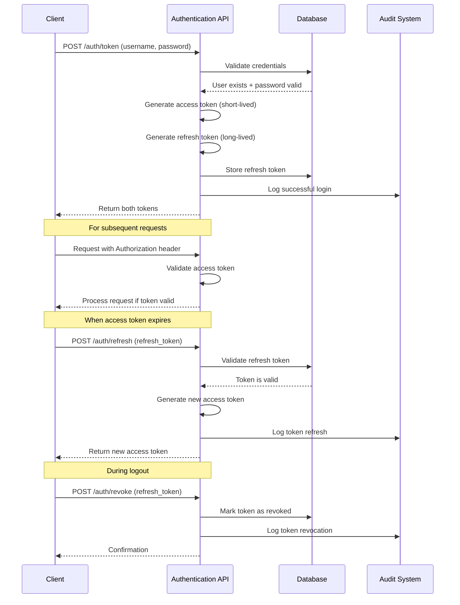
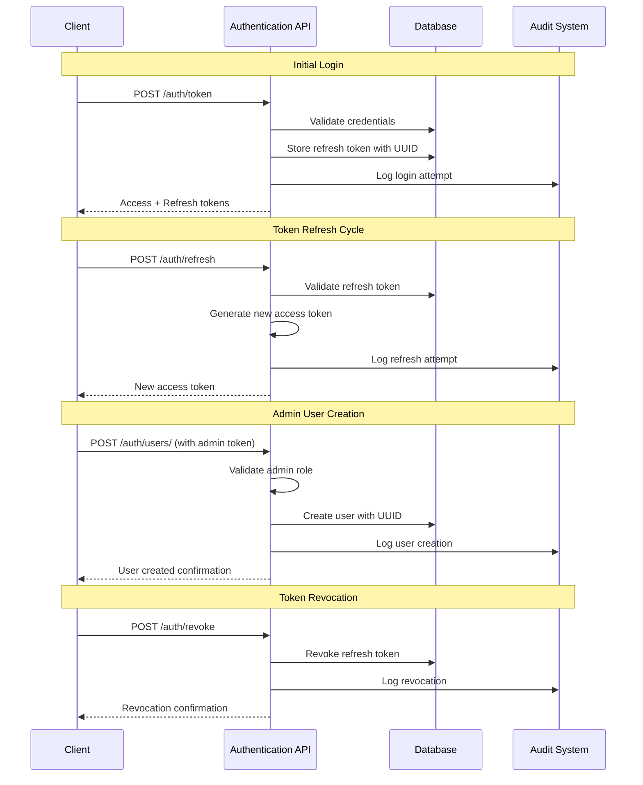

# Authentication API Reference

**Last Updated:** 2025-11-02 (Updated with ADR-049 reference)

> **📘 Architecture Documentation:** For architectural details, implementation rationale, security audit, and design decisions, see:
> - **[ADR-049: Unified Authentication and Security Implementation](../development/adrs/ADR-049-Unified-Authentication-Security-Implementation.md)** - Complete architecture documentation
> - **[Security Audit Report (2025-11-02)](../development/analysis/security-audit-2025-11-02.md)** - Comprehensive security assessment

This document provides a comprehensive reference for the AI Operations Platform authentication endpoints. These endpoints facilitate secure user authentication, token validation, and user management.

**Note:** The backend service uses the shared authentication router (`src/shared/auth/router.py`) which provides unified authentication across all services.

## Overview

AI Operations Platform uses JWT (JSON Web Token) for authentication. All protected endpoints require a valid JWT token provided in the HTTP Authorization header using the Bearer scheme.

```http
Authorization: Bearer <access_token>
```

## Authentication Flow

### Basic Authentication Flow



### Enhanced Refresh Token Flow (P1-F2)



## Token Structure

The system uses two types of tokens:

### Access Token

The access token is short-lived (30 minutes by default) and is used to authenticate API requests. It contains the following standard claims:

- `sub`: Subject (username)
- `user_id`: User UUID as string
- `role`: User role (analyst, admin, service)
- `exp`: Expiration time (Unix timestamp)
- `iat`: Issued at time (Unix timestamp)
- `iss`: Issuer (default: "ai-operations-platform")
- `token_type`: "access"

### Refresh Token

The refresh token is long-lived (7 days by default) and is used to obtain new access tokens without requiring the user to re-authenticate. It contains:

- `sub`: Subject (username)
- `user_id`: User UUID as string
- `exp`: Expiration time (7 days in the future, Unix timestamp)
- `iat`: Issued at time (Unix timestamp)
- `iss`: Issuer (default: "ai-operations-platform")
- `token_type`: "refresh"

## API Endpoints

### Create Access and Refresh Tokens

```http
POST /auth/token
```

Authenticates a user with username and password, returning both access and refresh tokens.

**Request Body**:

```json
{
  "username": "string",
  "password": "string"
}
```

**Response**:

```json
{
  "access_token": "eyJhbGciOiJIUzI1NiIsInR5cCI6IkpXVCJ9...",
  "refresh_token": "eyJhbGciOiJIUzI1NiIsInR5cCI6IkpXVCJ9...",
  "token_type": "bearer"
}
```

**Status Codes**:

- `200 OK`: Authentication successful
- `401 Unauthorized`: Invalid credentials

### Refresh Access Token

```http
POST /auth/refresh
```

Obtains a new access token using a valid refresh token. Use this when an access token has expired.

**Request Body**:

```json
{
  "refresh_token": "eyJhbGciOiJIUzI1NiIsInR5cCI6IkpXVCJ9..."
}
```

**Response**:

```json
{
  "access_token": "eyJhbGciOiJIUzI1NiIsInR5cCI6IkpXVCJ9...",
  "token_type": "bearer"
}
```

**Status Codes**:

- `200 OK`: Token refresh successful
- `401 Unauthorized`: Invalid, expired, or revoked refresh token

### Revoke Refresh Token

```http
POST /auth/revoke
```

Revokes a refresh token, preventing it from being used to obtain new access tokens. This should be used during logout or when a token might be compromised.

**Request Headers**:

```http
Authorization: Bearer <access_token>
```

**Request Body**:

```json
{
  "refresh_token": "eyJhbGciOiJIUzI1NiIsInR5cCI6IkpXVCJ9..."
}
```

**Response**:

```json
{
  "message": "Token successfully revoked"
}
```

**Status Codes**:

- `200 OK`: Token successfully revoked
- `400 Bad Request`: Invalid token or token already revoked
- `401 Unauthorized`: Invalid access token

### Validate Token

```http
GET /auth/validate
```

Validates the provided JWT token and returns the user information if the token is valid.

**Request Headers**:

```http
Authorization: Bearer <access_token>
```

**Response**:

```json
{
  "username": "string",
  "user_id": "string (UUID)",
  "role": "string",
  "token_type": "access"
}
```

**Status Codes**:

- `200 OK`: Token is valid
- `401 Unauthorized`: Invalid or expired token

### Create User (Admin Only)

```http
POST /auth/users
```

Creates a new user in the system with the specified credentials and role. **This endpoint requires admin privileges.**

**Request Headers**:

```http
Authorization: Bearer <access_token>
```

**Request Body**:

```json
{
  "username": "string",
  "password": "string",
  "full_name": "string",
  "email": "string (optional)",
  "role": "string (analyst|admin|service)",
  "metadata": "object (optional)"
}
```

**Response**:

```json
{
  "id": "string (UUID)",
  "username": "string",
  "full_name": "string",
  "email": "string (optional)",
  "role": "string",
  "is_active": true,
  "created_at": "ISO 8601 timestamp",
  "last_login": "ISO 8601 timestamp (optional)"
}
```

**Status Codes**:

- `200 OK`: User created successfully
- `400 Bad Request`: Username already exists or missing required fields
- `401 Unauthorized`: Invalid or expired access token
- `403 Forbidden`: Admin role required to create users

### List Users (Admin Only)

```http
GET /auth/users
```

Retrieves a list of all users in the system. **This endpoint requires admin privileges.**

**Request Headers**:

```http
Authorization: Bearer <access_token>
```

**Response**:

```json
[
  {
    "id": "string (UUID)",
    "username": "string",
    "full_name": "string",
    "email": "string (optional)",
    "role": "string",
    "is_active": true,
    "created_at": "ISO 8601 timestamp",
    "last_login": "ISO 8601 timestamp (optional)"
  }
]
```

**Status Codes**:

- `200 OK`: Users retrieved successfully
- `401 Unauthorized`: Invalid or expired access token
- `403 Forbidden`: Admin role required

### Get User by ID (Admin Only)

```http
GET /auth/users/{user_id}
```

Retrieves a specific user by their UUID. **This endpoint requires admin privileges.**

**Request Headers**:

```http
Authorization: Bearer <access_token>
```

**Path Parameters**:

- `user_id`: UUID of the user

**Response**:

```json
{
  "id": "string (UUID)",
  "username": "string",
  "full_name": "string",
  "email": "string (optional)",
  "role": "string",
  "is_active": true,
  "created_at": "ISO 8601 timestamp",
  "last_login": "ISO 8601 timestamp (optional)"
}
```

**Status Codes**:

- `200 OK`: User retrieved successfully
- `401 Unauthorized`: Invalid or expired access token
- `403 Forbidden`: Admin role required
- `404 Not Found`: User not found

### Update User (Admin Only)

```http
PUT /auth/users/{user_id}
```

Updates a user's information. **This endpoint requires admin privileges.**

**Request Headers**:

```http
Authorization: Bearer <access_token>
```

**Path Parameters**:

- `user_id`: UUID of the user

**Request Body** (all fields optional):

```json
{
  "username": "string",
  "password": "string",
  "full_name": "string",
  "email": "string",
  "role": "string",
  "is_active": true,
  "metadata": "object"
}
```

**Response**:

```json
{
  "id": "string (UUID)",
  "username": "string",
  "full_name": "string",
  "email": "string (optional)",
  "role": "string",
  "is_active": true,
  "created_at": "ISO 8601 timestamp",
  "last_login": "ISO 8601 timestamp (optional)"
}
```

**Status Codes**:

- `200 OK`: User updated successfully
- `401 Unauthorized`: Invalid or expired access token
- `403 Forbidden`: Admin role required
- `404 Not Found`: User not found

### Get Current User

```http
GET /auth/me
```

Retrieves information about the currently authenticated user.

**Request Headers**:

```http
Authorization: Bearer <access_token>
```

**Response**:

```json
{
  "id": "string (UUID)",
  "username": "string",
  "full_name": "string",
  "email": "string (optional)",
  "role": "string",
  "is_active": true,
  "created_at": "ISO 8601 timestamp",
  "last_login": "ISO 8601 timestamp (optional)"
}
```

**Status Codes**:

- `200 OK`: User information retrieved successfully
- `401 Unauthorized`: Invalid or expired access token
- `404 Not Found`: User not found in database

## Error Handling

Authentication errors return appropriate HTTP status codes with descriptive messages:

```json
{
  "detail": "Could not validate credentials"
}
```

Common error scenarios:

- Invalid credentials: 401 Unauthorized
- Token expired: 401 Unauthorized
- Missing token: 401 Unauthorized
- Username already exists: 400 Bad Request

## Audit Logging

Authentication and user management activities are logged for security and compliance purposes through the shared logging infrastructure. The following events are logged:

- **Login attempts** (successful and failed)
- **Token refresh operations** (successful and failed)
- **Token revocation** (successful and failed)
- **User creation** (successful and failed)
- **User updates** (successful and failed)
- **Permission violations** (e.g., non-admin attempting restricted operations)
- **Token validation** requests

Logs include:

- Timestamp (UTC)
- User ID (UUID) and username of the actor
- Action performed and resource affected
- Success/failure status
- Additional context (request IDs, error details)

## Security Considerations

### Token Security

1. **Access tokens** have a default expiration time of 30 minutes (configurable).
2. **Refresh tokens** have a default expiration time of 7 days (configurable).
3. **Refresh tokens** are stored in the database and can be revoked at any time.
4. **Token validation** is performed on every request to protected endpoints using the unified auth manager.
5. **JWT algorithm**: HS256 (HMAC with SHA-256)
6. **JWT issuer**: "ai-operations-platform" (verified on token validation)
7. **User roles** are embedded in the token and verified for role-based access control.

### Authentication Security

1. **Password storage** uses bcrypt hashing with automatically generated salt.
2. **Case-insensitive usernames** to prevent duplicate accounts with different casing.
3. **Admin-only endpoints** are enforced at the API level using dependency injection.
4. **Role-based access control** (RBAC) with three roles: analyst, admin, and service.

### Data Protection

1. **UUID-based user identification** provides consistent user tracking across services.
2. **Timezone consistency**: All timestamps use UTC.
3. **Enhanced logging** provides detailed information for debugging and monitoring.
4. **Authentication events** are logged through the centralized logging infrastructure.

### Client-Side Best Practices

1. **Implement secure token storage** on the client side. Access tokens should be stored in memory when possible.
2. **Refresh tokens** should be stored securely (e.g., in HTTP-only cookies or secure storage, never in localStorage for web applications).
3. **Regularly rotate and invalidate** unused refresh tokens as part of security maintenance.
4. **Implement proper logout** by calling the `/auth/revoke` endpoint before discarding tokens.
5. **Handle token expiration gracefully** by using the refresh token to obtain a new access token.

### Environment Configuration

1. **JWT_SECRET** must be set to a strong, unique value in production (never use default values).
2. **JWT_SECRET** is validated at startup - the application will not start with insecure secrets.
3. Token expiration times can be configured via environment variables for different deployment scenarios.
