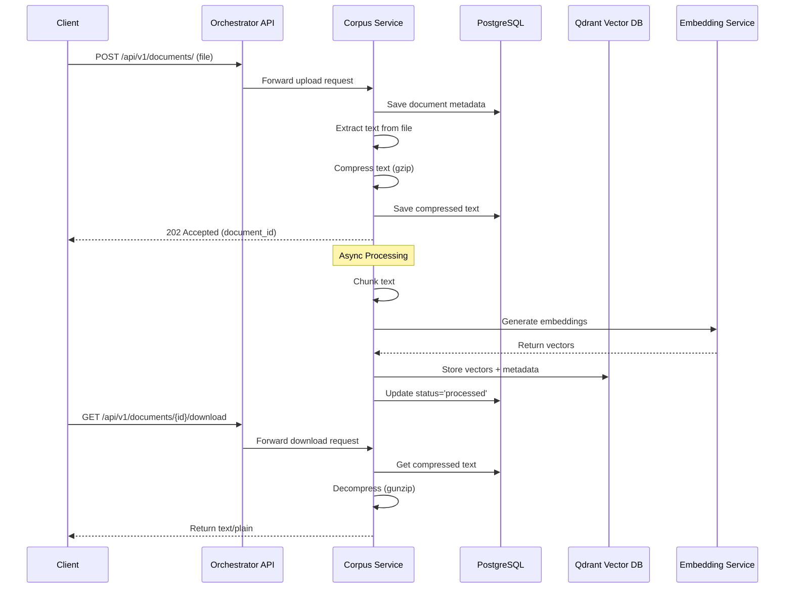

# Document Management API Reference

**Last Updated:** 2025-10-10
**Service:** Orchestrator API → Corpus Service
**Base Path:** `/api/v1/documents`

## Overview

The Document Management API provides endpoints for uploading, managing, and retrieving documents in the AI Operations Platform system. All endpoints require authentication via JWT token.

### Document Storage Architecture

**Important:** The system stores **extracted text content**, not original document files.

- **Upload**: Original files (PDF, DOCX, TXT, etc.) are uploaded
- **Processing**: Text is extracted from the original file
- **Storage**: Extracted text is gzip-compressed and stored in PostgreSQL
- **Vectors**: Text chunks are embedded and stored in Qdrant vector database
- **Download**: Returns the extracted text content (not the original file)

**Original file metadata is preserved:**

- `file_type` - Original file format (pdf, docx, txt, etc.)
- `original_file_name` - Original filename
- `file_size` - Original file size
- `file_checksum` - SHA-256 hash of original content

## Authentication

All endpoints require a valid JWT token:

```http
Authorization: Bearer <access_token>
```

## Endpoints

### Upload Document

Upload a new document for processing. Supports automatic chunking strategy detection (P4-DOC-07).

**Endpoint:** `POST /api/v1/documents/`
**Status Code:** `202 Accepted`

**Request:**

```http
POST /api/v1/documents/
Content-Type: multipart/form-data

file: [binary file]
title: "Document Title" (optional)
source: "Document Source" (optional)
author: "Author Name" (optional)
classification: "public|internal|confidential|restricted" (optional)
tags: "tag1,tag2,tag3" (optional)
metadata: '{"key": "value"}' (optional JSON string)
collection_name: "default" (optional, default: "default")
chunking_config: '{"strategy": "auto", "chunk_size": 512, "chunk_overlap": 50, "sample_size_tokens": 10000}' (optional JSON string)
process_async: true (optional, default: true)
```

**Chunking Configuration (P4-DOC-07):**

The `chunking_config` parameter allows you to specify how documents should be chunked:

- **`strategy`** (string, optional): Chunking strategy to use
  - `"auto"` - Automatically detect optimal strategy (recommended)
  - `"recursive"` - Recursive splitting (default fallback)
  - `"fixed_token"` - Fixed-size token blocks
  - `"sliding_token"` - Overlapping token windows
  - `"heading_aware"` - Split by headings (H1-H3)
  - `"sentence_paragraph"` - Natural language boundaries
  - `"table_aware"` - Preserve table structure
  - `"semantic_adaptive"` - Similarity-based splits (beta)
  - `"page_block"` - PDF layout blocks (beta)

- **`chunk_size`** (int, optional, default: 512): Target chunk size in tokens (50-8192, must not exceed embedding model context window)

- **`chunk_overlap`** (int, optional, default: 50): Overlap between chunks in tokens (0-200, must be < chunk_size)

- **`sample_size_tokens`** (int, optional): Sample size for auto-detection analysis (1000-100000, uses collection default if not specified)

**Auto-Detection Mode:**

When `strategy: "auto"` is specified:

1. System analyzes document structure (headings, tables, paragraphs)
2. Tests multiple chunking strategies based on collection configuration
3. Selects optimal strategy with confidence score
4. Stores decision metadata in document for visibility
5. Applies selected strategy to chunk the document

The selected strategy and analysis details are stored in the document's `metadata` field:

```json
{
  "chunking_auto_selected": true,
  "chunking_confidence": 0.94,
  "chunking_sample_tokens": 10000,
  "chunking_alternatives_tested": ["sentence_paragraph", "fixed_token", "heading_aware"],
  "chunking_scores": {"heading_aware": 0.94, "fixed_token": 0.65},
  "chunking_reasoning": ["Document has clear hierarchical structure"],
  "chunking_analysis_time_ms": 2450
}
```

**Response:**

```json
{
  "id": "uuid",
  "status": "uploaded",
  "message": "Document uploaded successfully",
  "document_id": "uuid"
}
```

---

### List Documents

Retrieve a paginated list of documents.

**Endpoint:** `GET /api/v1/documents/`

**Query Parameters:**

- `limit` (int, default: 10) - Number of documents to return
- `offset` (int, default: 0) - Pagination offset
- `document_type` (string, optional) - Filter by file type
- `tag` (string, optional) - Filter by tag
- `query` (string, optional) - Search query
- `include_deleted` (bool, default: false) - Include soft-deleted documents

**Response:**

```json
{
  "documents": [
    {
      "id": "uuid",
      "title": "Document Title",
      "original_file_name": "example.pdf",
      "file_type": "pdf",
      "file_size": 1234567,
      "file_checksum": "sha256_hash",
      "status": "processed",
      "classification": "public",
      "author": "Author Name",
      "source": "Source",
      "tags": ["tag1", "tag2"],
      "metadata": {},
      "content_compressed": true,
      "num_chunks": 150,
      "embedding_model": "all-minilm-l6-v2",
      "embedding_provider": "openai",
      "embedding_dimensions": 384,
      "created_at": "2025-10-10T12:00:00Z",
      "uploaded_at": "2025-10-10T12:00:00Z",
      "uploaded_by": "user_uuid",
      "processed_at": "2025-10-10T12:05:00Z",
      "updated_at": "2025-10-10T12:05:00Z"
    }
  ],
  "total": 1,
  "limit": 10,
  "offset": 0
}
```

---

### Get Document

Retrieve a single document by ID.

**Endpoint:** `GET /api/v1/documents/{document_id}`

**Query Parameters:**

- `include_preview` (bool, default: false) - Include text content preview
- `preview_length` (int, default: 1000) - Length of preview in characters

**Response:**

```json
{
  "id": "uuid",
  "title": "Document Title",
  "original_file_name": "example.pdf",
  "file_type": "pdf",
  "file_size": 1234567,
  "status": "processed",
  "num_chunks": 150,
  "content_preview": "First 1000 characters..." (if include_preview=true)
}
```

---

### Download Document

Download the extracted text content of a document.

**Endpoint:** `GET /api/v1/documents/{document_id}/download`

**Important Notes:**

- Returns **extracted text content**, not the original file
- Content-Type is `text/plain; charset=utf-8`
- Filename is `{original_filename}.txt`
- Original file format is indicated in `X-Original-File-Type` header

**Response Headers:**

```http
HTTP/1.1 200 OK
Content-Type: text/plain; charset=utf-8
Content-Disposition: attachment; filename="example.pdf.txt"
X-Original-File-Type: pdf
```

**Response Body:**

```
[Extracted text content from the document]
```

**Example:**

```bash
# Download document text
curl -O "http://localhost:8006/api/v1/documents/12d5a686-f0d1-402b-b953-f0e95393bd2a/download" \
  -H "Authorization: Bearer $TOKEN"

# Output file: example.pdf.txt (not example.pdf)
```

---

### Update Document

Update document metadata.

**Endpoint:** `PATCH /api/v1/documents/{document_id}`

**Request:**

```json
{
  "title": "Updated Title",
  "classification": "confidential",
  "tags": ["new-tag"],
  "metadata": {"key": "new-value"}
}
```

**Response:**

```json
{
  "id": "uuid",
  "title": "Updated Title",
  "classification": "confidential",
  "updated_at": "2025-10-10T12:30:00Z"
}
```

---

### Delete Document

Soft-delete or permanently delete a document.

**Endpoint:** `DELETE /api/v1/documents/{document_id}`

**Query Parameters:**

- `force` (bool, default: false) - Permanently delete if true, soft-delete if false

**Soft Delete (default):**

- Sets document status to 'deleted'
- Removes vectors from Qdrant
- Preserves database record
- Can be filtered from listings with `include_deleted=false`

**Force Delete:**

- Permanently removes document record
- Removes all associated chunks
- Removes vectors from Qdrant
- Cannot be recovered

**Response:**

```json
{
  "message": "Document deleted successfully",
  "document_id": "uuid",
  "deleted_at": "2025-10-10T12:45:00Z"
}
```

---

### Get Document Status

Check the processing status of a document.

**Endpoint:** `GET /api/v1/documents/{document_id}/status`

**Response:**

```json
{
  "document_id": "uuid",
  "status": "processing|processed|failed|uploaded",
  "progress": 75,
  "error_message": null,
  "num_chunks": 150,
  "processed_at": "2025-10-10T12:05:00Z"
}
```

---

### Reprocess Document

Trigger re-processing of a document (re-chunk and re-embed).

**Endpoint:** `POST /api/v1/documents/{document_id}/reprocess`

**Query Parameters:**

- `embedding_model` (string, optional) - Override embedding model

**Response:**

```json
{
  "message": "Document reprocessing started",
  "document_id": "uuid",
  "status": "processing"
}
```

---

### Get Document Statistics

Get aggregate statistics about documents.

**Endpoint:** `GET /api/v1/documents/stats`

**Response:**

```json
{
  "total_documents": 150,
  "by_status": {
    "processed": 145,
    "processing": 3,
    "uploaded": 1,
    "failed": 1
  },
  "by_type": {
    "pdf": 100,
    "docx": 30,
    "txt": 20
  },
  "total_chunks": 15000,
  "total_size_bytes": 524288000
}
```

---

## Error Responses

All endpoints may return the following error responses:

### 400 Bad Request

```json
{
  "detail": "Invalid document ID format"
}
```

### 401 Unauthorized

```json
{
  "detail": "Not authenticated"
}
```

### 404 Not Found

```json
{
  "detail": "Document {document_id} not found"
}
```

### 500 Internal Server Error

```json
{
  "detail": "Error processing document: [error message]"
}
```

---

## Document Processing Workflow



---

## Best Practices

### Document Upload

1. **Use descriptive titles and metadata** for better searchability
2. **Set appropriate classifications** for access control
3. **Tag documents** for organization and filtering
4. **Monitor upload status** via the status endpoint

### Document Download

1. **Understand you're downloading extracted text**, not the original file
2. **Check the X-Original-File-Type header** to know the source format
3. **Expect .txt files** regardless of original format
4. **Use for text analysis**, not file reconstruction

### Document Management

1. **Use soft delete** (force=false) for archival purposes
2. **Use force delete** only when data must be permanently removed
3. **Filter deleted documents** in listings with include_deleted=false
4. **Reprocess documents** after embedding model upgrades

---

## Implementation Notes

### Orchestrator API

- **File:** `src/orchestrator/app/routers/corpus.py`
- **Pattern:** Proxy pattern - forwards requests to Retrieval Service
- **Auth:** Validates JWT and forwards Authorization header
- **Response Transform:** Wraps responses for frontend compatibility

### Corpus Service

- **File:** `src/corpus_svc/app/routers/documents.py`
- **Storage:** Gzip-compressed text in PostgreSQL
- **Vectors:** Qdrant vector database for semantic search
- **Processing:** Async chunking and embedding

### Database Schema

- **Table:** `documents` in PostgreSQL
- **Key Fields:**
  - `content_compressed` (BYTEA) - Gzipped text
  - `content_text` (TEXT) - Uncompressed text (optional)
  - `file_type` - Original format
  - `original_file_name` - Original filename

---

## See Also

- [Authentication API](./authentication.md)
- [Architecture Overview](../architecture/SYSTEM_ARCHITECTURE.md)
- [Database Schema](../architecture/DATABASE_SCHEMA.md)
