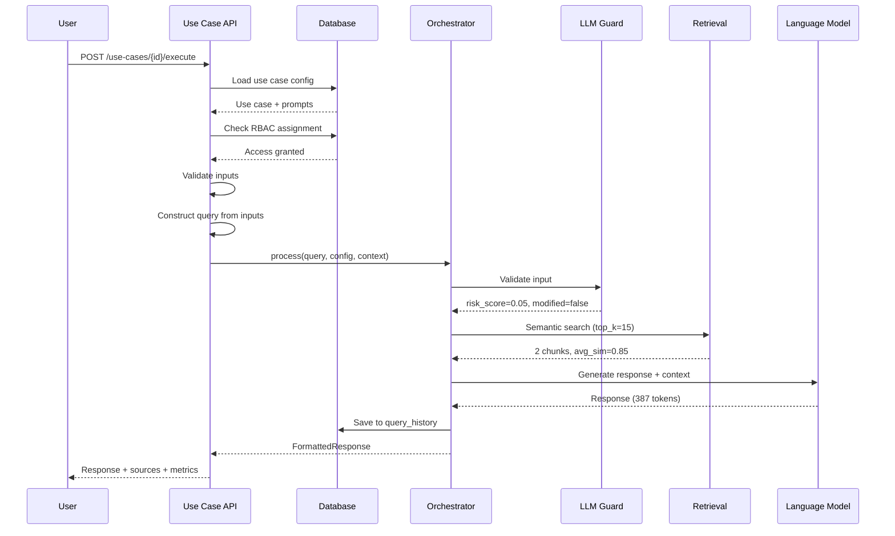

# Use Case Execution API Reference

**Version:** 1.0
**Base URL:** `/api/v1/use-cases`
**Authentication:** Required (role-based access per use case)
**Date:** October 18, 2025
**Status:** Implemented

---

## Overview

The Use Case Execution API provides endpoints for discovering and executing use cases in the AI Operations Platform system. This is the **primary user-facing API** that SOC analysts interact with to perform AI-assisted threat intelligence operations.

**Key Features:**

- RBAC-filtered use case discovery
- Template-driven execution with dynamic inputs
- Comprehensive metrics and source citations
- Query history integration
- Parameter overrides for power users
- Automatic context preservation

**Related APIs:**

- **Use Case Management:** `/api/v1/admin/use-cases` (admin CRUD operations)
- **Query History:** `/api/v1/query-history` (conversation threads)
- **Collections:** `/api/v1/admin/collections` (document collections)

---

## Authentication

All endpoints require JWT authentication. Access to specific use cases is controlled by role-based assignments.

```bash
Authorization: Bearer <access_token>
```

**Get Access Token:**

```bash
TOKEN=$(curl -s -X POST "http://localhost:8006/auth/token" \
  -H "Content-Type: application/x-www-form-urlencoded" \
  -d "username=analyst" \
  -d "password=analystpassword" | jq -r '.access_token')
```

---

## Endpoints

### 1. List Available Use Cases

**GET** `/api/v1/use-cases/available`

Get RBAC-filtered list of use cases available to the current user. Returns only **published** and **active** use cases that the user has access to.

**Query Parameters:**

- `category` (string, optional) - Filter by category (threat_intel, malware, etc.)
- `intent_type` (string, optional) - Filter by intent type (rag_qa, semantic_search, etc.)

**RBAC Rules:**

- **Admin users:** See all published active use cases
- **Other users:** See only assigned use cases (via `user_use_case_assignments` table)

**Example Request:**

```bash
curl -X GET "http://localhost:8006/api/v1/use-cases/available?category=threat_intel" \
  -H "Authorization: Bearer $TOKEN"
```

**Response:**

```json
{
  "use_cases": [
    {
      "id": "ba0c6e49-2813-4887-8970-e0c1753234f7",
      "use_case_id": "threat_intelligence_query",
      "name": "Threat Intelligence Query",
      "description": "Query threat intelligence databases for IOCs and threat actor information",
      "category": "threat_intel",
      "intent_type": "rag_qa",
      "icon": "security",
      "tags": ["threat_intel", "ioc", "apt"]
    },
    {
      "id": "c8d4f3b2-1234-5678-9abc-def012345678",
      "use_case_id": "malware_analysis",
      "name": "Malware Analysis Assistant",
      "description": "Analyze malware samples and provide threat assessment",
      "category": "malware",
      "intent_type": "rag_qa",
      "icon": "bug_report",
      "tags": ["malware", "analysis", "ransomware"]
    }
  ],
  "total": 2
}
```

**Status Codes:**

- `200 OK` - Use cases retrieved successfully
- `401 Unauthorized` - Not authenticated
- `500 Internal Server Error` - Server error

**Use Case:**
This endpoint powers the **Use Case Menu** in the Angular UI, showing analysts which use cases they can execute.

---

### 2. Get Use Case Configuration

**GET** `/api/v1/use-cases/{use_case_id}/config`

Retrieve the complete configuration for a use case, including UI input field definitions for dynamic form generation.

**Path Parameters:**

- `use_case_id` (UUID) - Use case primary key UUID (e.g., "ba0c6e49-2813-4887-8970-e0c1753234f7")

**Note:** As per ADR-037, this endpoint uses the UUID primary key (`id`), not the string identifier (`use_case_id` field).

**Example Request:**

```bash
curl -X GET "http://localhost:8006/api/v1/use-cases/ba0c6e49-2813-4887-8970-e0c1753234f7/config" \
  -H "Authorization: Bearer $TOKEN"
```

**Response:**

```json
{
  "use_case_id": "threat_intelligence_query",
  "name": "Threat Intelligence Query",
  "intent_type": "rag_qa",
  "config": {
    "models": {
      "llm": "mistral-large",
      "embedding": "all-minilm-l6-v2"
    },
    "rag": {
      "enabled": true,
      "vector_collections": ["threat_intelligence", "apt_reports"],
      "top_k": 15,
      "similarity_threshold": 0.7
    },
    "generation": {
      "temperature": 0.3,
      "max_tokens": 2048
    },
    "policies": {
      "streaming_enabled": true,
      "pii_redaction": true
    },
    "ui_config": {
      "input_sections": [
        {
          "section_id": "query_section",
          "title": "Threat Intelligence Query",
          "description": "Enter your threat intelligence question",
          "fields": [
            {
              "field_name": "ioc_query",
              "field_type": "text_area",
              "label": "IOC or Threat Actor",
              "placeholder": "Enter IP address, domain, hash, or threat actor name...",
              "required": true,
              "help_text": "Provide the indicator of compromise you want to investigate"
            },
            {
              "field_name": "search_scope",
              "field_type": "selectbox",
              "label": "Search Scope",
              "options": [
                {"value": "all", "label": "All Sources"},
                {"value": "apt_only", "label": "APT Reports Only"},
                {"value": "ioc_only", "label": "IOC Databases Only"}
              ],
              "default_value": "all",
              "required": false
            }
          ]
        }
      ]
    }
  }
}
```

**Status Codes:**

- `200 OK` - Configuration retrieved successfully
- `404 Not Found` - Use case not found or not accessible
- `403 Forbidden` - User lacks access to this use case
- `401 Unauthorized` - Not authenticated

**Use Case:**
This endpoint powers the **Dynamic Form Generator** (P3-F1), which renders input forms based on the `ui_config` section.

---

### 3. Execute Use Case

**POST** `/api/v1/use-cases/{use_case_id}/execute`

Execute a use case with provided inputs. This is the **primary endpoint** for AI-assisted threat intelligence operations.

**Path Parameters:**

- `use_case_id` (UUID) - Use case primary key UUID (e.g., "ba0c6e49-2813-4887-8970-e0c1753234f7")

**Note:** As per ADR-037, this endpoint uses the UUID primary key (`id`), not the string identifier (`use_case_id` field).

**Request Body:**

```json
{
  "inputs": {
    "ioc_query": "Analyze threat actor APT29 recent campaigns",
    "search_scope": "apt_only"
  },
  "overrides": {
    "temperature": 0.2,
    "top_k": 20,
    "streaming": false
  },
  "thread_id": "550e8400-e29b-41d4-a716-446655440000",
  "discussion_id": "INC-2025-042"
}
```

**Field Descriptions:**

**`inputs`** (required, object):

- Dynamic field object matching use case's `ui_config.input_sections`
- Field names must match `field_name` from config
- Required fields must be provided
- Type validation based on `field_type` (text_input, text_area, selectbox, etc.)

**`overrides`** (optional, object):

- `temperature` (number, 0.0-2.0) - Override generation temperature
- `top_k` (integer, 1-50) - Override RAG retrieval count
- `streaming` (boolean) - Override streaming preference
- `similarity_threshold` (number, 0.0-1.0) - Override minimum similarity

**`thread_id`** (optional, UUID):

- Continue existing conversation thread
- If provided, loads conversation history
- Enables multi-turn conversations

**`discussion_id`** (optional, string):

- Namespace for related threads (e.g., incident number)
- Used for SOAR integration
- Groups multiple threads under one discussion

**Example Request:**

```bash
curl -X POST "http://localhost:8006/api/v1/use-cases/threat_intelligence_query/execute" \
  -H "Authorization: Bearer $TOKEN" \
  -H "Content-Type: application/json" \
  -d '{
    "inputs": {
      "ioc_query": "Analyze IP address 192.0.2.1",
      "search_scope": "all"
    }
  }'
```

**Response:**

```json
{
  "response": "Based on threat intelligence data, IP address 192.0.2.1 has been associated with the following indicators:\n\n1. **APT29 Infrastructure** (doc:apt29_report_2025, page:12)\n   - First observed: 2025-09-15\n   - Confidence: High (0.92)\n   - Activity: Command and control communications\n\n2. **Malware Campaign** (doc:malware_analysis_042, page:7)\n   - Campaign: Operation ShadowStrike\n   - Malware family: Sunburst variant\n   - Confidence: Medium (0.78)\n\n**Recommendation:** Block this IP immediately and investigate all communications.",

  "sources": [
    {
      "chunk_id": "d9e5f4c3-2345-6789-bcde-f01234567890",
      "document_id": "apt29_report_2025",
      "document_title": "APT29 Threat Assessment 2025",
      "text_snippet": "IP address 192.0.2.1 identified as command and control server...",
      "relevance_score": 0.92,
      "page_number": 12,
      "metadata": {
        "author": "Threat Intel Team",
        "source": "Internal Analysis",
        "classification": "confidential"
      }
    },
    {
      "chunk_id": "e0f6g5d4-3456-7890-cdef-012345678901",
      "document_id": "malware_analysis_042",
      "document_title": "Operation ShadowStrike Analysis",
      "text_snippet": "Network communications to 192.0.2.1 observed in Sunburst samples...",
      "relevance_score": 0.78,
      "page_number": 7,
      "metadata": {
        "author": "Malware Lab",
        "source": "Sandbox Analysis"
      }
    }
  ],

  "metrics": {
    "retrieval": {
      "top_k": 15,
      "hits": 2,
      "avg_similarity": 0.85,
      "min_similarity": 0.78,
      "max_similarity": 0.92
    },
    "guard": {
      "risk_score": 0.05,
      "modified": false
    },
    "model": {
      "model_id": "mistral-large",
      "tokens_in": 1245,
      "tokens_out": 387,
      "latency_ms": 1842
    },
    "confidence_score": 0.87
  },

  "request_id": "f1g7h6e5-4567-8901-defg-123456789012",
  "execution_time_ms": 2156
}
```

**Status Codes:**

- `200 OK` - Execution completed successfully
- `400 Bad Request` - Missing required inputs or invalid data
- `403 Forbidden` - User lacks access to this use case
- `404 Not Found` - Use case not found or not accessible
- `500 Internal Server Error` - Execution failed

---

## Execution Flow

The execute endpoint orchestrates a complex workflow:



**Processing Steps:**

1. **Load Use Case** - Retrieve from database (must be published + active)
2. **Validate Access** - Check RBAC assignments (admins bypass, others need assignment)
3. **Validate Inputs** - Ensure all required fields provided
4. **Construct Query** - Build query text from input fields
5. **Execute Orchestrator** - Process with RAG, LLM-Guard, and LLM
6. **Save History** - Automatically saved to `query_history` table
7. **Return Response** - Formatted response with metrics and sources

---

## Data Models

### UseCaseListItem

Minimal use case information for menu display.

```typescript
interface UseCaseListItem {
  id: string;                     // UUID
  use_case_id: string;            // String identifier
  name: string;                   // Display name
  description: string | null;     // Description
  category: string;               // Category (threat_intel, malware, etc.)
  intent_type: string;            // Intent classification
  icon: string | null;            // Material icon name (optional)
  tags: string[];                 // Searchable tags
}
```

### UseCaseExecution

Request to execute a use case.

```typescript
interface UseCaseExecution {
  inputs: Record<string, any>;    // Required: Dynamic input fields
  overrides?: {                   // Optional: Parameter overrides
    temperature?: number;          // 0.0-2.0
    top_k?: number;                // 1-50
    streaming?: boolean;           // Enable SSE streaming
    similarity_threshold?: number; // 0.0-1.0
  };
  thread_id?: string;              // Optional: Continue existing thread (UUID)
  discussion_id?: string;          // Optional: Discussion namespace (e.g., "INC-2025-042")
}
```

### FormattedResponse

Comprehensive execution result.

```typescript
interface FormattedResponse {
  response: string;                 // LLM response text
  sources: SourceCitation[];        // Retrieved documents with relevance
  metrics: ConsolidatedMetrics;     // Performance and quality metrics
  suggested_actions?: any;          // Optional: Suggested follow-up actions
  request_id: string;               // Unique request identifier
  execution_time_ms: number;        // Total execution time
}
```

### SourceCitation

Retrieved document with relevance information.

```typescript
interface SourceCitation {
  chunk_id: string;                 // UUID of text chunk
  document_id: string;              // Document identifier
  document_title: string;           // Document title
  text_snippet: string;             // Relevant text excerpt
  relevance_score: number;          // Similarity score (0.0-1.0)
  page_number: number | null;       // Page number (if available)
  metadata: {                       // Document metadata
    author?: string;
    source?: string;
    classification?: string;
    [key: string]: any;
  };
}
```

### ConsolidatedMetrics

Performance and quality metrics.

```typescript
interface ConsolidatedMetrics {
  retrieval: {
    top_k: number;                  // Requested chunks
    hits: number;                   // Actual chunks found
    avg_similarity: number;         // Average similarity score
    min_similarity: number;         // Minimum similarity
    max_similarity: number;         // Maximum similarity
  };
  guard: {
    risk_score: number;             // LLM-Guard risk score (0.0-1.0)
    modified: boolean;              // Whether input was sanitized
  };
  model: {
    model_id: string;               // LLM model used
    tokens_in: number;              // Input tokens
    tokens_out: number;             // Output tokens
    latency_ms: number;             // LLM latency
  };
  confidence_score: number;         // Overall confidence (0.0-1.0)
}
```

---

## Dynamic Input Handling

### Input Field Types

Use cases define dynamic input fields in `config_json.ui_config.input_sections`. The execution API validates inputs against this schema.

**Supported Field Types:**

- `text_input` - Single line text
- `text_area` - Multi-line text
- `selectbox` - Dropdown selection
- `multiselect` - Multiple selection
- `slider` - Numeric range
- `date_input` - Date picker
- `file_uploader` - File upload (future)

**Example UI Config:**

```json
{
  "ui_config": {
    "input_sections": [
      {
        "section_id": "query_input",
        "title": "Query Parameters",
        "fields": [
          {
            "field_name": "threat_query",
            "field_type": "text_area",
            "label": "Threat Query",
            "placeholder": "Enter your question...",
            "required": true,
            "validation_pattern": ".{10,}",
            "validation_message": "Query must be at least 10 characters"
          },
          {
            "field_name": "time_range",
            "field_type": "selectbox",
            "label": "Time Range",
            "options": [
              {"value": "24h", "label": "Last 24 Hours"},
              {"value": "7d", "label": "Last 7 Days"},
              {"value": "30d", "label": "Last 30 Days"}
            ],
            "default_value": "7d",
            "required": false
          }
        ]
      }
    ]
  }
}
```

**Corresponding Execution Request:**

```json
{
  "inputs": {
    "threat_query": "What are the latest APT29 campaigns?",
    "time_range": "30d"
  }
}
```

---

## Parameter Overrides

Power users can override use case default parameters:

### Available Overrides

**`temperature`** (number, 0.0-2.0)

- Controls randomness in LLM generation
- Lower = more focused and consistent (lower variance)
- Higher = more creative and diverse
- **Default:** From use case config (typically 0.3-0.7)

**`top_k`** (integer, 1-50)

- Number of document chunks to retrieve
- More chunks = more context, slower, higher cost
- **Default:** From use case config (typically 10-15)

**`streaming`** (boolean)

- Enable Server-Sent Events (SSE) streaming
- `true` = real-time token-by-token response
- `false` = wait for complete response
- **Default:** From use case config

**`similarity_threshold`** (number, 0.0-1.0)

- Minimum similarity score for chunk inclusion
- Higher = more relevant but fewer results
- **Default:** From use case config (typically 0.7)

**Example with Overrides:**

```bash
curl -X POST "http://localhost:8006/api/v1/use-cases/threat_intelligence_query/execute" \
  -H "Authorization: Bearer $TOKEN" \
  -H "Content-Type: application/json" \
  -d '{
    "inputs": {
      "threat_query": "Latest ransomware campaigns"
    },
    "overrides": {
      "temperature": 0.1,
      "top_k": 25,
      "similarity_threshold": 0.8
    }
  }'
```

**Use Case:**

- Analysts can fine-tune execution for specific scenarios
- Override defaults without modifying use case config
- Experiment with parameters to improve results

---

## Multi-Turn Conversations

### Continuing a Thread

Provide `thread_id` to continue an existing conversation with full context:

**First Query:**

```bash
# Execute without thread_id (creates new thread automatically)
RESPONSE=$(curl -s -X POST "http://localhost:8006/api/v1/use-cases/threat_intelligence_query/execute" \
  -H "Authorization: Bearer $TOKEN" \
  -H "Content-Type: application/json" \
  -d '{
    "inputs": {
      "threat_query": "What are the TTPs of APT29?"
    }
  }')

# Extract request_id from response
REQUEST_ID=$(echo $RESPONSE | jq -r '.request_id')
```

**Follow-Up Query:**

```bash
# Get thread_id from query history
THREAD_ID=$(curl -s -X GET "http://localhost:8006/api/v1/query-history/?request_id=$REQUEST_ID" \
  -H "Authorization: Bearer $TOKEN" | jq -r '.results[0].thread_id')

# Continue conversation with context
curl -X POST "http://localhost:8006/api/v1/use-cases/threat_intelligence_query/execute" \
  -H "Authorization: Bearer $TOKEN" \
  -H "Content-Type: application/json" \
  -d "{
    \"inputs\": {
      \"threat_query\": \"What are their most recent campaigns?\"
    },
    \"thread_id\": \"$THREAD_ID\"
  }"
```

**Context Preservation:**

- LLM sees full conversation history
- Previous Q&A pairs included in context
- RAG results from previous queries available
- Token count tracked (compaction warning at 70% of max_context_tokens)

---

## Query Patterns

### Simple Query

**Use Case:** Single question, no follow-up needed

```json
{
  "inputs": {
    "threat_query": "What is the MITRE ATT&CK tactic for credential dumping?"
  }
}
```

---

### Investigation Thread

**Use Case:** Multi-turn investigation of an incident

```json
// Query 1: Initial question
{
  "inputs": {
    "threat_query": "Analyze suspicious activity from IP 192.0.2.1"
  },
  "discussion_id": "INC-2025-042"
}

// Query 2: Follow-up (uses thread_id from Query 1)
{
  "inputs": {
    "threat_query": "What malware families are associated with that IP?"
  },
  "thread_id": "ba0c6e49-2813-4887-8970-e0c1753234f7",
  "discussion_id": "INC-2025-042"
}

// Query 3: Deeper analysis
{
  "inputs": {
    "threat_query": "What are the recommended mitigation steps?"
  },
  "thread_id": "ba0c6e49-2813-4887-8970-e0c1753234f7",
  "discussion_id": "INC-2025-042"
}
```

---

### Power User Query with Overrides

**Use Case:** Analyst wants maximum context and high precision

```json
{
  "inputs": {
    "threat_query": "Comprehensive analysis of APT41 supply chain attacks"
  },
  "overrides": {
    "top_k": 30,
    "temperature": 0.1,
    "similarity_threshold": 0.85
  }
}
```

**Effect:**

- Retrieves 30 chunks (2x default)
- Lower temperature = more focused response
- Higher threshold = only highly relevant chunks

---

## RBAC and Access Control

### Use Case Assignment

Users must be **assigned** to use cases (except admins who see all).

**Assignment Table:** `user_use_case_assignments`

```sql
-- Example assignment
INSERT INTO user_use_case_assignments (
  user_id,
  use_case_id,
  assigned_role,
  status
) VALUES (
  '550e8400-e29b-41d4-a716-446655440000',  -- analyst user
  'ba0c6e49-2813-4887-8970-e0c1753234f7',  -- threat_intel use case
  'analyst',
  'active'
);
```

**Access Rules:**

- **Admin:** Access all published use cases automatically
- **Analyst/User:** Access only assigned use cases
- **Assignment Status:** Must be `active` (not `revoked` or `expired`)
- **Use Case State:** Must be `published` and `is_active: true`

---

### Visibility Filter

```
User requests /available
  ↓
Is user admin?
  ├── YES → Return all published + active use cases
  └── NO → Query user_use_case_assignments
              ↓
          Filter use cases to assigned + active assignments only
              ↓
          Return filtered list
```

---

## Error Handling

### Common Errors

#### 1. Missing Required Input

**Request:**

```json
{
  "inputs": {
    // Missing required field: "ioc_query"
  }
}
```

**Error:**

```json
{
  "detail": "Missing required input field: ioc_query"
}
```

**Resolution:** Provide all required fields from use case config.

---

#### 2. Access Denied

**Request:** User not assigned to use case

**Error:**

```json
{
  "detail": "Access denied to this use case"
}
```

**Resolution:**

- Admin assigns user to use case via `user_use_case_assignments`
- Or request admin access

---

#### 3. Use Case Not Found

**Request:** Use case doesn't exist or not published

**Error:**

```json
{
  "detail": "Use case not found or not accessible"
}
```

**Possible Causes:**

- Use case doesn't exist
- Use case is in `draft` or `review` state (not published)
- Use case has `is_active: false`
- User lacks assignment

---

## Performance Optimization

### Response Time Targets

| Component | Target Latency | Typical Range |
|-----------|---------------|---------------|
| **RBAC Check** | < 50ms | 10-30ms |
| **LLM-Guard** | < 200ms | 100-150ms |
| **RAG Retrieval** | < 300ms | 150-250ms |
| **LLM Generation** | < 2000ms | 1500-2500ms |
| **Total** | < 3000ms | 2000-3000ms |

**Optimization Strategies:**

1. **Use streaming** for large responses (improves perceived latency)
2. **Lower top_k** for faster retrieval
3. **Cache frequent queries** (future enhancement)
4. **Use smaller models** for simple queries

---

## Streaming Execution (SSE)

### Enable Streaming

**Request:**

```json
{
  "inputs": {
    "threat_query": "Detailed APT29 analysis"
  },
  "overrides": {
    "streaming": true
  }
}
```

**Response:** Server-Sent Events (SSE) stream

```
event: token
data: {"token": "Based", "chunk": "Based"}

event: token
data: {"token": " on", "chunk": " on"}

event: token
data: {"token": " threat", "chunk": " threat"}

event: sources
data: {"sources": [...]}

event: metrics
data: {"metrics": {...}}

event: done
data: {"status": "complete"}
```

**See:** [P2-F6: SSE Streaming Integration](../development/plans/UI_DEVELOPMENT_PLAN.md#p2-f6-real-time-integration-sse-streaming) for streaming implementation details.

---

## Integration Examples

### Angular Frontend Integration

```typescript
// src/app/api/services/use-case-execution.service.ts

@Injectable({ providedIn: 'root' })
export class UseCaseExecutionService {

  executeUseCase(
    useCaseId: string,
    execution: UseCaseExecution
  ): Observable<FormattedResponse> {
    return this.http.post<FormattedResponse>(
      `/api/v1/use-cases/${useCaseId}/execute`,
      execution
    );
  }

  executeWithStreaming(
    useCaseId: string,
    execution: UseCaseExecution
  ): Observable<SSEEvent> {
    execution.overrides = {
      ...execution.overrides,
      streaming: true
    };

    return this.sseService.connect(
      `/api/v1/use-cases/${useCaseId}/execute`,
      execution
    );
  }
}
```

---

### Python API Client Integration

```python
import requests

class UseCaseClient:
    def __init__(self, base_url: str, token: str):
        self.base_url = base_url
        self.headers = {"Authorization": f"Bearer {token}"}

    def list_available(self, category: str = None) -> dict:
        """List available use cases."""
        params = {}
        if category:
            params["category"] = category

        response = requests.get(
            f"{self.base_url}/api/v1/use-cases/available",
            headers=self.headers,
            params=params
        )
        response.raise_for_status()
        return response.json()

    def execute(
        self,
        use_case_id: str,
        inputs: dict,
        overrides: dict = None,
        thread_id: str = None,
        discussion_id: str = None
    ) -> dict:
        """Execute a use case."""
        payload = {"inputs": inputs}
        if overrides:
            payload["overrides"] = overrides
        if thread_id:
            payload["thread_id"] = thread_id
        if discussion_id:
            payload["discussion_id"] = discussion_id

        response = requests.post(
            f"{self.base_url}/api/v1/use-cases/{use_case_id}/execute",
            headers=self.headers,
            json=payload
        )
        response.raise_for_status()
        return response.json()

# Usage
client = UseCaseClient("http://localhost:8006", token)

# List available
use_cases = client.list_available(category="threat_intel")

# Execute
result = client.execute(
    use_case_id="threat_intelligence_query",
    inputs={"ioc_query": "Analyze domain malicious.com"},
    overrides={"top_k": 20}
)

print(f"Response: {result['response']}")
print(f"Sources: {len(result['sources'])}")
print(f"Confidence: {result['metrics']['confidence_score']}")
```

---

## Security Considerations

### Input Validation

- ✅ All inputs validated against use case schema
- ✅ Required fields enforced
- ✅ LLM-Guard sanitization on all user inputs
- ✅ XSS protection via input sanitization

### Access Control

- ✅ JWT authentication required
- ✅ RBAC enforced via assignments
- ✅ Lifecycle state controls visibility
- ✅ Audit trail for all executions

### Data Protection

- ✅ PII redaction based on use case policy
- ✅ Response sources include classification metadata
- ✅ Query history isolated by user
- ✅ Center-based isolation (multi-tenancy)

---

## Troubleshooting

### Issue: "Use case not found or not accessible"

**Causes:**

1. Use case doesn't exist
2. Use case is not published (`lifecycle_state != "published"`)
3. Use case is inactive (`is_active = false`)
4. User not assigned to use case (non-admin)

**Debugging:**

```bash
# Check if use case exists
curl -X GET "http://localhost:8006/api/v1/use-cases/available" \
  -H "Authorization: Bearer $TOKEN" | jq '.use_cases[] | select(.use_case_id == "TARGET_ID")'

# If empty, use case not accessible to this user

# Admin check: List all use cases
curl -X GET "http://localhost:8006/api/v1/admin/use-cases?use_case_id_filter=TARGET_ID" \
  -H "Authorization: Bearer $ADMIN_TOKEN" | jq '.use_cases[] | {lifecycle_state, is_active}'
```

---

### Issue: Slow execution (>5 seconds)

**Causes:**

1. High `top_k` value (retrieving many chunks)
2. Large LLM response (high `max_tokens`)
3. Multiple collections in vector_collections
4. Slow LLM model
5. Network latency

**Optimizations:**

```json
{
  "overrides": {
    "top_k": 5,           // Reduce from default 15
    "max_tokens": 1024,   // Limit response length
    "streaming": true     // Improve perceived latency
  }
}
```

---

## Related Documentation

- **Use Case Management:** [use-case-management.md](./use-case-management.md) (admin CRUD)
- **Collections:** [collection-management.md](./collection-management.md) (RAG collections)
- **Conversations:** [conversations.md](./conversations.md) (thread management)
- **Query History:** Query history endpoints (thread continuation)
- **Architecture:** [ADR-018: Use Case Owned Architecture](../development/adrs/ADR-018-Use-Case-Owned-Architecture.md)

---

**Last Updated:** October 18, 2025
**API Version:** 1.0
**Implementation Status:** Implemented
