# Tools Architecture Diagrams

**Visual reference for Enterprise MCP Tool Integration**

---

## System Architecture Overview

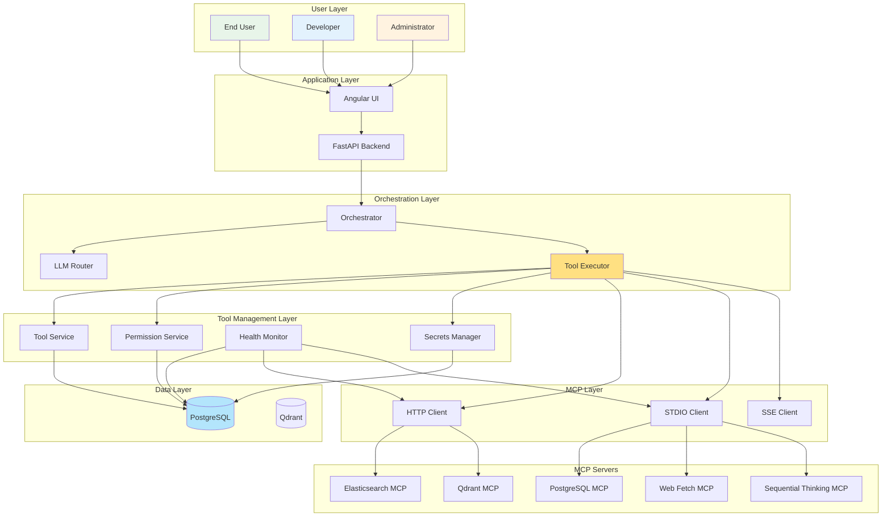
```mermaid
graph TB
    subgraph "User Layer"
        USER[End User]
        DEV[Developer]
        ADMIN[Administrator]
    end

    subgraph "Application Layer"
        UI[Angular UI]
        API[FastAPI Backend]
    end

    subgraph "Orchestration Layer"
        ORCH[Orchestrator]
        LLM[LLM Router]
        TOOL_EXEC[Tool Executor]
    end

    subgraph "Tool Management Layer"
        TOOL_SVC[Tool Service]
        PERM_SVC[Permission Service]
        HEALTH_MON[Health Monitor]
        SECRET_MGR[Secrets Manager]
    end

    subgraph "MCP Layer"
        MCP_HTTP[HTTP Client]
        MCP_STDIO[STDIO Client]
        MCP_SSE[SSE Client]
    end

    subgraph "MCP Servers"
        ELASTIC[Elasticsearch MCP]
        POSTGRES[PostgreSQL MCP]
        QDRANT[Qdrant MCP]
        WEB[Web Fetch MCP]
        REASON[Sequential Thinking MCP]
    end

    subgraph "Data Layer"
        DB[(PostgreSQL)]
        VECTOR[(Qdrant)]
    end

    USER --> UI
    DEV --> UI
    ADMIN --> UI

    UI --> API
    API --> ORCH

    ORCH --> LLM
    ORCH --> TOOL_EXEC

    TOOL_EXEC --> TOOL_SVC
    TOOL_EXEC --> PERM_SVC
    TOOL_EXEC --> SECRET_MGR

    TOOL_SVC --> DB
    PERM_SVC --> DB
    SECRET_MGR --> DB
    HEALTH_MON --> DB

    TOOL_EXEC --> MCP_HTTP
    TOOL_EXEC --> MCP_STDIO
    TOOL_EXEC --> MCP_SSE

    MCP_HTTP --> ELASTIC
    MCP_HTTP --> QDRANT
    MCP_STDIO --> POSTGRES
    MCP_STDIO --> WEB
    MCP_STDIO --> REASON

    HEALTH_MON --> MCP_HTTP
    HEALTH_MON --> MCP_STDIO

    style USER fill:#E8F5E9
    style DEV fill:#E3F2FD
    style ADMIN fill:#FFF3E0
    style TOOL_EXEC fill:#FFE082
    style DB fill:#B3E5FC
```

---

## Request Flow with Tools

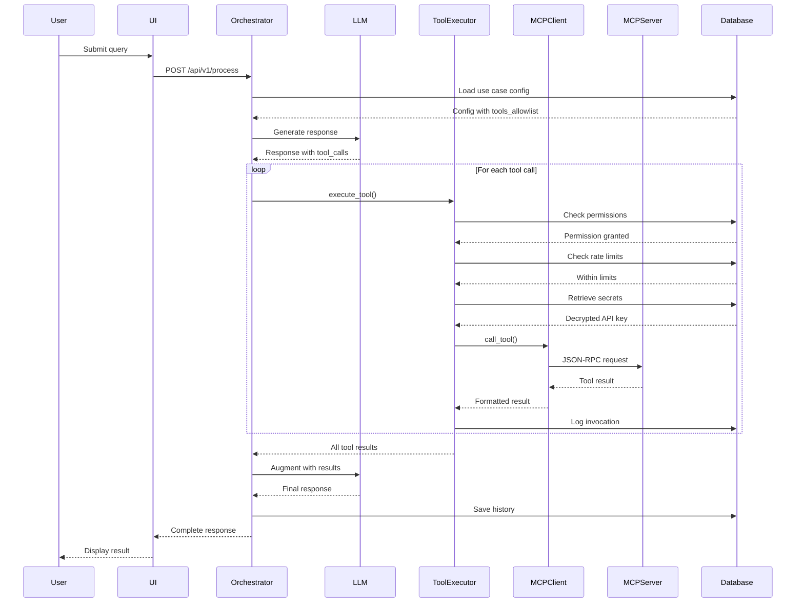
```mermaid
sequenceDiagram
    participant User
    participant UI
    participant Orchestrator
    participant LLM
    participant ToolExecutor
    participant MCPClient
    participant MCPServer
    participant Database

    User->>UI: Submit query
    UI->>Orchestrator: POST /api/v1/process

    Orchestrator->>Database: Load use case config
    Database-->>Orchestrator: Config with tools_allowlist

    Orchestrator->>LLM: Generate response
    LLM-->>Orchestrator: Response with tool_calls

    loop For each tool call
        Orchestrator->>ToolExecutor: execute_tool()

        ToolExecutor->>Database: Check permissions
        Database-->>ToolExecutor: Permission granted

        ToolExecutor->>Database: Check rate limits
        Database-->>ToolExecutor: Within limits

        ToolExecutor->>Database: Retrieve secrets
        Database-->>ToolExecutor: Decrypted API key

        ToolExecutor->>MCPClient: call_tool()
        MCPClient->>MCPServer: JSON-RPC request
        MCPServer-->>MCPClient: Tool result
        MCPClient-->>ToolExecutor: Formatted result

        ToolExecutor->>Database: Log invocation
    end

    ToolExecutor-->>Orchestrator: All tool results

    Orchestrator->>LLM: Augment with results
    LLM-->>Orchestrator: Final response

    Orchestrator->>Database: Save history
    Orchestrator-->>UI: Complete response
    UI-->>User: Display result
```

---

## Database Schema Relationships

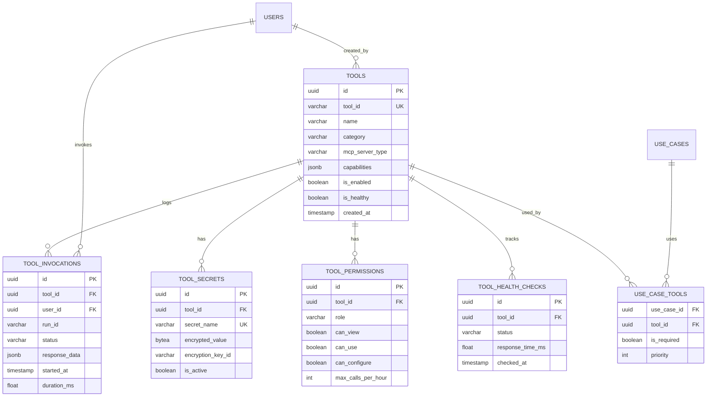
```mermaid
erDiagram
    TOOLS ||--o{ TOOL_SECRETS : "has"
    TOOLS ||--o{ TOOL_PERMISSIONS : "has"
    TOOLS ||--o{ TOOL_HEALTH_CHECKS : "tracks"
    TOOLS ||--o{ TOOL_INVOCATIONS : "logs"
    TOOLS ||--o{ USE_CASE_TOOLS : "used_by"

    USE_CASES ||--o{ USE_CASE_TOOLS : "uses"
    USERS ||--o{ TOOL_INVOCATIONS : "invokes"
    USERS ||--o{ TOOLS : "created_by"

    TOOLS {
        uuid id PK
        varchar tool_id UK
        varchar name
        varchar category
        varchar mcp_server_type
        jsonb capabilities
        boolean is_enabled
        boolean is_healthy
        timestamp created_at
    }

    TOOL_SECRETS {
        uuid id PK
        uuid tool_id FK
        varchar secret_name UK
        bytea encrypted_value
        varchar encryption_key_id
        boolean is_active
    }

    TOOL_PERMISSIONS {
        uuid id PK
        uuid tool_id FK
        varchar role
        boolean can_view
        boolean can_use
        boolean can_configure
        int max_calls_per_hour
    }

    TOOL_HEALTH_CHECKS {
        uuid id PK
        uuid tool_id FK
        varchar status
        float response_time_ms
        timestamp checked_at
    }

    TOOL_INVOCATIONS {
        uuid id PK
        uuid tool_id FK
        uuid user_id FK
        varchar run_id
        varchar status
        jsonb response_data
        timestamp started_at
        float duration_ms
    }

    USE_CASE_TOOLS {
        uuid use_case_id FK
        uuid tool_id FK
        boolean is_required
        int priority
    }
```

---

## Tool Lifecycle State Machine

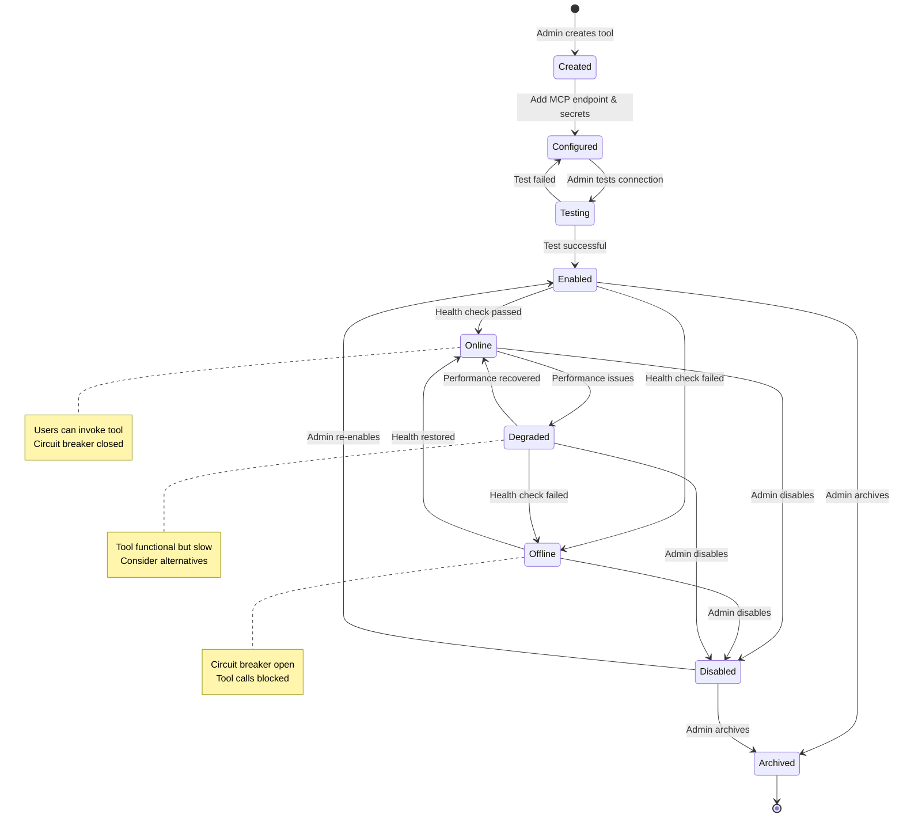
```mermaid
stateDiagram-v2
    [*] --> Created: Admin creates tool
    Created --> Configured: Add MCP endpoint & secrets
    Configured --> Testing: Admin tests connection
    Testing --> Configured: Test failed
    Testing --> Enabled: Test successful
    Enabled --> Online: Health check passed
    Enabled --> Offline: Health check failed
    Online --> Degraded: Performance issues
    Degraded --> Online: Performance recovered
    Degraded --> Offline: Health check failed
    Offline --> Online: Health restored
    Online --> Disabled: Admin disables
    Offline --> Disabled: Admin disables
    Degraded --> Disabled: Admin disables
    Disabled --> Enabled: Admin re-enables
    Enabled --> Archived: Admin archives
    Disabled --> Archived: Admin archives
    Archived --> [*]

    note right of Online
        Users can invoke tool
        Circuit breaker closed
    end note

    note right of Offline
        Circuit breaker open
        Tool calls blocked
    end note

    note right of Degraded
        Tool functional but slow
        Consider alternatives
    end note
```

---

## Permission Flow

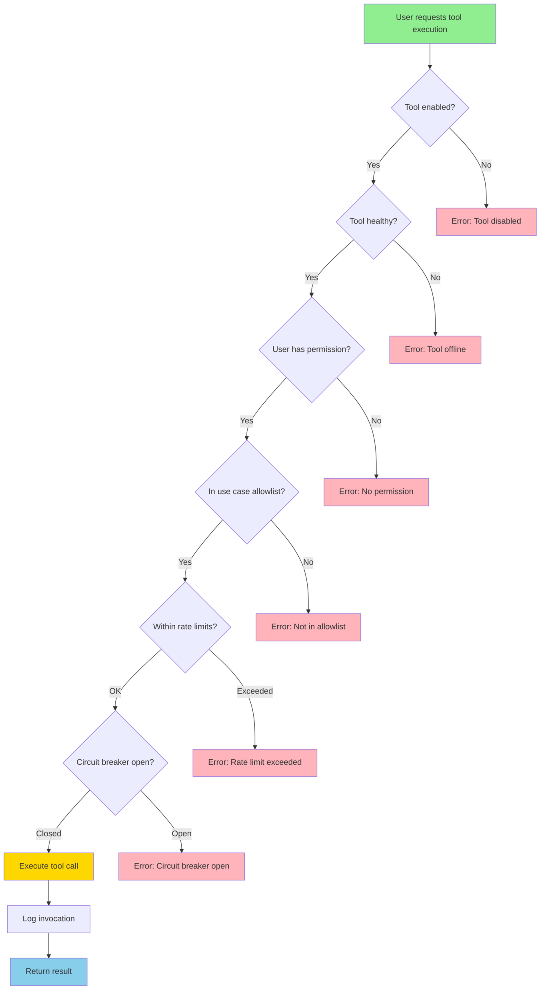
```mermaid
flowchart TD
    START[User requests tool execution]

    CHECK_ENABLED{Tool enabled?}
    CHECK_HEALTHY{Tool healthy?}
    CHECK_PERM{User has permission?}
    CHECK_ALLOWLIST{In use case allowlist?}
    CHECK_RATE{Within rate limits?}
    CHECK_CIRCUIT{Circuit breaker open?}

    EXECUTE[Execute tool call]
    LOG[Log invocation]
    RETURN[Return result]

    BLOCKED_DISABLED[Error: Tool disabled]
    BLOCKED_HEALTH[Error: Tool offline]
    BLOCKED_PERM[Error: No permission]
    BLOCKED_ALLOWLIST[Error: Not in allowlist]
    BLOCKED_RATE[Error: Rate limit exceeded]
    BLOCKED_CIRCUIT[Error: Circuit breaker open]

    START --> CHECK_ENABLED
    CHECK_ENABLED -->|No| BLOCKED_DISABLED
    CHECK_ENABLED -->|Yes| CHECK_HEALTHY

    CHECK_HEALTHY -->|No| BLOCKED_HEALTH
    CHECK_HEALTHY -->|Yes| CHECK_PERM

    CHECK_PERM -->|No| BLOCKED_PERM
    CHECK_PERM -->|Yes| CHECK_ALLOWLIST

    CHECK_ALLOWLIST -->|No| BLOCKED_ALLOWLIST
    CHECK_ALLOWLIST -->|Yes| CHECK_RATE

    CHECK_RATE -->|Exceeded| BLOCKED_RATE
    CHECK_RATE -->|OK| CHECK_CIRCUIT

    CHECK_CIRCUIT -->|Open| BLOCKED_CIRCUIT
    CHECK_CIRCUIT -->|Closed| EXECUTE

    EXECUTE --> LOG
    LOG --> RETURN

    style START fill:#90EE90
    style EXECUTE fill:#FFD700
    style RETURN fill:#87CEEB
    style BLOCKED_DISABLED fill:#FFB3BA
    style BLOCKED_HEALTH fill:#FFB3BA
    style BLOCKED_PERM fill:#FFB3BA
    style BLOCKED_ALLOWLIST fill:#FFB3BA
    style BLOCKED_RATE fill:#FFB3BA
    style BLOCKED_CIRCUIT fill:#FFB3BA
```

---

## Circuit Breaker State Diagram

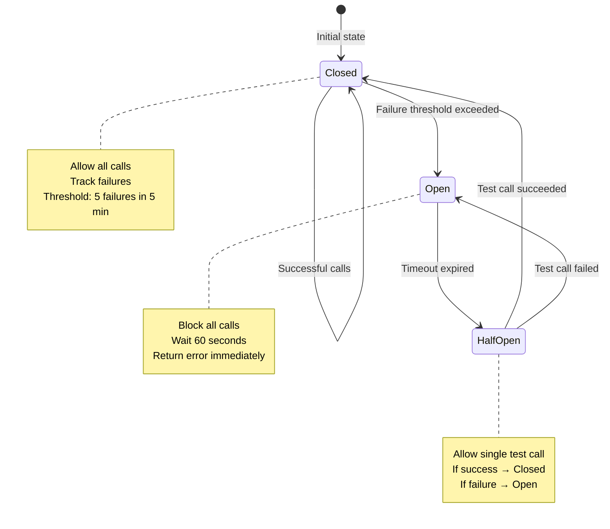
```mermaid
stateDiagram-v2
    [*] --> Closed: Initial state
    Closed --> Open: Failure threshold exceeded
    Open --> HalfOpen: Timeout expired
    HalfOpen --> Closed: Test call succeeded
    HalfOpen --> Open: Test call failed
    Closed --> Closed: Successful calls

    note right of Closed
        Allow all calls
        Track failures
        Threshold: 5 failures in 5 min
    end note

    note right of Open
        Block all calls
        Wait 60 seconds
        Return error immediately
    end note

    note right of HalfOpen
        Allow single test call
        If success → Closed
        If failure → Open
    end note
```

---

## Data Flow: Tool Configuration

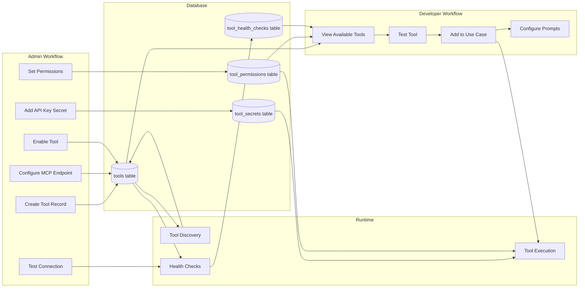
```mermaid
flowchart LR
    subgraph "Admin Workflow"
        A1[Create Tool Record]
        A2[Configure MCP Endpoint]
        A3[Add API Key Secret]
        A4[Set Permissions]
        A5[Enable Tool]
        A6[Test Connection]
    end

    subgraph "Database"
        DB_TOOL[(tools table)]
        DB_SECRET[(tool_secrets table)]
        DB_PERM[(tool_permissions table)]
        DB_HEALTH[(tool_health_checks table)]
    end

    subgraph "Developer Workflow"
        D1[View Available Tools]
        D2[Test Tool]
        D3[Add to Use Case]
        D4[Configure Prompts]
    end

    subgraph "Runtime"
        R1[Tool Discovery]
        R2[Health Checks]
        R3[Tool Execution]
    end

    A1 --> DB_TOOL
    A2 --> DB_TOOL
    A3 --> DB_SECRET
    A4 --> DB_PERM
    A5 --> DB_TOOL
    A6 --> R2

    DB_TOOL --> D1
    DB_PERM --> D1
    DB_HEALTH --> D1

    D1 --> D2
    D2 --> D3
    D3 --> D4

    DB_TOOL --> R1
    R1 --> DB_TOOL

    DB_TOOL --> R2
    R2 --> DB_HEALTH

    D3 --> R3
    DB_SECRET --> R3
    DB_PERM --> R3
```

---

## MCP Tool Registration Workflow (T5)

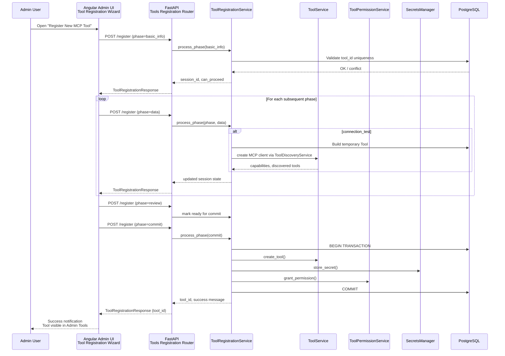
```mermaid
sequenceDiagram
    participant Admin as Admin User
    participant UI as Angular Admin UI<br/>Tool Registration Wizard
    participant API as FastAPI<br/>Tools Registration Router
    participant SVC as ToolRegistrationService
    participant TOOL_SVC as ToolService
    participant PERM_SVC as ToolPermissionService
    participant SECRET as SecretsManager
    participant DB as PostgreSQL

    Admin->>UI: Open "Register New MCP Tool"
    UI->>API: POST /register (phase=basic_info)
    API->>SVC: process_phase(basic_info)
    SVC->>DB: Validate tool_id uniqueness
    DB-->>SVC: OK / conflict
    SVC-->>API: session_id, can_proceed
    API-->>UI: ToolRegistrationResponse

    loop For each subsequent phase
        UI->>API: POST /register (phase=data)
        API->>SVC: process_phase(phase, data)
        alt connection_test
            SVC->>DB: Build temporary Tool
            SVC->>TOOL_SVC: create MCP client via ToolDiscoveryService
            TOOL_SVC-->>SVC: capabilities, discovered tools
        end
        SVC-->>API: updated session state
        API-->>UI: ToolRegistrationResponse
    end

    UI->>API: POST /register (phase=review)
    API->>SVC: mark ready for commit

    UI->>API: POST /register (phase=commit)
    API->>SVC: process_phase(commit)
    SVC->>DB: BEGIN TRANSACTION
    SVC->>TOOL_SVC: create_tool()
    SVC->>SECRET: store_secret()
    SVC->>PERM_SVC: grant_permission()
    SVC->>DB: COMMIT
    SVC-->>API: tool_id, success message
    API-->>UI: ToolRegistrationResponse (tool_id)
    UI-->>Admin: Success notification<br/>Tool visible in Admin Tools
```

---

## Registration Session Management

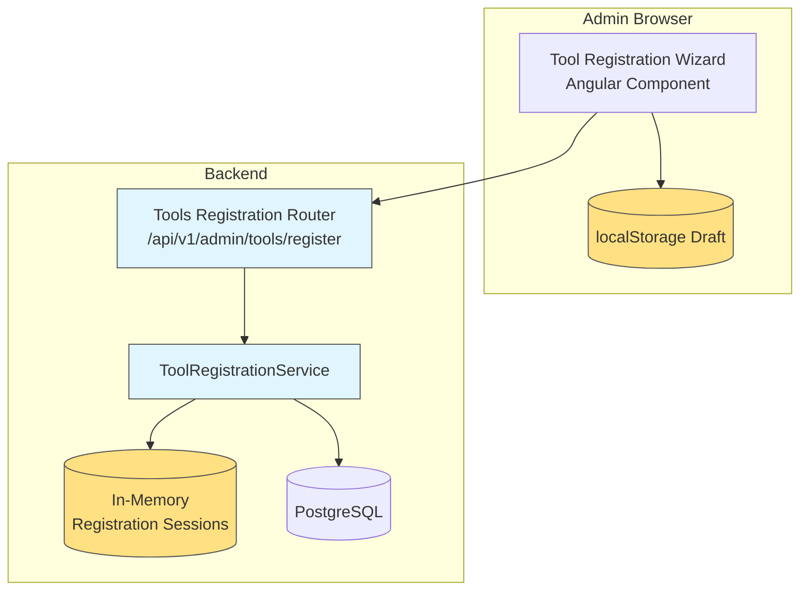
```mermaid
graph TB
    subgraph "Admin Browser"
        WIZ[Tool Registration Wizard<br/>Angular Component]
        LS[(localStorage Draft)]
    end

    subgraph "Backend"
        REG_API[Tools Registration Router<br/>/api/v1/admin/tools/register]
        REG_SVC[ToolRegistrationService]
        SESS[(In-Memory<br/>Registration Sessions)]
        DB[(PostgreSQL)]
    end

    WIZ --> REG_API
    REG_API --> REG_SVC
    REG_SVC --> SESS
    REG_SVC --> DB

    WIZ --> LS

    classDef store fill:#FFE082,stroke:#555;
    classDef backend fill:#E1F5FE,stroke:#555;

    class SESS,LS store;
    class REG_API,REG_SVC backend;
```

T5 uses **dual session tracking**:

- **Frontend draft:** Stored in browser `localStorage` (1-hour expiry) for UX.
- **Backend session:** In-memory state keyed by `session_id` (1-hour expiry)
  for validation and commit.

## MCP Protocol Layer

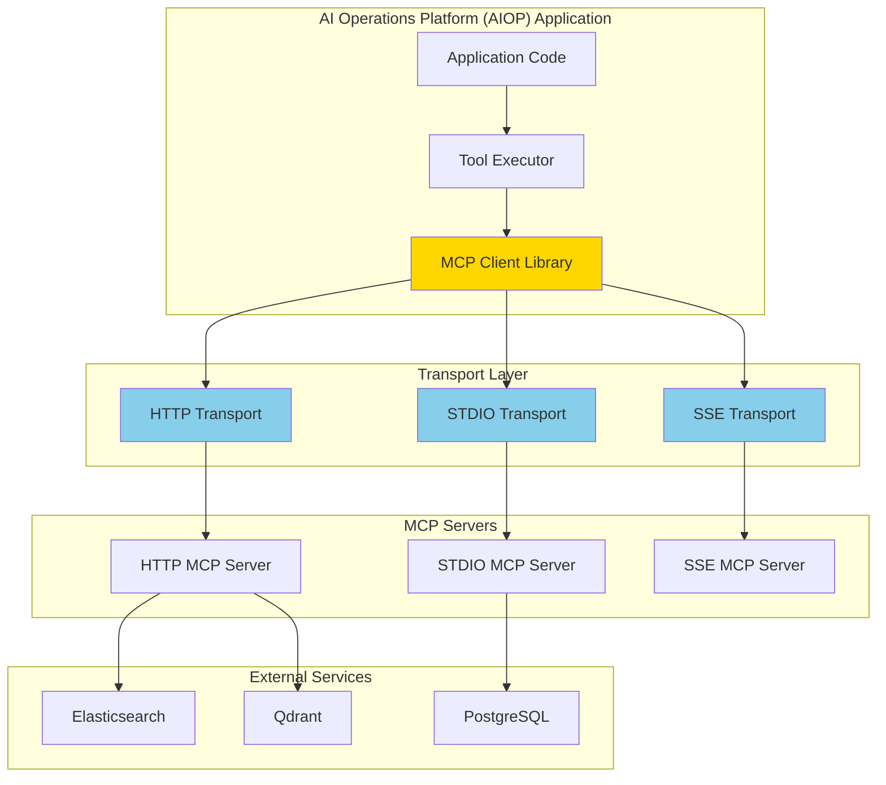
```mermaid
graph TB
    subgraph "AI Operations Platform (AIOP) Application"
        APP[Application Code]
        EXEC[Tool Executor]
        MCP_CLIENT[MCP Client Library]
    end

    subgraph "Transport Layer"
        HTTP[HTTP Transport]
        STDIO[STDIO Transport]
        SSE[SSE Transport]
    end

    subgraph "MCP Servers"
        direction LR
        HTTP_SERVER[HTTP MCP Server]
        STDIO_SERVER[STDIO MCP Server]
        SSE_SERVER[SSE MCP Server]
    end

    subgraph "External Services"
        ELASTIC[Elasticsearch]
        DB[PostgreSQL]
        VECTOR[Qdrant]
    end

    APP --> EXEC
    EXEC --> MCP_CLIENT

    MCP_CLIENT --> HTTP
    MCP_CLIENT --> STDIO
    MCP_CLIENT --> SSE

    HTTP --> HTTP_SERVER
    STDIO --> STDIO_SERVER
    SSE --> SSE_SERVER

    HTTP_SERVER --> ELASTIC
    STDIO_SERVER --> DB
    HTTP_SERVER --> VECTOR

    style MCP_CLIENT fill:#FFD700
    style HTTP fill:#87CEEB
    style STDIO fill:#87CEEB
    style SSE fill:#87CEEB
```

---

## Security Architecture

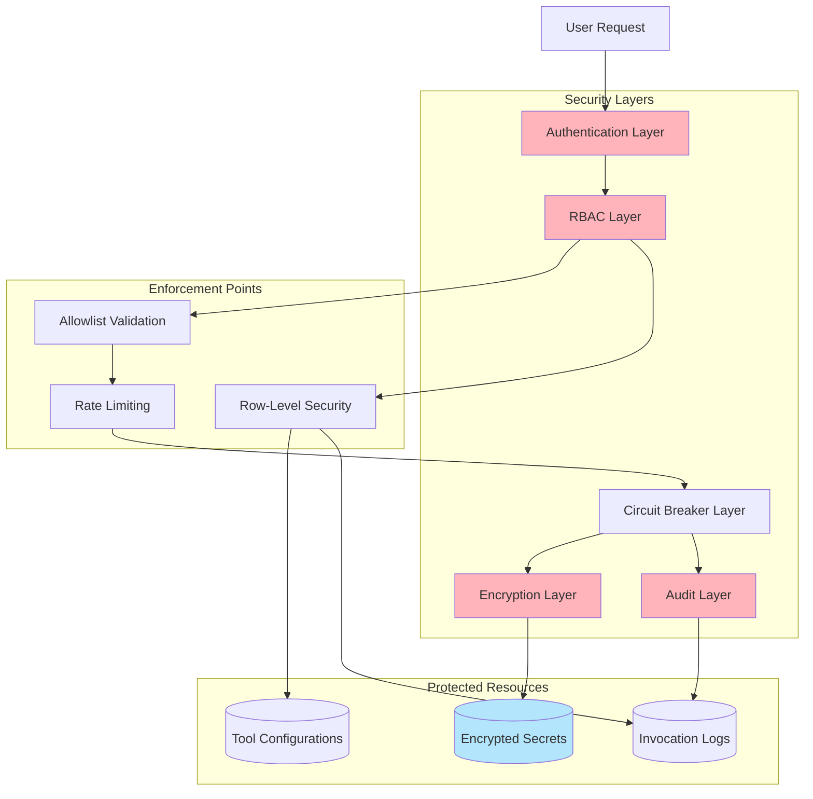
```mermaid
graph TB
    subgraph "Security Layers"
        AUTH[Authentication Layer]
        RBAC[RBAC Layer]
        ENCRYPT[Encryption Layer]
        AUDIT[Audit Layer]
        CIRCUIT[Circuit Breaker Layer]
    end

    subgraph "Protected Resources"
        SECRETS[(Encrypted Secrets)]
        TOOLS[(Tool Configurations)]
        INVOCATIONS[(Invocation Logs)]
    end

    subgraph "Enforcement Points"
        RLS[Row-Level Security]
        RATE[Rate Limiting]
        ALLOWLIST[Allowlist Validation]
    end

    USER[User Request] --> AUTH
    AUTH --> RBAC
    RBAC --> ALLOWLIST
    ALLOWLIST --> RATE
    RATE --> CIRCUIT
    CIRCUIT --> ENCRYPT
    ENCRYPT --> SECRETS

    RBAC --> RLS
    RLS --> TOOLS
    RLS --> INVOCATIONS

    CIRCUIT --> AUDIT
    AUDIT --> INVOCATIONS

    style AUTH fill:#FFB3BA
    style RBAC fill:#FFB3BA
    style ENCRYPT fill:#FFB3BA
    style AUDIT fill:#FFB3BA
    style SECRETS fill:#B3E5FC
```

---

## Tool Execution Timeline

```
┌─────────────────────────────────────────────────────────────────┐
│ Tool Execution Timeline (typical 500ms call)                    │
└─────────────────────────────────────────────────────────────────┘

 0ms ├─────────────────────────────────────────────────────────────┤
     │ [Permission Check]                                          │
     │  ↓ DB query: 5ms                                           │
 5ms ├─────────────────────────────────────────────────────────────┤
     │ [Rate Limit Check]                                          │
     │  ↓ DB query: 3ms                                           │
 8ms ├─────────────────────────────────────────────────────────────┤
     │ [Circuit Breaker Check]                                     │
     │  ↓ In-memory: <1ms                                         │
10ms ├─────────────────────────────────────────────────────────────┤
     │ [Retrieve Secret]                                           │
     │  ↓ DB decrypt: 10ms                                        │
20ms ├─────────────────────────────────────────────────────────────┤
     │ [MCP Client Connect]                                        │
     │  ↓ TCP/HTTP: 50ms                                          │
70ms ├─────────────────────────────────────────────────────────────┤
     │ [MCP Initialize]                                            │
     │  ↓ Handshake: 30ms                                         │
100ms├─────────────────────────────────────────────────────────────┤
     │ [Tool Call]                                                 │
     │  ↓ MCP request/response: 350ms                             │
450ms├─────────────────────────────────────────────────────────────┤
     │ [Process Result]                                            │
     │  ↓ Format & validate: 20ms                                 │
470ms├─────────────────────────────────────────────────────────────┤
     │ [Log Invocation]                                            │
     │  ↓ DB insert: 10ms                                         │
480ms├─────────────────────────────────────────────────────────────┤
     │ [Return to Orchestrator]                                    │
500ms└─────────────────────────────────────────────────────────────┘

 Total: 500ms (Target: <2s, Max: 5s)
```

---

## Health Check Flow

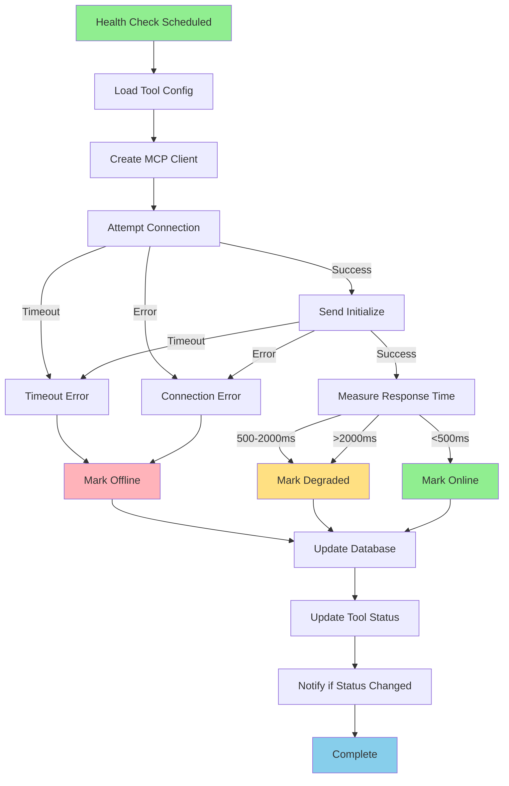
```mermaid
flowchart TD
    START[Health Check Scheduled]
    LOAD[Load Tool Config]
    CLIENT[Create MCP Client]
    CONNECT[Attempt Connection]
    INIT[Send Initialize]
    MEASURE[Measure Response Time]
    UPDATE_DB[Update Database]
    UPDATE_STATUS[Update Tool Status]
    NOTIFY[Notify if Status Changed]
    END[Complete]

    TIMEOUT[Timeout Error]
    ERROR[Connection Error]
    MARK_OFFLINE[Mark Offline]
    MARK_DEGRADED[Mark Degraded]
    MARK_ONLINE[Mark Online]

    START --> LOAD
    LOAD --> CLIENT
    CLIENT --> CONNECT

    CONNECT -->|Success| INIT
    CONNECT -->|Timeout| TIMEOUT
    CONNECT -->|Error| ERROR

    INIT -->|Success| MEASURE
    INIT -->|Timeout| TIMEOUT
    INIT -->|Error| ERROR

    TIMEOUT --> MARK_OFFLINE
    ERROR --> MARK_OFFLINE

    MEASURE -->|<500ms| MARK_ONLINE
    MEASURE -->|500-2000ms| MARK_DEGRADED
    MEASURE -->|>2000ms| MARK_DEGRADED

    MARK_OFFLINE --> UPDATE_DB
    MARK_DEGRADED --> UPDATE_DB
    MARK_ONLINE --> UPDATE_DB

    UPDATE_DB --> UPDATE_STATUS
    UPDATE_STATUS --> NOTIFY
    NOTIFY --> END

    style START fill:#90EE90
    style MARK_ONLINE fill:#90EE90
    style MARK_DEGRADED fill:#FFE082
    style MARK_OFFLINE fill:#FFB3BA
    style END fill:#87CEEB
```

---

## Use Case Tool Selection Workflow

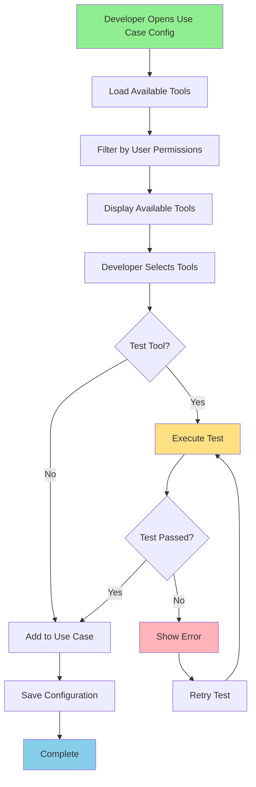
```mermaid
flowchart TD
    START[Developer Opens Use Case Config]
    LOAD_TOOLS[Load Available Tools]
    FILTER_PERM[Filter by User Permissions]
    DISPLAY[Display Available Tools]
    SELECT[Developer Selects Tools]
    TEST{Test Tool?}
    TEST_EXEC[Execute Test]
    TEST_PASS{Test Passed?}
    ADD[Add to Use Case]
    SAVE[Save Configuration]
    END[Complete]

    ERROR_DISPLAY[Show Error]
    RETRY[Retry Test]

    START --> LOAD_TOOLS
    LOAD_TOOLS --> FILTER_PERM
    FILTER_PERM --> DISPLAY
    DISPLAY --> SELECT
    SELECT --> TEST

    TEST -->|Yes| TEST_EXEC
    TEST -->|No| ADD

    TEST_EXEC --> TEST_PASS
    TEST_PASS -->|Yes| ADD
    TEST_PASS -->|No| ERROR_DISPLAY

    ERROR_DISPLAY --> RETRY
    RETRY --> TEST_EXEC

    ADD --> SAVE
    SAVE --> END

    style START fill:#90EE90
    style TEST_EXEC fill:#FFE082
    style ERROR_DISPLAY fill:#FFB3BA
    style END fill:#87CEEB
```

---

## Component Architecture (Orchestrator)

```
src/orchestrator/app/
├── mcp/
│   ├── base_client.py          # Abstract MCP client
│   ├── http_client.py          # HTTP transport
│   ├── stdio_client.py         # STDIO transport
│   ├── sse_client.py           # SSE transport
│   └── protocol_handler.py     # MCP spec validation
│
├── services/
│   ├── tool_service.py         # CRUD operations
│   ├── tool_registration_service.py  # Multi-phase registration workflow (T5)
│   ├── tool_permission_service.py  # RBAC
│   ├── tool_executor.py        # Execute tool calls
│   ├── tool_discovery_service.py   # Auto-discover
│   ├── tool_health_monitor.py  # Health checks
│   ├── tool_result_processor.py    # Format results
│   └── secrets_manager.py      # Encrypted secrets
│
├── routers/
│   ├── tools_registration.py   # MCP tool registration API (T5)
│   ├── tools_admin.py          # Admin CRUD API
│   ├── tools_developer.py      # Developer API
│   ├── tools_health.py         # Health monitoring API
│   ├── tools_analytics.py      # Analytics API
│   └── tools_testing.py        # Testing API
│
├── schemas/
│   ├── tool.py                 # Core tool models
│   └── tool_registration.py    # Multi-phase registration models (T5)
│
└── db/
    └── models.py               # SQLAlchemy models
        ├── Tool
        ├── ToolSecret
        ├── ToolPermission
        ├── ToolHealthCheck
        ├── ToolInvocation
        └── UseCaseTools
```

---

## Component Architecture (Frontend)

```
src/frontend-angular/src/app/
├── admin/
│   ├── tools/
│   │   ├── tool-list/
│   │   │   ├── tool-list.component.ts
│   │   │   ├── tool-list.component.html
│   │   │   └── tool-list.component.scss
│   │   ├── tool-registration-wizard/
│   │   │   ├── tool-registration-wizard.component.ts
│   │   │   ├── tool-registration-wizard.component.html
│   │   │   └── tool-registration-wizard.component.scss
│   │   ├── tool-config/
│   │   │   ├── tool-config.component.ts
│   │   │   ├── tool-config.component.html
│   │   │   └── tool-config.component.scss
│   │   └── health-dashboard/
│   │       ├── health-dashboard.component.ts
│   │       └── health-dashboard.component.html
│   │
│   └── analytics/
│       └── tool-analytics/
│           ├── tool-analytics.component.ts
│           └── tool-analytics.component.html
│
├── developer/
│   ├── use-case-builder/
│   │   └── tool-selector/
│   │       ├── tool-selector.component.ts
│   │       ├── tool-selector.component.html
│   │       └── tool-selector.component.scss
│   │
│   └── tool-testing/
│       ├── tool-testing.component.ts
│       └── tool-testing.component.html
│
├── shared/
│   ├── components/
│   │   ├── tool-card/
│   │   │   ├── tool-card.component.ts
│   │   │   └── tool-card.component.html
│   │   └── tool-status-indicator/
│   │       ├── tool-status-indicator.component.ts
│   │       └── tool-status-indicator.component.html
│   │
│   └── services/
│       ├── tool.service.ts
│       ├── tool-health.service.ts
│       └── tool-analytics.service.ts
```

---

## Deployment Architecture

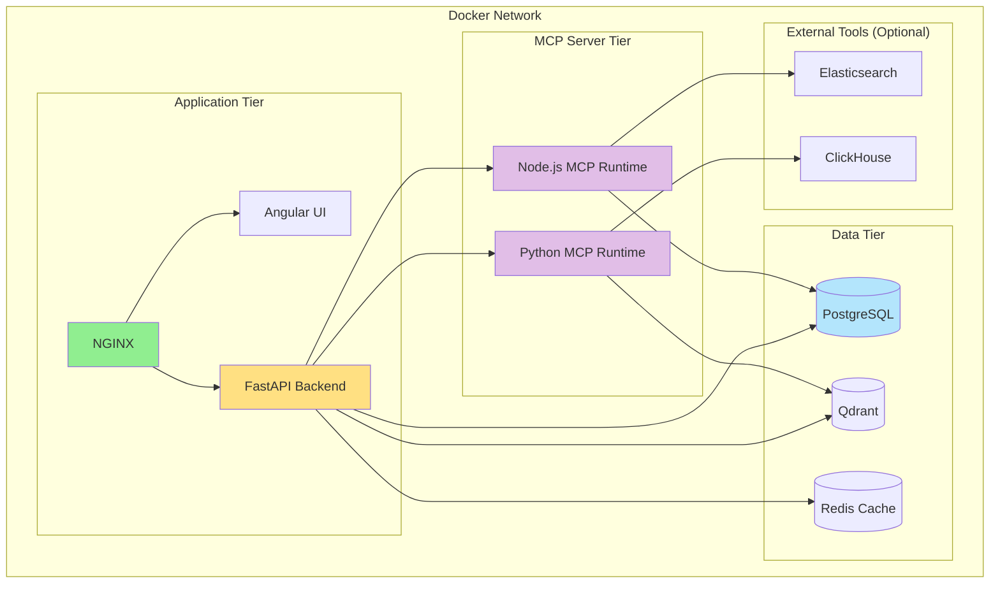
```mermaid
graph TB
    subgraph "Docker Network"
        subgraph "Application Tier"
            NGINX[NGINX]
            ANGULAR[Angular UI]
            FASTAPI[FastAPI Backend]
        end

        subgraph "MCP Server Tier"
            MCP_NODE[Node.js MCP Runtime]
            MCP_PYTHON[Python MCP Runtime]
        end

        subgraph "Data Tier"
            POSTGRES[(PostgreSQL)]
            QDRANT[(Qdrant)]
            REDIS[(Redis Cache)]
        end

        subgraph "External Tools (Optional)"
            ELASTIC[Elasticsearch]
            CLICKHOUSE[ClickHouse]
        end
    end

    NGINX --> ANGULAR
    NGINX --> FASTAPI

    FASTAPI --> POSTGRES
    FASTAPI --> QDRANT
    FASTAPI --> REDIS

    FASTAPI --> MCP_NODE
    FASTAPI --> MCP_PYTHON

    MCP_NODE --> POSTGRES
    MCP_NODE --> ELASTIC
    MCP_PYTHON --> QDRANT
    MCP_PYTHON --> CLICKHOUSE

    style NGINX fill:#90EE90
    style FASTAPI fill:#FFE082
    style MCP_NODE fill:#E1BEE7
    style MCP_PYTHON fill:#E1BEE7
    style POSTGRES fill:#B3E5FC
```

---

## T5 Tool Registration Workflow

### Registration Phase Sequence

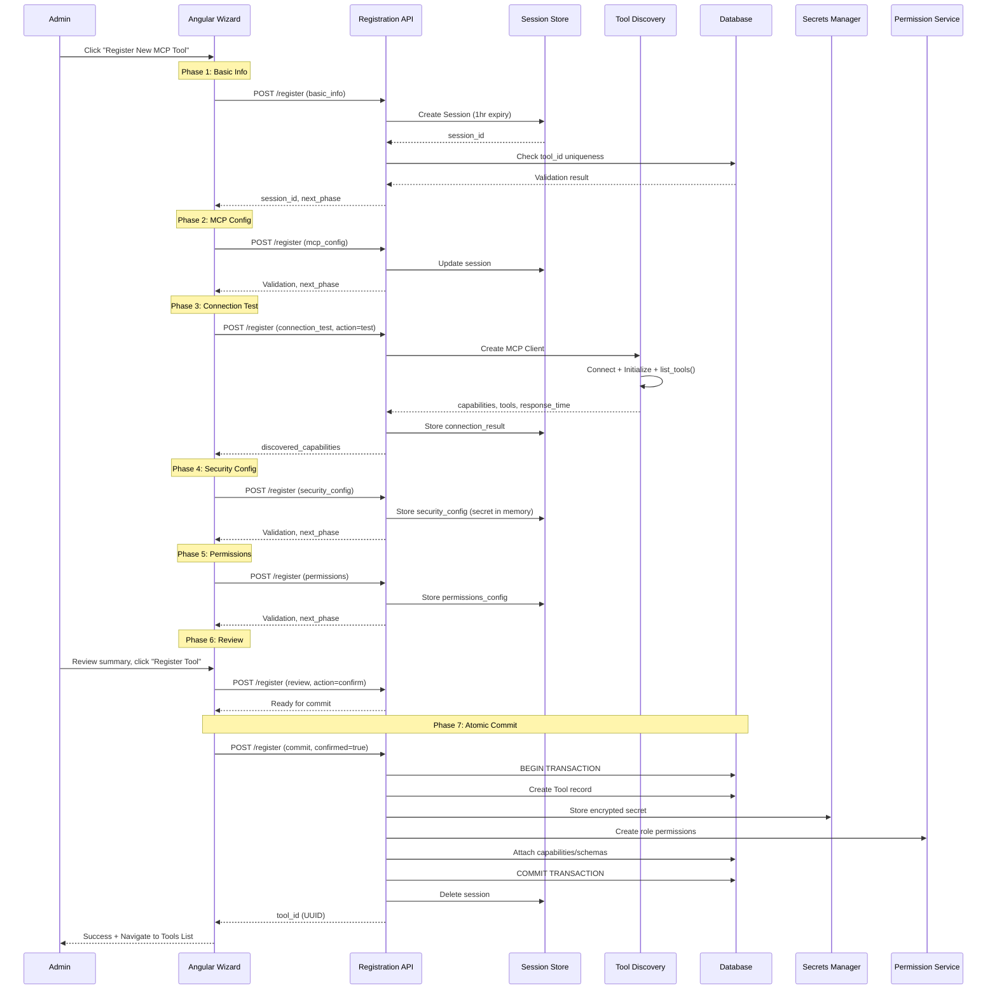
```mermaid
sequenceDiagram
    participant Admin
    participant Wizard as Angular Wizard
    participant API as Registration API
    participant Session as Session Store
    participant Discovery as Tool Discovery
    participant DB as Database
    participant Secrets as Secrets Manager
    participant Perms as Permission Service

    Admin->>Wizard: Click "Register New MCP Tool"

    Note over Wizard: Phase 1: Basic Info
    Wizard->>API: POST /register (basic_info)
    API->>Session: Create Session (1hr expiry)
    Session-->>API: session_id
    API->>DB: Check tool_id uniqueness
    DB-->>API: Validation result
    API-->>Wizard: session_id, next_phase

    Note over Wizard: Phase 2: MCP Config
    Wizard->>API: POST /register (mcp_config)
    API->>Session: Update session
    API-->>Wizard: Validation, next_phase

    Note over Wizard: Phase 3: Connection Test
    Wizard->>API: POST /register (connection_test, action=test)
    API->>Discovery: Create MCP Client
    Discovery->>Discovery: Connect + Initialize + list_tools()
    Discovery-->>API: capabilities, tools, response_time
    API->>Session: Store connection_result
    API-->>Wizard: discovered_capabilities

    Note over Wizard: Phase 4: Security Config
    Wizard->>API: POST /register (security_config)
    API->>Session: Store security_config (secret in memory)
    API-->>Wizard: Validation, next_phase

    Note over Wizard: Phase 5: Permissions
    Wizard->>API: POST /register (permissions)
    API->>Session: Store permissions_config
    API-->>Wizard: Validation, next_phase

    Note over Wizard: Phase 6: Review
    Admin->>Wizard: Review summary, click "Register Tool"
    Wizard->>API: POST /register (review, action=confirm)
    API-->>Wizard: Ready for commit

    Note over Wizard,DB: Phase 7: Atomic Commit
    Wizard->>API: POST /register (commit, confirmed=true)
    API->>DB: BEGIN TRANSACTION
    API->>DB: Create Tool record
    API->>Secrets: Store encrypted secret
    API->>Perms: Create role permissions
    API->>DB: Attach capabilities/schemas
    API->>DB: COMMIT TRANSACTION
    API->>Session: Delete session
    API-->>Wizard: tool_id (UUID)
    Wizard-->>Admin: Success + Navigate to Tools List
```

### Session State Management

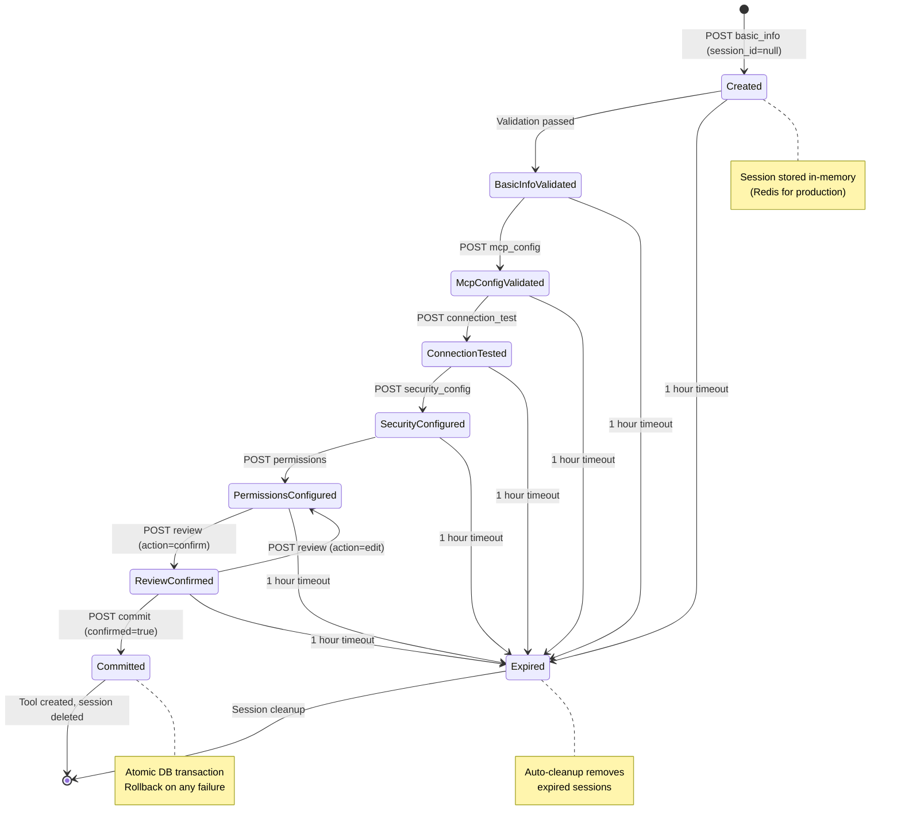
```mermaid
stateDiagram-v2
    [*] --> Created: POST basic_info (session_id=null)
    Created --> BasicInfoValidated: Validation passed
    BasicInfoValidated --> McpConfigValidated: POST mcp_config
    McpConfigValidated --> ConnectionTested: POST connection_test
    ConnectionTested --> SecurityConfigured: POST security_config
    SecurityConfigured --> PermissionsConfigured: POST permissions
    PermissionsConfigured --> ReviewConfirmed: POST review (action=confirm)
    ReviewConfirmed --> Committed: POST commit (confirmed=true)
    Committed --> [*]: Tool created, session deleted

    Created --> Expired: 1 hour timeout
    BasicInfoValidated --> Expired: 1 hour timeout
    McpConfigValidated --> Expired: 1 hour timeout
    ConnectionTested --> Expired: 1 hour timeout
    SecurityConfigured --> Expired: 1 hour timeout
    PermissionsConfigured --> Expired: 1 hour timeout
    ReviewConfirmed --> Expired: 1 hour timeout
    Expired --> [*]: Session cleanup

    ReviewConfirmed --> PermissionsConfigured: POST review (action=edit)

    note right of Created
        Session stored in-memory
        (Redis for production)
    end note

    note right of Committed
        Atomic DB transaction
        Rollback on any failure
    end note

    note right of Expired
        Auto-cleanup removes
        expired sessions
    end note
```

### T5 Integration with T1-T4 Infrastructure

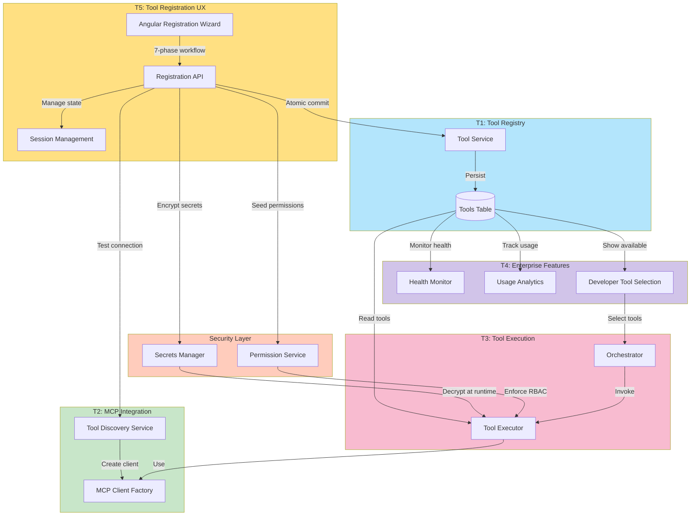
```mermaid
flowchart TD
    subgraph T5["T5: Tool Registration UX"]
        WIZARD[Angular Registration Wizard]
        REG_API[Registration API]
        SESSION[Session Management]
    end

    subgraph T1["T1: Tool Registry"]
        TOOL_SVC[Tool Service]
        TOOL_DB[(Tools Table)]
    end

    subgraph T2["T2: MCP Integration"]
        DISCOVERY[Tool Discovery Service]
        MCP_CLIENT[MCP Client Factory]
    end

    subgraph T3["T3: Tool Execution"]
        EXECUTOR[Tool Executor]
        ORCHESTRATOR[Orchestrator]
    end

    subgraph T4["T4: Enterprise Features"]
        HEALTH[Health Monitor]
        ANALYTICS[Usage Analytics]
        DEV_UI[Developer Tool Selection]
    end

    subgraph Security["Security Layer"]
        SECRETS[Secrets Manager]
        PERMS[Permission Service]
    end

    WIZARD -->|7-phase workflow| REG_API
    REG_API -->|Manage state| SESSION
    REG_API -->|Test connection| DISCOVERY
    DISCOVERY -->|Create client| MCP_CLIENT

    REG_API -->|Atomic commit| TOOL_SVC
    TOOL_SVC -->|Persist| TOOL_DB
    REG_API -->|Encrypt secrets| SECRETS
    REG_API -->|Seed permissions| PERMS

    TOOL_DB -->|Read tools| EXECUTOR
    TOOL_DB -->|Monitor health| HEALTH
    TOOL_DB -->|Track usage| ANALYTICS
    TOOL_DB -->|Show available| DEV_UI

    SECRETS -->|Decrypt at runtime| EXECUTOR
    PERMS -->|Enforce RBAC| EXECUTOR

    DEV_UI -->|Select tools| ORCHESTRATOR
    ORCHESTRATOR -->|Invoke| EXECUTOR
    EXECUTOR -->|Use| MCP_CLIENT

    style T5 fill:#FFE082
    style T1 fill:#B3E5FC
    style T2 fill:#C8E6C9
    style T3 fill:#F8BBD0
    style T4 fill:#D1C4E9
    style Security fill:#FFCCBC
```

### Registration Data Flow

```
┌─────────────────────────────────────────────────────────────────┐
│ T5 Tool Registration Data Flow                                  │
└─────────────────────────────────────────────────────────────────┘

Admin Input (UI)
    ↓
┌─────────────────────┐
│ Phase 1: Basic Info │ → tool_id, name, category, purpose
└─────────────────────┘
    ↓
┌─────────────────────┐
│ Phase 2: MCP Config │ → server_type, endpoint/command, timeout
└─────────────────────┘
    ↓
┌─────────────────────┐
│ Phase 3: Conn Test  │ → discovered_tools, capabilities, schemas
└─────────────────────┘
    ↓
┌─────────────────────┐
│ Phase 4: Security   │ → secret_name, secret_value (encrypted)
└─────────────────────┘
    ↓
┌─────────────────────┐
│ Phase 5: Permissions│ → role_permissions, rate_limits
└─────────────────────┘
    ↓
┌─────────────────────┐
│ Phase 6: Review     │ → User confirmation
└─────────────────────┘
    ↓
┌─────────────────────┐
│ Phase 7: Commit     │ → Atomic DB transaction
└─────────────────────┘
    ↓
Database Records Created:
├── tools (tool record with MCP config)
├── tool_secrets (encrypted credentials)
├── tool_permissions (per-role RBAC)
└── tool_health_checks (initial entry)
    ↓
Tool Available For:
├── T3: Execution (via ToolExecutor)
├── T4: Health Monitoring
├── T4: Usage Analytics
└── T4: Developer Tool Selection UI
```

### Registration Session Lifecycle

```
Session Creation (Phase 1)
    ↓
┌──────────────────────────────────────┐
│ RegistrationSession                  │
│                                      │
│ - session_id: str                    │
│ - user_id: UUID                      │
│ - current_phase: ToolRegistrationPhase│
│ - created_at: datetime               │
│ - expires_at: datetime (+1 hour)     │
│                                      │
│ Phase Data:                          │
│ - basic_info: dict | None            │
│ - mcp_config: dict | None            │
│ - connection_result: dict | None     │
│ - security_config: dict | None       │
│ - permissions_config: dict | None    │
│                                      │
│ Validation State:                    │
│ - validation_errors: dict            │
│ - can_proceed: bool                  │
└──────────────────────────────────────┘
    ↓
Phase Processing (2-7)
├── Validate input
├── Update session state
├── Store phase data
└── Return next_phase
    ↓
Commit Success → Session Deleted
Commit Failure → Session Retained (with errors)
Timeout (1hr) → Session Auto-Cleanup
Cancel → Session Deleted
```

### Wizard UI Flow

```
┌─────────────────────────────────────────────────────────────────┐
│ Angular Material Stepper (6 UI Steps)                           │
└─────────────────────────────────────────────────────────────────┘

Step 1: Basic Information
├── Form: tool_id, name, category, purpose
├── Validation: Real-time + backend
└── Action: Next → POST basic_info

Step 2: MCP Configuration
├── Form: server_type, endpoint/command, timeout
├── Dynamic validation (stdio vs http/sse)
└── Action: Next → POST mcp_config

Step 3: Connection Test
├── Button: "Test Connection"
├── Loading: Spinner + "Testing connection..."
├── Result: Success (tool count) | Failure (error)
└── Action: Next (if success) → POST connection_test

Step 4: Security Configuration
├── Toggle: requires_authentication
├── Conditional: secret_name, secret_value (password field)
└── Action: Next → POST security_config

Step 5: Permissions & Limits
├── Form: rate_limit, max_concurrent_calls
├── (Future: Role permissions matrix)
└── Action: Next → POST permissions

Step 6: Review & Confirm
├── Summary: All collected data (secrets masked)
├── Confirmation: "Register Tool" button
└── Action: Register → POST review + POST commit
    ↓
Success: Navigate to /admin/tools
Failure: Show error, stay on review
```

### Draft Management (Browser-Side)

```
┌─────────────────────────────────────────────────────────────────┐
│ localStorage Draft Management                                    │
└─────────────────────────────────────────────────────────────────┘

Wizard Load
    ↓
Check localStorage for draft
    ↓
    ├── Draft exists & not expired (< 1hr)
    │   ├── Load session_id
    │   ├── Restore form data
    │   ├── Navigate to saved step
    │   └── Continue workflow
    │
    └── No draft or expired
        └── Start fresh from Phase 1

Form Changes (Debounced 500ms)
    ↓
Auto-save to localStorage
    ├── session_id
    ├── currentStep (stepper index)
    ├── formData (all phases)
    └── timestamp

Wizard Complete
    ↓
Clear localStorage draft

Wizard Cancel
    ↓
Keep localStorage draft (1hr expiry)
Optional: DELETE /session/{session_id}
```

---

**Document Maintained By:** AI Assistant
**Last Updated:** November 24, 2025
**Related Plans:** TOOLS_IMPLEMENTATION_PLAN.md (Parts 1-3)
**Related Docs:** T5-F1 (Backend), T5-F2 (Frontend), T5-F3 (Documentation)
