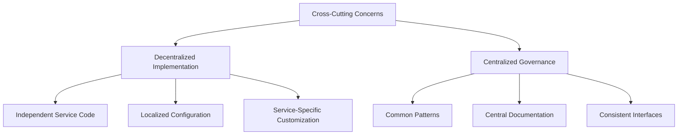

# Cross-Cutting Concerns in AI Operations Platform

## Overview

This document provides a comprehensive overview of how cross-cutting concerns are managed across the AI Operations Platform microservices architecture. It serves as an index to the detailed documentation for each specific concern.

## What Are Cross-Cutting Concerns?

Cross-cutting concerns are aspects of a system that affect multiple components and cannot be cleanly decomposed into a single module. Common examples include:

- Authentication and Authorization
- Logging and Monitoring
- Error Handling
- Telemetry and Tracing
- Configuration Management

In a microservices architecture, handling these concerns consistently while maintaining service independence is a key challenge.

## Implementation Strategy

AI Operations Platform follows a **decentralized implementation with centralized governance** approach:

This approach balances service autonomy with system-wide consistency by:

1. **Implementing concerns independently** in each service
2. **Documenting patterns centrally** to ensure consistency
3. **Maintaining consistent interfaces** across services

## Key Cross-Cutting Concerns

### Authentication and Authorization

AI Operations Platform uses JWT-based authentication with role-based access control across all services.

- **Implementation**: Each service has its own `auth.py` module
- **Common Pattern**: JWTValidator class with consistent API
- **Consistency**: Same roles and validation logic throughout the system

[Detailed Authentication Documentation](authentication_patterns.md)

### Observability (Logging, Tracing, Metrics)

A comprehensive observability strategy combining structured logging, distributed tracing, and health monitoring.

- **Structured Logging**: JSON format with request ID correlation
- **Distributed Tracing**: OpenTelemetry integration
- **Health Endpoints**: Consistent /health endpoints in each service

[Detailed Observability Documentation](observability_patterns.md)

### Service Independence

Each service is designed to operate independently while maintaining compatibility with the overall system.

- **No Shared Code**: Each service owns its own utility code
- **Consistent Interfaces**: APIs and utilities follow consistent patterns
- **Independent Deployment**: Services can be deployed independently

[Detailed Service Decoupling Documentation](service_decoupling.md)

## Service-Specific Implementations

### Embedding Service

The Embedding Service manages text embedding generation.

- [Embedding Service README](../../src/embedding/README.md)
- Key utilities in `src/embedding/app/utils/`

### Corpus Service

The Corpus Service manages document processing and vector retrieval.

- [Corpus Service README](../../src/corpus_svc/README.md)
- Key utilities in `src/corpus_svc/app/utils/`

## Configuration Management

Each service's cross-cutting concerns are configured through environment variables:

- **Authentication**: `SECRET_KEY`, `TOKEN_ISSUER`
- **Logging**: `LOG_LEVEL`
- **Telemetry**: `OTEL_EXPORTER_OTLP_ENDPOINT`, `DISABLE_TELEMETRY`

## Best Practices

1. **Maintain Interface Stability**: Changes to utility modules should preserve backward compatibility
2. **Update Documentation**: When modifying cross-cutting concerns, update the central documentation
3. **Consider All Services**: Changes to patterns should be considered for all services
4. **Follow Established Patterns**: New services should implement the same patterns

## Future Considerations

As the system evolves, consider these potential enhancements:

1. **Shared Libraries**: If duplicate code becomes a maintenance burden, extract to shared libraries
2. **Service Mesh**: For more complex deployments, a service mesh could handle cross-cutting concerns
3. **Infrastructure Automation**: Infrastructure as code to ensure consistent configuration

## Conclusion

By addressing cross-cutting concerns with a balanced approach of decentralized implementation and centralized governance, AI Operations Platform maintains service independence while ensuring system-wide consistency and reliability.
