# Entity-Relationship Diagram (ERD)

**Version:** 1.3.0
**Last Updated:** 2025-10-30
**Changes:**

- ADR-041 integrated - Role-based use case permissions (removed `role_intent_permissions`, added `role_use_case_assignments`)
- Added `system_config` table (P4-ADMIN-03) - JSONB-based system configuration with RLS
- ADR-046 integrated - Per‑model pricing history (`model_pricing_history`) and active price function

## Overview

This document provides Entity-Relationship Diagrams for the AI Operations Platform database schema using both ASCII art and Mermaid diagrams. The database is organized into logical domains, each with clear relationships and dependencies.

**Recent Update (ADR-041):** Permission model corrected - Use Cases are the permission boundary (NOT Intent Types). Intent Types are configuration presets only. Supports dynamic custom roles.

---

## Complete Database Architecture

### Mermaid: High-Level Domain Overview

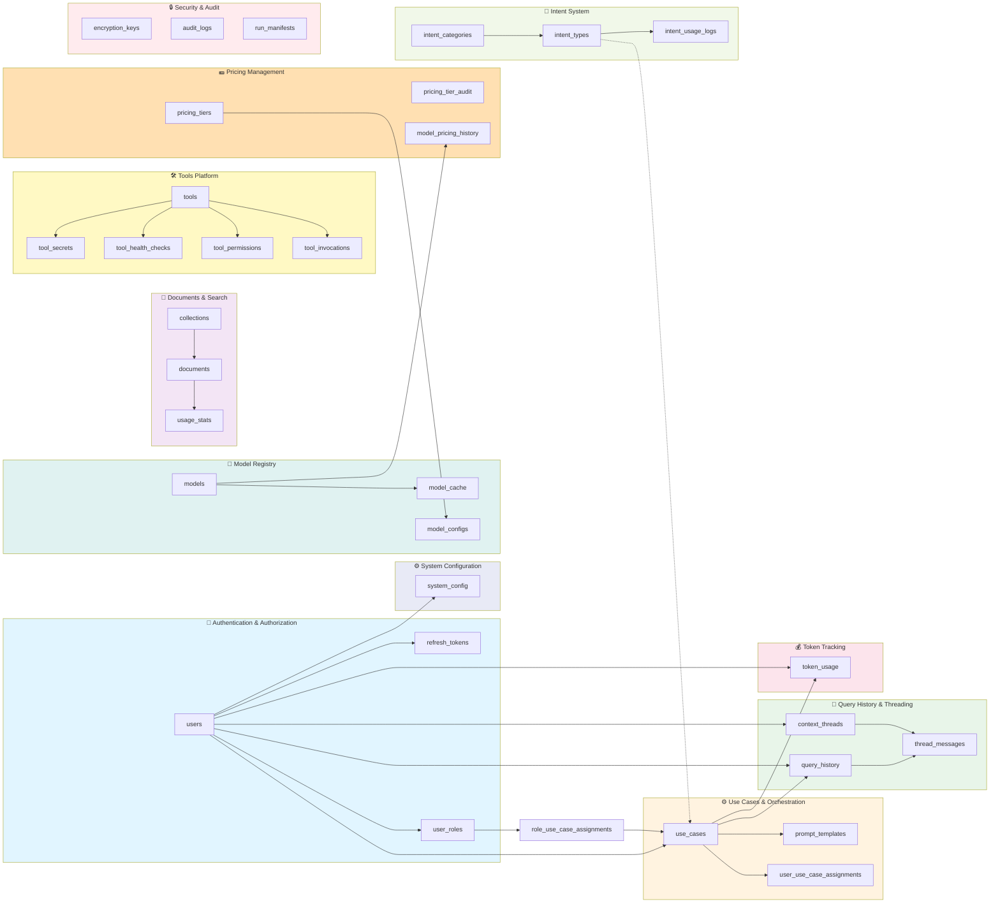

---

## Authentication & Authorization Domain

### Mermaid ER Diagram

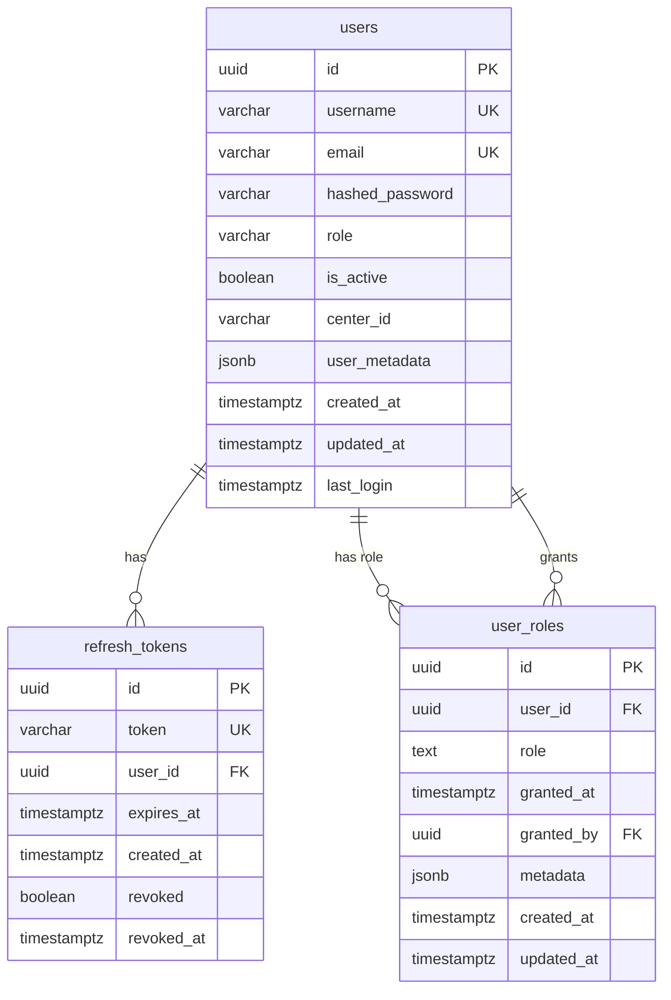

**Key Relationships:**

- One user has many refresh tokens (sessions)
- One user has many roles (multi-role support)
- Roles granted by other users (self-referential FK)

---

## System Configuration Domain

### Mermaid ER Diagram

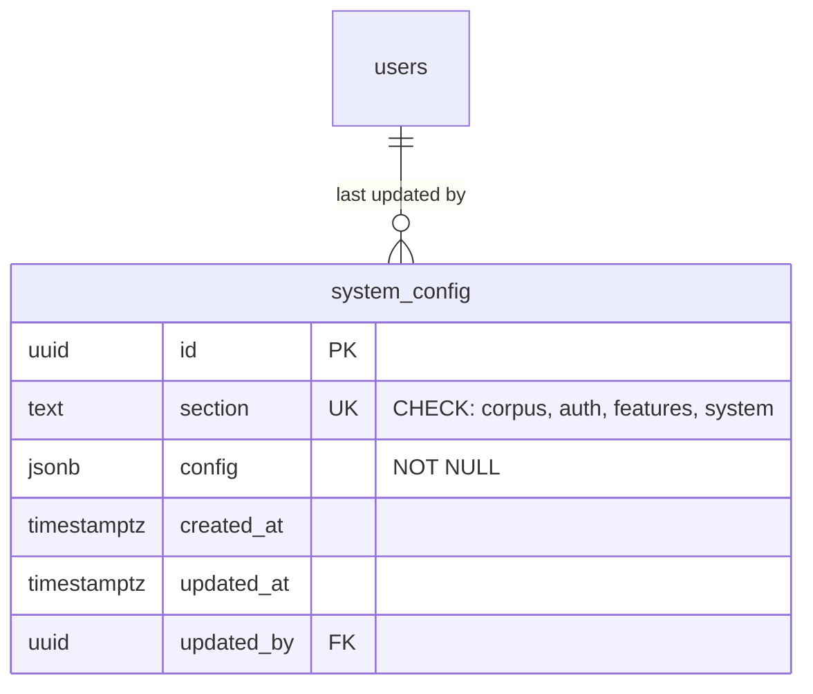

**Key Relationships:**

- System config tracks who last updated each section (N:1 to users)
- No cascade delete (ON DELETE SET NULL) - preserves audit trail

**Table Purpose:**

Store system-wide configuration using JSONB for flexibility (ADR-038):

- **corpus** - Document chunking, embedding model defaults, file type restrictions
- **auth** - Session timeouts, token TTLs, password policies
- **features** - Feature flags (multi-collection search, export, caching, telemetry)
- **system** - Operational settings (log level, workers, request timeouts, debug mode)

**Access Control (ADR-039):**

- ✅ **Admin only** - Full access via RLS policy `admin_only_system_config`
- ❌ **All other roles** - No access (developers, corpus_admin, users, service)

**Configuration Structure Examples:**

```jsonb
-- corpus section
{
  "chunk_size": 512,
  "chunk_overlap": 50,
  "default_embedding_model": "text-embedding-3-small",
  "max_document_size_mb": 50,
  "allowed_file_types": ["pdf", "txt", "docx", "md"]
}

-- auth section
{
  "session_timeout_minutes": 60,
  "refresh_token_ttl_days": 30,
  "password_policy": {
    "min_length": 8,
    "require_uppercase": true,
    "require_lowercase": true,
    "require_numbers": true,
    "require_special": false
  }
}

-- features section
{
  "multi_collection_search": false,
  "export_functionality": true,
  "conversation_cache": true,
  "telemetry_enabled": true
}

-- system section
{
  "log_level": "INFO",
  "max_workers": 4,
  "request_timeout_seconds": 30,
  "enable_debug_endpoints": false
}
```

**Indexes:**

- `idx_system_config_section` - Primary access pattern (section lookup)
- `idx_system_config_updated_by` - Audit queries
- `idx_system_config_config_gin` - GIN index for JSONB queries

**API Endpoints:**

- `GET /api/v1/admin/config/` - Get all configuration
- `GET /api/v1/admin/config/{section}` - Get specific section
- `PUT /api/v1/admin/config/{section}` - Update section
- `GET /api/v1/admin/config/schema/{section}` - Get JSON schema
- `POST /api/v1/admin/config/export` - Export as YAML
- `POST /api/v1/admin/config/import` - Import from YAML

---

## Use Case Domain

### Mermaid ER Diagram

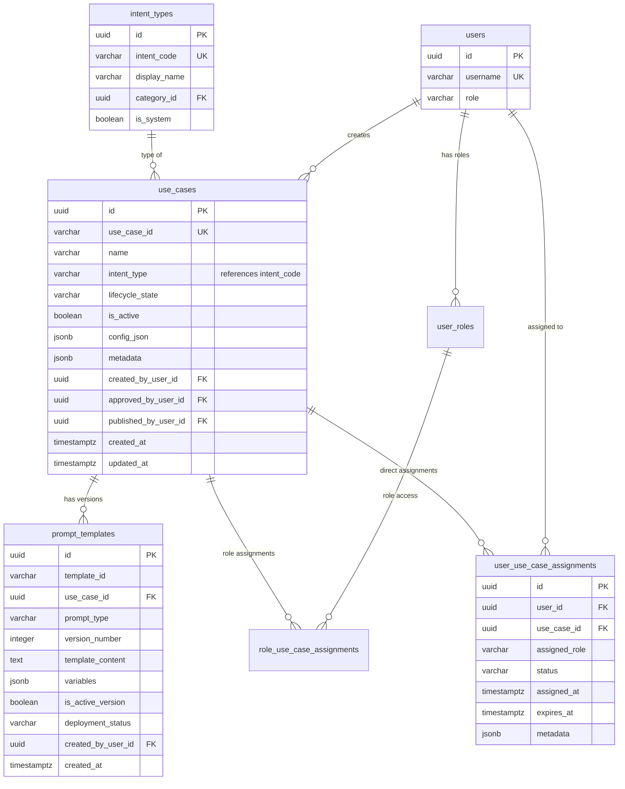

**Key Relationships:**

- Users create use cases (1:N)
- **Intent types categorize use cases (1:N)** - Logical reference, not FK
- Use cases have multiple prompt template versions (1:N)
- Users assigned to use cases with specific roles (N:M relationship)

**Design Notes:**

1. **Intent Type Reference:** `use_cases.intent_type` is a VARCHAR that references `intent_types.intent_code` (also VARCHAR). This is intentionally NOT a foreign key constraint to allow flexibility - use cases can specify intent types that don't yet exist in the registry. See ADR-016 (Dynamic Intent System) for rationale.

2. **Permission Model (ADR-041):** Use cases are the permission boundary, NOT intent types:
   - **Direct Access:** `user_use_case_assignments` - Individual user exceptions
   - **Role-Based Access:** `role_use_case_assignments` - Users inherit via role membership
   - **Intent Types:** Configuration presets only (sampling parameters, model recommendations)

---

## Document & Search Domain

### Mermaid ER Diagram

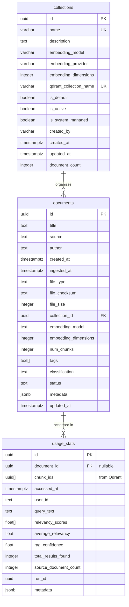

**Key Relationships:**

- **Collections organize documents with embedding model consistency (1:N)** - See ADR-021
- Each document belongs to exactly one collection (required)
- Collections bound to specific embedding model (immutable after creation)
- Documents metadata stored in PostgreSQL
- Actual content and chunk vectors stored in Qdrant (vector DB)
- usage_stats tracks retrieval events with chunk UUID references

- document_id nullable (can track queries without specific document)

**Important Constraints:**

- `collections.name` - Unique, lowercase alphanumeric with hyphens/underscores
- `collections.is_default` - Only one collection can be default (unique partial index)

- `documents.collection_id` - Foreign key with ON DELETE RESTRICT (cannot delete collection with documents)
- `documents.embedding_model` - Must match collection's embedding model

**Analytics Views:**

- `hot_documents` - Most accessed docs (30 days rolling window)
- `hot_chunks` - Most retrieved chunks (30 days rolling window)

---

## Query History & Threading Domain

### Mermaid ER Diagram

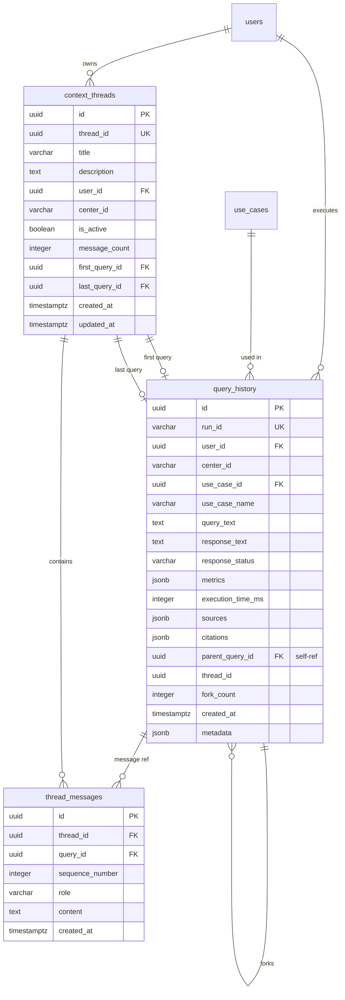

**Key Relationships:**

- Query history belongs to users (1:N)
- Queries can fork from other queries (self-referential 1:N)
- Threads contain ordered messages (1:N)
- Messages reference both thread and query
- Threads track first and last query for navigation

---

## Token Tracking Domain

### Mermaid ER Diagram

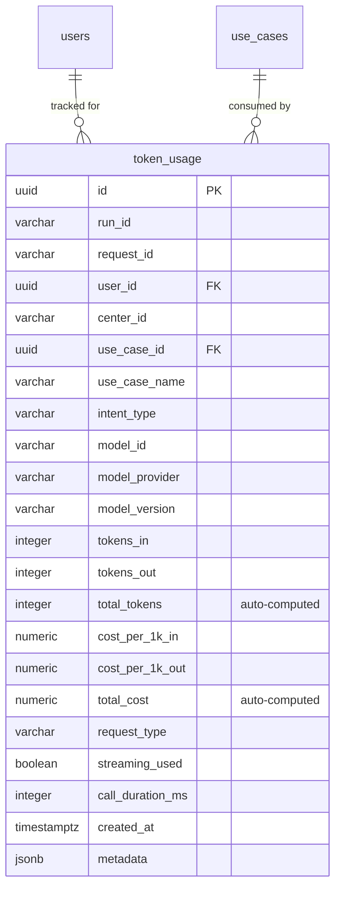

**Key Relationships:**

- Token usage tracked per user (1:N)
- Token usage tracked per use case (1:N)
- Token usage tracked per organization (center_id)
- total_tokens and total_cost auto-calculated by trigger

**Analytics Functions:**

- `get_center_usage_summary(center_id, start_date, end_date)`
- `get_all_centers_usage_summary(start_date, end_date)`

---

## Tools Platform Domain

### Mermaid ER Diagram

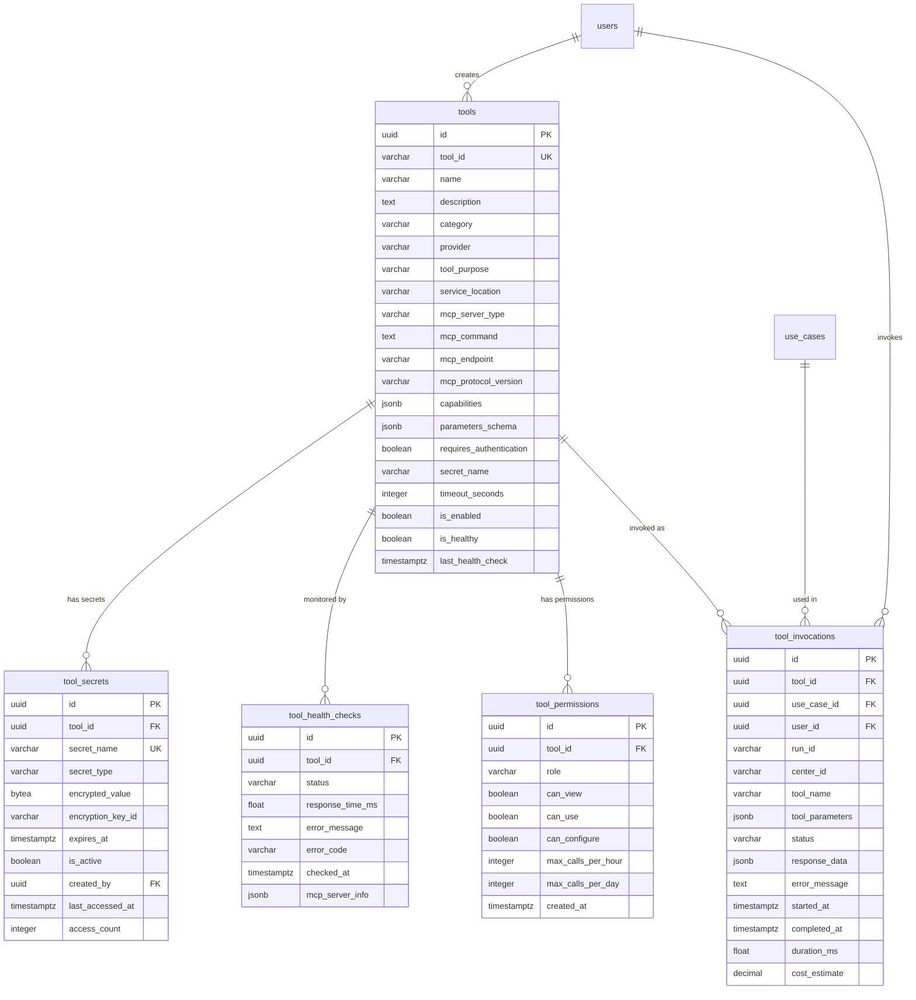

**Key Relationships:**

- Tools have encrypted secrets (1:N)
- Tools have role-based permissions (1:N)
- Tools have health check history (1:N)
- Tool invocations track usage (1:N) and link to users and use cases

---

## Model Registry & Pricing Domain

### Mermaid ER Diagram

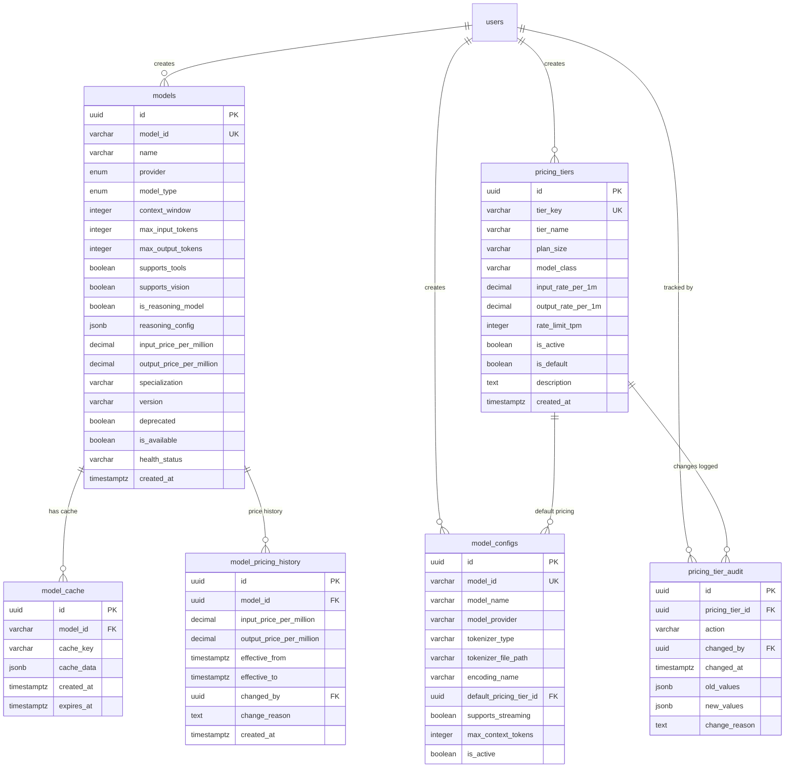

**Key Relationships:**

- Models have metadata cache entries (1:N)
- Model configs reference pricing tiers (N:1)
- Pricing tier changes fully audited (1:N)
- Users create and update all registry entries

---

## Intent System Domain

### Mermaid ER Diagram

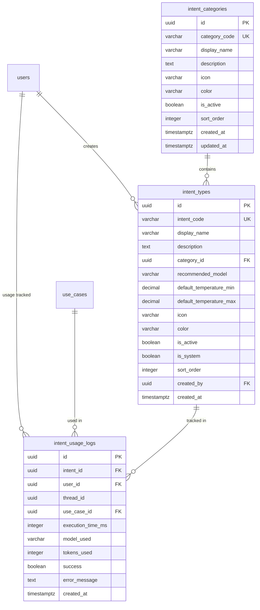

**Key Relationships:**

- Intent types organized into categories (N:1)
- Usage logs track all intent invocations (1:N)
- System intents (is_system=TRUE) cannot be deleted

**Important Note (ADR-041):**

- ⚠️ Intent Types are **NOT** permission boundaries
- ✅ Intent Types are **configuration presets** (sampling parameters, model recommendations)
- ✅ Permissions managed at **Use Case** level via `role_use_case_assignments`

---

## Security & Audit Domain

### Mermaid ER Diagram

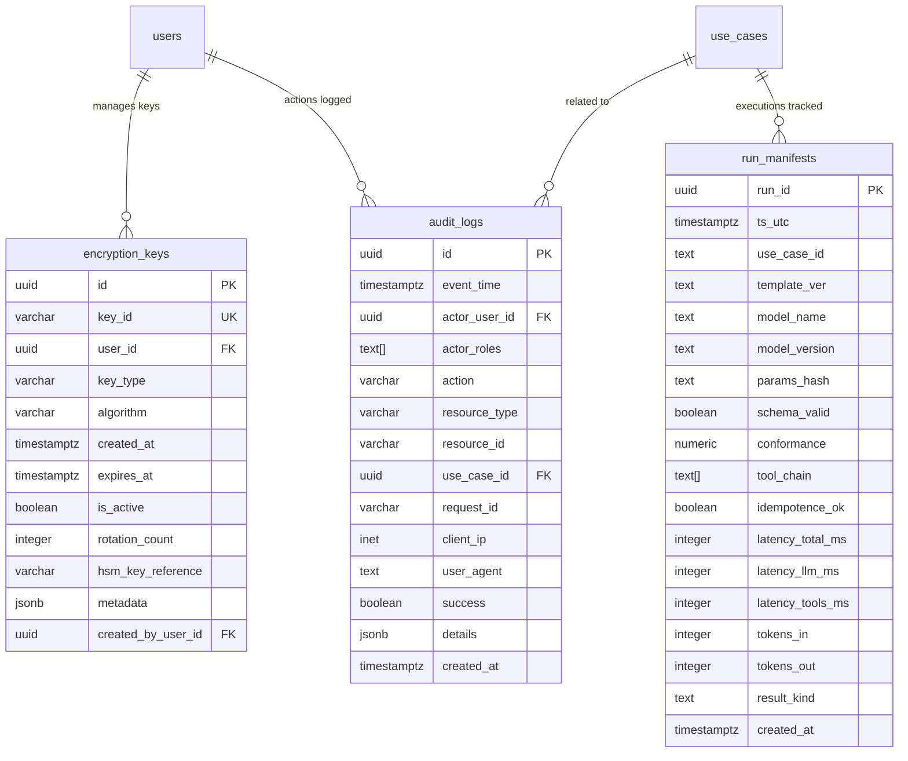

**Key Relationships:**

- Encryption keys managed per user (1:N)
- Audit logs track all security-sensitive operations (1:N)
- Audit logs reference users and use cases
- Run manifests are PII-free telemetry (ADR-004)

---

## Complete Database ER Diagram

### Mermaid: All Tables with Full Relationships

```mermaid
erDiagram
    %% ===== AUTHENTICATION =====
    users ||--o{ refresh_tokens : sessions
    users ||--o{ user_roles : "has roles"
    users ||--o{ user_roles : "grants roles"

    %% ===== SYSTEM CONFIGURATION =====
    users ||--o{ system_config : "last updated by"

    %% ===== USE CASE SYSTEM =====
    users ||--o{ use_cases : creates
    users ||--o{ use_cases : approves
    users ||--o{ use_cases : publishes
    users ||--o{ prompt_templates : creates
    users ||--o{ user_roles : "has roles"
    users ||--o{ user_use_case_assignments : "assigned to"
    user_roles ||--o{ role_use_case_assignments : "role access"
    intent_types ||--o{ use_cases : "type of (VARCHAR ref)"
    use_cases ||--o{ prompt_templates : "has templates"
    use_cases ||--o{ user_use_case_assignments : "direct assignments"
    use_cases ||--o{ role_use_case_assignments : "role assignments"

    %% ===== DOCUMENTS =====
    collections ||--o{ documents : "organizes"
    documents ||--o{ usage_stats : "tracked in"

    %% ===== QUERY HISTORY & THREADING =====
    users ||--o{ query_history : executes
    users ||--o{ context_threads : owns
    use_cases ||--o{ query_history : "used in"
    query_history ||--o{ query_history : "forks from"
    query_history ||--o{ thread_messages : "message ref"
    context_threads ||--o{ thread_messages : contains
    context_threads ||--o| query_history : "first query"
    context_threads ||--o| query_history : "last query"

    %% ===== TOKEN TRACKING =====
    users ||--o{ token_usage : "tracked for"
    use_cases ||--o{ token_usage : "consumed by"

    %% ===== TOOLS PLATFORM =====
    users ||--o{ tools : creates
    users ||--o{ tool_secrets : creates
    users ||--o{ tool_permissions : creates
    users ||--o{ tool_invocations : invokes
    use_cases ||--o{ tool_invocations : "used in"
    tools ||--o{ tool_secrets : secrets
    tools ||--o{ tool_health_checks : "health checks"
    tools ||--o{ tool_permissions : permissions
    tools ||--o{ tool_invocations : invocations

    %% ===== MODEL REGISTRY =====
    users ||--o{ models : creates
    users ||--o{ model_configs : creates
    models ||--o{ model_cache : cache
    pricing_tiers ||--o{ model_configs : "pricing for"

    %% ===== PRICING =====
    users ||--o{ pricing_tiers : creates
    users ||--o{ pricing_tier_audit : "changes by"
    pricing_tiers ||--o{ pricing_tier_audit : "changes logged"

    %% ===== INTENT SYSTEM =====
    users ||--o{ intent_types : creates
    users ||--o{ intent_usage_logs : "usage tracked"
    use_cases ||--o{ intent_usage_logs : "used in"
    intent_categories ||--o{ intent_types : contains
    intent_types ||--o{ intent_usage_logs : "tracked in"

    %% ===== SECURITY & AUDIT =====
    users ||--o{ encryption_keys : "manages keys"
    users ||--o{ audit_logs : "actions logged"
    use_cases ||--o{ audit_logs : "related to"
    use_cases ||--o{ run_manifests : "executions"

    %% ===== KEY TABLES (simplified attributes) =====
    users {
        uuid id PK
        varchar username UK
        varchar email UK
        varchar role
        varchar center_id
        boolean is_active
    }

    use_cases {
        uuid id PK
        varchar use_case_id UK
        varchar name
        varchar intent_type
        jsonb config_json
        varchar lifecycle_state
        boolean is_active
    }

    query_history {
        uuid id PK
        varchar run_id UK
        uuid user_id FK
        uuid use_case_id FK
        uuid thread_id
        uuid parent_query_id FK
    }

    collections {
        uuid id PK
        varchar name UK
        varchar embedding_model
        boolean is_default
        integer document_count
    }

    documents {
        uuid id PK
        text title
        uuid collection_id FK
        text[] tags
        integer num_chunks
    }

    tools {
        uuid id PK
        varchar tool_id UK
        varchar mcp_server_type
        boolean is_enabled
    }

    models {
        uuid id PK
        varchar model_id UK
        enum provider
        enum model_type
    }

    pricing_tiers {
        uuid id PK
        varchar tier_key UK
        decimal input_rate_per_1m
        integer rate_limit_tpm
    }

    intent_types {
        uuid id PK
        varchar intent_code UK
        uuid category_id FK
        boolean is_system
    }
```

---

## Cardinality Summary

| Relationship | Cardinality | Description |
|--------------|-------------|-------------|
| users → refresh_tokens | 1:N | User sessions |
| users → user_roles | 1:N | Multi-role support |
| users → system_config | 1:N | Config updates (tracked) |
| users → use_cases | 1:N | Created by |
| users ↔ use_cases | N:M | Via user_use_case_assignments |
| **intent_types → use_cases** | **1:N** | **Type classification (VARCHAR ref, not FK)** ⭐ |
| use_cases → prompt_templates | 1:N | Template versions |
| use_cases → query_history | 1:N | Executed queries |
| **collections → documents** | **1:N** | **Document organization with embedding model binding** ⭐ |
| documents → usage_stats | 1:N | Retrieval events |
| query_history → query_history | 1:N | Forking (self-ref) |
| query_history → thread_messages | 1:N | Thread participation |
| context_threads → thread_messages | 1:N | Message sequence |
| tools → tool_secrets | 1:N | Encrypted credentials |
| tools → tool_invocations | 1:N | Usage history |
| models → model_cache | 1:N | Metadata cache |
| pricing_tiers → model_configs | 1:N | Default pricing |
| intent_categories → intent_types | 1:N | Type grouping |

---

## Cascade Behavior

### ON DELETE CASCADE (Data removed with parent)

- `users` → `refresh_tokens` - Sessions removed when user deleted
- `users` → `user_roles` - Roles removed when user deleted
- `users` → `query_history` - Queries removed when user deleted
- `users` → `token_usage` - Token history removed when user deleted
- `use_cases` → `user_use_case_assignments` - Direct assignments removed with use case
- `use_cases` → `role_use_case_assignments` - Role assignments removed with use case
- `context_threads` → `thread_messages` - Messages removed with thread
- `tools` → `tool_secrets` - Secrets removed with tool
- `tools` → `tool_health_checks` - Health history removed with tool
- `intent_categories` → `intent_types` - Types removed with category

### ON DELETE RESTRICT (Cannot delete parent while children exist)

- `collections` → `documents.collection_id` - **Cannot delete collection with documents** (ADR-021)
  - Must move or delete all documents first before deleting collection
  - Protects against accidental data loss
  - System-managed collections (`is_system_managed=TRUE`) have additional protection

### ON DELETE SET NULL (Orphaned but preserved)

- `users` → `system_config.updated_by` - Config preserved, user reference nulled (audit trail)
- `use_cases` → `prompt_templates.use_case_id` - Template orphaned but kept
- `use_cases` → `query_history.use_case_id` - Query kept, use case reference nulled
- `documents` → `usage_stats.document_id` - Stats kept, document reference nulled
- `query_history` → `query_history.parent_query_id` - Fork chain broken gracefully
- `query_history` → `context_threads.first_query_id` - Thread kept, reference nulled
- `query_history` → `context_threads.last_query_id` - Thread kept, reference nulled

---

## Database Normalization

**Normal Form:** 3NF (Third Normal Form)

**Design Decisions:**

- **JSONB for flexibility** - `config_json`, `metadata` columns denormalized for configurability (ADR-002)
- **Audit columns** - created_at, updated_at, created_by on most tables
- **UUIDs everywhere** - Distributed-friendly, non-sequential (ADR-001)
- **Array types** - tags[], chunk_ids[], tool_chain[], actor_roles[] for lists
- **No junction tables for simple lists** - Use PostgreSQL arrays where appropriate

**Denormalization (Performance Optimization):**

- `use_case_name` duplicated in `query_history` and `token_usage`
- `center_id` duplicated across user-linked tables for multi-tenant filtering
- `intent_type` duplicated in `query_history` and `token_usage`
- `role_name` in `role_use_case_assignments` references `user_roles.role` (not FK for flexibility - ADR-041)
- `embedding_model`, `embedding_provider`, `embedding_dimensions` duplicated in `documents` (matches `collections`)
- `document_count` cached in `collections` (maintained by trigger)

These redundant fields avoid expensive joins in high-frequency query paths.

---

## Legend

### Mermaid Notation

- `||--o{` - One to many (one parent, many children)
- `||--||` - One to one
- `}o--o{` - Many to many
- `PK` - Primary Key
- `FK` - Foreign Key
- `UK` - Unique Key

### Cardinality Symbols

- `1` - Exactly one
- `0..1` - Zero or one (optional)
- `1..N` - One or many
- `0..N` - Zero or many

---

## Special Relationships

### Collections ⭐ Embedding Model Binding

**Relationship:** `collections` (1) → (N) `documents` with embedding model enforcement

```sql
-- Collections table with immutable embedding model
CREATE TABLE collections (
    id UUID PRIMARY KEY,
    name VARCHAR(255) UNIQUE NOT NULL,
    embedding_model VARCHAR(255) NOT NULL,      -- IMMUTABLE after creation
    embedding_provider VARCHAR(100) NOT NULL,    -- IMMUTABLE after creation
    embedding_dimensions INTEGER NOT NULL,       -- IMMUTABLE after creation
    qdrant_collection_name VARCHAR(255) UNIQUE NOT NULL,
    is_default BOOLEAN DEFAULT FALSE,
    is_system_managed BOOLEAN DEFAULT FALSE,
    document_count INTEGER DEFAULT 0,            -- Maintained by trigger
    ...

);

-- Documents must belong to a collection
CREATE TABLE documents (
    id UUID PRIMARY KEY,
    collection_id UUID NOT NULL REFERENCES collections(id) ON DELETE RESTRICT,

    embedding_model TEXT,                        -- Should match collection
    embedding_provider TEXT,                     -- Should match collection
    embedding_dimensions INTEGER,                -- Should match collection
    ...
);
```

**Key Constraints:**

1. **Foreign Key with RESTRICT** - Cannot delete collection with documents
2. **Unique Default** - Only one collection can have `is_default=TRUE`
3. **Immutable Embedding Model** - Collection's embedding model cannot be changed after creation
4. **Document Count Trigger** - Automatically maintained on INSERT/UPDATE/DELETE

**Design Rationale (ADR-021):**

- ✅ **Vector Space Consistency** - Query embeddings must match document embeddings
- ✅ **Semantic Search Correctness** - Cosine similarity only works within same vector space
- ✅ **Prevents Accidental Mismatches** - Embedding model enforced at collection level
- ✅ **Supports Multiple Embedding Models** - Different collections can use different models

**Query Pattern:**

```sql
-- Get collection with document count
SELECT

    c.*,
    c.document_count,  -- Cached value
    COUNT(d.id) AS actual_count  -- Verification
FROM collections c
LEFT JOIN documents d ON d.collection_id = c.id
GROUP BY c.id;

-- Find documents in a specific collection
SELECT d.*
FROM documents d
JOIN collections c ON d.collection_id = c.id
WHERE c.name = 'threat-intel'
  AND c.is_active = TRUE
  AND d.status != 'deleted';
```

**Validation Example:**

```sql
-- Application-level validation: Ensure document's embedding model matches collection
CREATE OR REPLACE FUNCTION validate_document_embedding_model()
RETURNS TRIGGER AS $$
BEGIN
    IF EXISTS (
        SELECT 1 FROM collections
        WHERE id = NEW.collection_id
          AND (
              embedding_model != NEW.embedding_model
              OR embedding_provider != NEW.embedding_provider
              OR embedding_dimensions != NEW.embedding_dimensions
          )
    ) THEN
        RAISE EXCEPTION 'Document embedding model must match collection embedding model';
    END IF;
    RETURN NEW;
END;
$$ LANGUAGE plpgsql;

-- Note: Currently handled at application layer, not database trigger
```

---

## Logical Relationships (Non-FK References)

### Intent Types ⭐ Soft Reference

The database contains an important **logical relationship** that is intentionally NOT enforced by a foreign key:

```sql
-- use_cases.intent_type references intent_types.intent_code
-- but NO FK constraint exists

CREATE TABLE use_cases (
    ...
    intent_type VARCHAR(50) NOT NULL,  -- References intent_types.intent_code
    ...
);

CREATE TABLE intent_types (
    ...
    intent_code VARCHAR(50) UNIQUE NOT NULL,  -- Referenced by use_cases.intent_type

    ...
);

-- This FK constraint is intentionally COMMENTED OUT:
-- ALTER TABLE use_cases
--     ADD CONSTRAINT ck_use_cases_valid_intent_type

--     CHECK (
--         intent_type IN (
--             SELECT intent_code FROM intent_types WHERE is_active = TRUE
--         )
--     );

```

### Why No Foreign Key?

**Design Decision:** Flexibility over referential integrity

**Advantages:**

1. **Backward Compatibility** - Existing use cases with hardcoded intent types (QUERY, RULE_GENERATION, etc.) don't break
2. **Forward Compatibility** - New intent types can be added without migrating existing use cases
3. **Flexibility** - Use cases can reference intent types before they're registered
4. **No Migration Coupling** - Intent system can evolve independently

**Trade-offs:**

1. ❌ **No referential integrity** - Orphaned references possible
2. ❌ **No CASCADE behavior** - Deleting intent type doesn't affect use cases
3. ❌ **Application validation required** - Must validate intent_type exists

**Mitigation:**

- Application layer validates intent_type on use case creation
- Index on `use_cases.intent_type` enables fast lookups
- Can add CHECK constraint later if needed (commented out for now)

**Query Pattern:**

```sql
-- Find use cases by intent type (works even without FK)
SELECT uc.*
FROM use_cases uc
JOIN intent_types it ON uc.intent_type = it.intent_code
WHERE it.intent_code = 'QUERY';

-- Optimized by: idx_use_cases_intent (intent_type, lifecycle_state)
```

### Verification Query

```sql
-- Find use cases with invalid intent_type references
SELECT
    uc.use_case_id,
    uc.intent_type,
    CASE
        WHEN it.intent_code IS NULL THEN 'ORPHANED'
        ELSE 'VALID'
    END AS status
FROM use_cases uc
LEFT JOIN intent_types it ON uc.intent_type = it.intent_code
WHERE it.intent_code IS NULL;

-- Should return zero rows in healthy database
```

### Future Considerations

If strict referential integrity is needed:

```sql
-- Option 1: Add CHECK constraint (validates on insert/update)
ALTER TABLE use_cases
ADD CONSTRAINT ck_use_cases_valid_intent_type
    intent_type IN (
        SELECT intent_code FROM intent_types WHERE is_active = TRUE
    )
);

-- Option 2: Add proper FK (requires migration of existing data)
-- 1. Ensure all use_cases.intent_type values exist in intent_types.intent_code
-- 2. Then add FK:
ALTER TABLE use_cases
ADD CONSTRAINT fk_use_cases_intent_type
FOREIGN KEY (intent_type) REFERENCES intent_types(intent_code)
ON DELETE RESTRICT;  -- Prevent deleting intent types in use
```

**Recommendation:** Keep as VARCHAR reference for now (pre-release flexibility), add constraint post-release if needed.

---

## Role-Based Use Case Permissions ⭐ ADR-041

**Relationship:** `user_roles` (N) ← (M) → `role_use_case_assignments` → (N) `use_cases`

### Architecture

**Correct Permission Model (ADR-041):**

```
User → Role → [role_use_case_assignments] → Use Case → Intent Type (presets)
     ↘ [user_use_case_assignments] → Use Case (direct overrides)
```

### Database Schema

```sql
-- User role memberships (supports custom roles)
CREATE TABLE user_roles (
    id UUID PRIMARY KEY,
    user_id UUID NOT NULL REFERENCES users(id),
    role TEXT NOT NULL,
    -- No CHECK constraint - allows custom roles: legal_counsel, threat_hunter, etc.
    UNIQUE(user_id, role)
);

-- Role-based use case assignments
CREATE TABLE role_use_case_assignments (
    id UUID PRIMARY KEY,
    role_name VARCHAR(50) NOT NULL,
    use_case_id UUID NOT NULL REFERENCES use_cases(id),
    granted_by UUID REFERENCES users(id),
    granted_at TIMESTAMPTZ NOT NULL,
    expires_at TIMESTAMPTZ,
    is_active BOOLEAN DEFAULT TRUE,
    -- No CHECK constraint - allows custom roles
    UNIQUE(role_name, use_case_id)
);
```

### Access Resolution Priority

1. **Admin Override** - Admin role always has full access (bypasses checks)
2. **Direct Assignment** - `user_use_case_assignments` (individual exceptions)
3. **Role Assignment** - `role_use_case_assignments` (inherited from role)
4. **Default** - No access

### Custom Roles Support

**Predefined Roles:**

- `admin`, `developer`, `analyst`, `corpus_admin`, `user`, `service`

**Custom Roles (Examples):**

- `legal_counsel` - Legal department
- `hr_manager` - HR department
- `threat_hunter` - Advanced SOC analysts
- `soc_tier1/2/3` - Tiered access
- Any role matching: `^[a-z][a-z0-9_-]{1,49}$`

### Query Pattern

```sql
-- Get all use cases accessible to a user
WITH user_role_names AS (
    SELECT role FROM user_roles WHERE user_id = '<user-uuid>'
)
SELECT DISTINCT uc.*
FROM use_cases uc
WHERE uc.id IN (
    -- Direct user assignments
    SELECT use_case_id FROM user_use_case_assignments
    WHERE user_id = '<user-uuid>' AND status = 'active'
    UNION
    -- Role-based assignments
    SELECT use_case_id FROM role_use_case_assignments
    WHERE role_name IN (SELECT role FROM user_role_names)
      AND is_active = TRUE
      AND (expires_at IS NULL OR expires_at > NOW())
);

-- Optimized by:
-- idx_role_use_case_assignments_role (role_name, is_active)
-- idx_role_use_case_assignments_use_case (use_case_id, is_active)
```

### Example Usage

**Create Custom Role & Assign Use Cases:**

```sql
-- Step 1: Create role membership
INSERT INTO user_roles (user_id, role)
SELECT id, 'threat_hunter'
FROM users
WHERE username IN ('alice', 'bob');

-- Step 2: Assign use cases to role
INSERT INTO role_use_case_assignments (role_name, use_case_id)
SELECT 'threat_hunter', id
FROM use_cases
WHERE intent_type = 'ENRICHMENT'
  AND lifecycle_state = 'published';

-- Step 3: Users automatically inherit access
-- Alice and Bob can now execute all ENRICHMENT use cases
```

### Design Rationale (ADR-041)

✅ **Correct Architectural Layering**

- Use Cases are permission boundaries (what users can execute)
- Intent Types are presets (configuration defaults)

✅ **Scalable**

- Assign 10 use cases to "analyst" role → All analysts inherit access
- No need to assign each user individually

✅ **Flexible**

- Role-based (standard)
- Direct user overrides (exceptions)
- Time-limited access (expires_at)
- Custom roles (legal, HR, compliance, etc.)

✅ **Multi-Department Support**

- Security: `analyst`, `threat_hunter`, `soc_tier1/2/3`
- Legal: `legal_counsel`, `contract_reviewer`
- HR: `hr_manager`, `recruiter`
- Compliance: `compliance_officer`, `audit_reviewer`

---

**Last Updated:** 2025-10-27
**Maintainer:** AI Operations Platform Team
