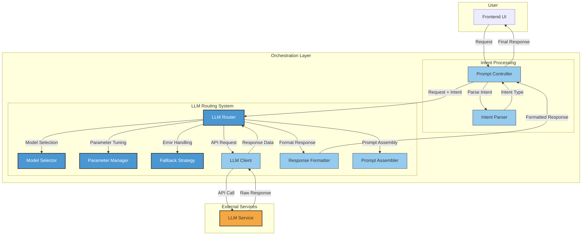
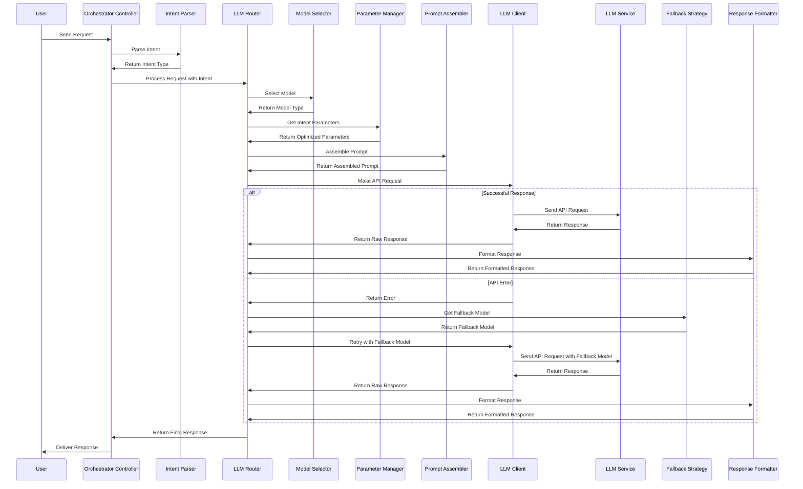
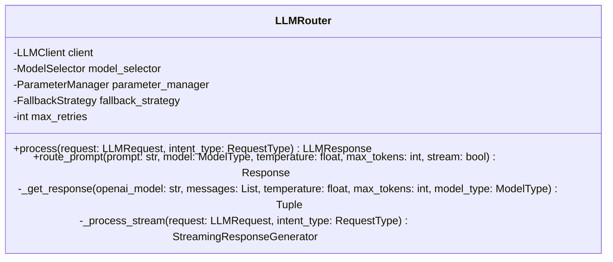
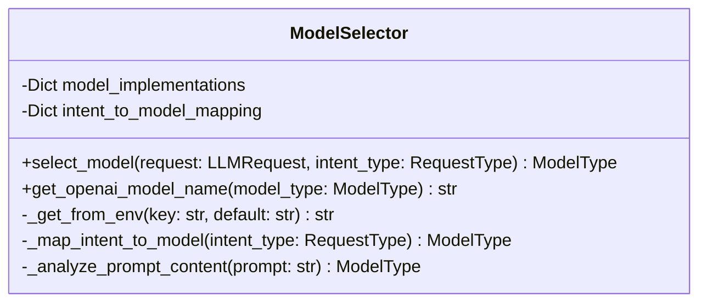
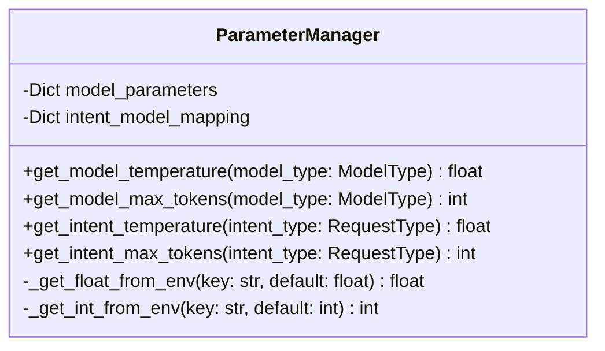
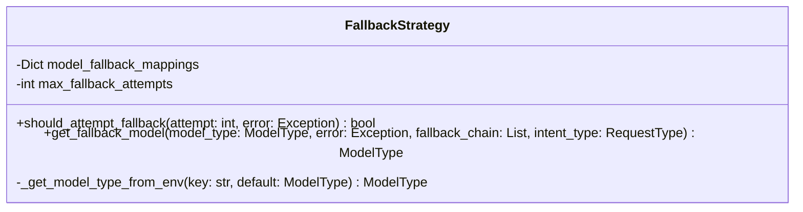

# Intent-Based Routing Component Architecture

**Status:** 🟢 Active
**Last Updated:** 2025-10-12
**Related:** [ADR-016 Dynamic Intent System](../development/adrs/ADR-016-Dynamic-Intent-System.md)

This document provides detailed component diagrams showing the modular architecture of the intent-based LLM routing system.

**Evolution Note:** This architecture currently uses hardcoded intent types (QUERY, RULE_GENERATION, SUMMARIZATION, ENRICHMENT). The system is evolving to support dynamic, database-backed intent types while maintaining this component structure. See [OPTIMAL_IMPLEMENTATION_SEQUENCE.md](../development/plans/OPTIMAL_IMPLEMENTATION_SEQUENCE.md) for implementation details.

## High-Level Component Architecture

The diagram below shows the main components of the intent-based routing system and their relationships:

## Component Interactions

The following sequence diagram shows the interactions between components for a typical request:

## Component Details

### LLM Router

The central coordinator that manages the request flow through all components.

### Model Selector

Determines the optimal model based on intent type and request characteristics.

### Parameter Manager

Applies intent-specific parameters like temperature and token limits.

### Fallback Strategy

Implements error recovery by selecting appropriate fallback models.

## Implementation Patterns

The intent-based routing system uses the following design patterns:

1. **Strategy Pattern**: Different components implement different strategies for model selection, parameter tuning, and fallback handling
2. **Dependency Injection**: Components receive their dependencies through constructor parameters
3. **Factory Pattern**: The LLMRouter acts as a factory that creates and manages all other components
4. **Chain of Responsibility**: Requests flow through a chain of components that each handle a specific aspect of processing
5. **Adapter Pattern**: The LLMClient adapts the external LLM API to the internal system requirements
