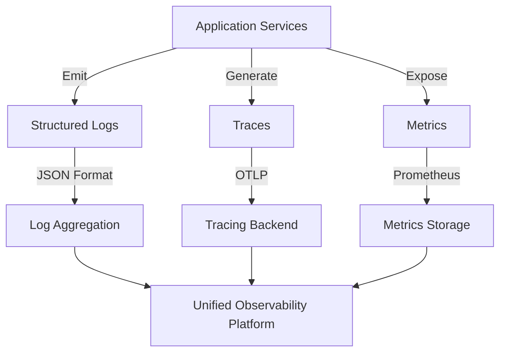

# Observability Patterns in AI Operations Platform

## Overview

AI Operations Platform implements a comprehensive observability strategy across its microservices architecture, using structured logging, distributed tracing, and metrics collection. This document outlines the observability patterns used throughout the system, focusing on how they're implemented independently in each service.

## Observability Components



## Logging Implementation

### Structured JSON Logging

Each service implements structured JSON logging independently:

1. **JSON Formatting**: All logs are emitted in a consistent JSON format
2. **Request ID Tracking**: Request IDs are propagated across service boundaries
3. **Contextual Information**: Logs include service name, timestamp, level, and relevant context
4. **Exception Handling**: Error logs include full exception details

### Key Components in `logging.py`

#### JSONFormatter

```python
class JSONFormatter(logging.Formatter):
    """Format logs as structured JSON objects with consistent fields."""

    def format(self, record: logging.LogRecord) -> str:
        """Convert log record to a structured JSON string."""
        # Builds a consistent JSON structure with standard and custom fields
```

#### RequestIDFilter

```python
class RequestIDFilter(logging.Filter):
    """Add request_id attribute to log records."""

    def filter(self, record: logging.LogRecord) -> bool:
        """Add the request_id attribute to the log record."""
        # Ensures each log entry has a request ID for correlation
```

#### RequestIDLoggerMiddleware

```python
def RequestIDLoggerMiddleware(app):
    """Extract request_id from headers and attach it to logs."""
    # ASGI middleware to propagate request IDs from HTTP headers to logs
```

### Usage Example

```python
# Service startup
configure_logging("service-name", log_level="INFO")

# In application code
logger = logging.getLogger(__name__)
logger.info("Processing request", extra={"user_id": user_id, "action": action})
```

## Distributed Tracing

### OpenTelemetry Integration

Each service implements OpenTelemetry independently using the `telemetry.py` module:

1. **Tracer Provider**: Configures a tracer provider with service information
2. **Instrumentors**: Automatically traces FastAPI, SQLAlchemy, and HTTP requests
3. **Span Processors**: Configures batch processors for efficient transmission
4. **OTLP Exporter**: Exports traces to a configurable endpoint

### Key Components in `telemetry.py`

```python
def setup_telemetry(
    app: FastAPI,
    service_name: str,
    otlp_endpoint: Optional[str] = None,
    sqlalchemy_engine=None,
):
    """Configure OpenTelemetry for the application."""
    # Sets up tracer provider, exporters, and instrumentors

def get_tracer(name: str):
    """Get a tracer for the specified name."""
    # Returns a named tracer for creating spans in custom code
```

### Usage Example

```python
# Service startup
telemetry.setup_telemetry(
    app=app,
    service_name="embedding-service",
    otlp_endpoint="http://otel-collector:4317",
    sqlalchemy_engine=engine
)

# In application code
tracer = telemetry.get_tracer("document_processor")
with tracer.start_as_current_span("process_document") as span:
    span.set_attribute("document.id", document_id)
    span.set_attribute("document.size", len(document))
    # Processing logic...
```

## Automatic Instrumentation

The following components are automatically instrumented:

1. **FastAPI Applications**: All HTTP requests, responses, and exceptions
2. **HTTP Clients**: Outgoing HTTP requests via the requests library
3. **SQLAlchemy Database**: Database queries and transactions

## Request ID Propagation

A critical aspect of the observability strategy is request ID propagation:

1. **Generation**: New request IDs are generated for each incoming request if not present
2. **Extraction**: Existing request IDs are extracted from the `X-Request-ID` header
3. **Propagation**: The request ID is included in all logs related to the request
4. **Outgoing Requests**: Services include the request ID in outgoing HTTP requests

This enables tracking a single request as it flows through multiple services.

### Audit Trail Integration

Phase 1 introduced persistent audit logging inside the backend middleware stack.
The pipeline order is now `RequestIDLoggerMiddleware → sanitize_request → audit_middleware → security_headers_middleware`.
This ensures that:

- Every HTTP interaction emits structured JSON logs containing the propagated request ID
  plus request duration metadata.
- The audit middleware persists immutable records in the `audit_logs` table with
  columns for request ID, actor roles, client IP, user agent, status, and latency.
- Existing `X-Request-ID` headers supplied by upstream systems are honoured,
  enabling correlation with external telemetry solutions.

The audit records provide the foundation for SOC-grade observability and satisfy
the governance requirements documented in the UI Development Plan Phase 1 security
guardrails.

## Configuration

Observability components are configured through environment variables:

- `LOG_LEVEL`: Controls the verbosity of logging (default: INFO)
- `OTEL_EXPORTER_OTLP_ENDPOINT`: The endpoint for exporting telemetry data
- `DISABLE_TELEMETRY`: If set to "true", disables OpenTelemetry integration

## Service-Specific Considerations

### Embedding Service

- Includes model loading and inference time in traces
- Logs embedding dimensions and model information
- Captures batch processing metrics

### Retrieval Service

- Traces Qdrant vector search operations
- Logs document metadata during retrieval
- Measures search latency and result counts

## Health Checks and Monitoring

Each service exposes a `/health` endpoint that reports:

- Service status
- Database connectivity (where applicable)
- Version information

This endpoint can be used by monitoring systems to verify service health.

## Best Practices

1. **Consistent Service Names**: Use consistent service names across logging and tracing
2. **Contextual Logging**: Include relevant business context in logs (user IDs, document IDs)
3. **Appropriate Log Levels**: Use appropriate log levels (ERROR, WARNING, INFO, DEBUG)
4. **Custom Spans**: Create custom spans for important operations
5. **Error Tracking**: Include full exception details in error logs
6. **Performance Metrics**: Log performance-sensitive operations with timing information

## Future Enhancements

1. **Metrics Collection**: Adding Prometheus metrics endpoints to all services
2. **Log Aggregation**: Implementing a centralized logging solution (ELK, Loki)
3. **Trace Sampling**: Implementing intelligent trace sampling strategies
4. **Custom Dashboards**: Creating service-specific observability dashboards
5. **Alerting**: Setting up alerts based on errors and performance metrics

## Conclusion

The observability strategy in AI Operations Platform provides comprehensive visibility into service behavior while maintaining service independence. By implementing structured logging, distributed tracing, and consistent request ID propagation in each service, we achieve a balanced approach to observability across the system.
