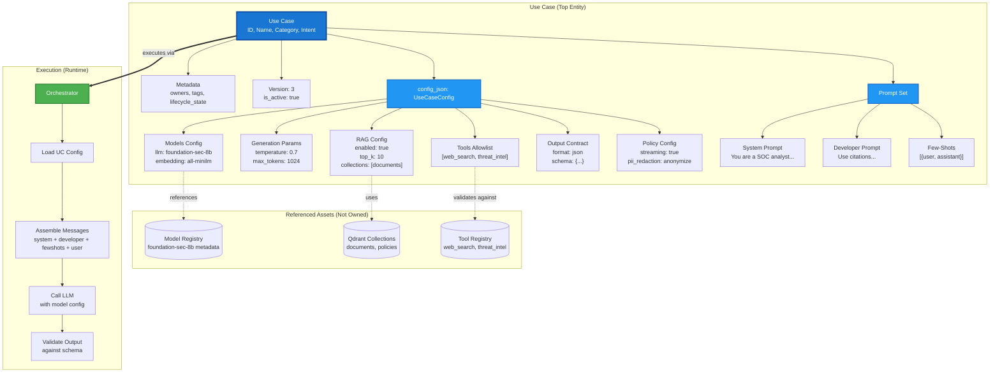

## Context

The AI Operations Platform application is built around a **Use-Case-Driven architecture** where templates define complete operational workflows. We need to clarify the ownership model and ensure Use Cases remain the top-level, self-contained entity.

**Key Questions:**
- What does a Use Case own vs. reference?
- Should prompts/configs be separate reusable templates or UC-specific?
- How do patterns/blueprints fit into the creation workflow?

## Decision

**Use Case is the sovereign entity that OWNS all its configuration:**

1. **Use Case Structure:**
   - Each UC owns its prompts (system, developer, fewshots)
   - Each UC owns its complete config (model, RAG, tools, policies)
   - Each UC can be versioned as a complete snapshot
   - UCs reference but don't own external assets (models, collections, tools)

2. **Prompt Patterns = Starter Templates (Not Runtime):**
   - Patterns are read-only library entries
   - Used during UC creation to pre-fill prompts
   - After creation, prompts are owned by UC (no live references)
   - Users can freely edit prompts after pattern application

3. **Multi-Role Prompt Support:**
   - System prompt (user-visible persona)
   - Developer prompt (hidden instructions: citations, format, guardrails)
   - Few-shots (optional example pairs)

4. **No Separate Template Entities:**
   - No shared "Model Templates"
   - No shared "Prompt Templates"
   - Reuse via cloning UCs, not shared references

## Architecture Diagram



## Rationale

**Why UC Owns Everything:**
- **Tight Coupling:** Prompts are tuned for specific model + RAG + tool combinations
- **Versioning:** UC versions capture complete snapshot (prompts + config together)
- **Testability:** Each UC+config combination is independently testable
- **Clarity:** Developers think "What should this UC do?" not "Which template should I use?"
- **Encapsulation:** Changes to one UC don't affect others

**Why Patterns as Read-Only Library:**
- **Best Practices:** Curated from [promptingguide.ai](https://www.promptingguide.ai/)
- **Learning Aid:** Developers see proven techniques
- **Simplicity:** No complex merging, versioning, or dependency tracking
- **Flexibility:** Users can edit freely after pattern application

**Why Multi-Role Prompts:**
- **Industry Standard:** Aligns with GPT-4, Claude, etc. best practices
- **Separation of Concerns:** Public persona vs. hidden instructions
- **Citation Support:** Developer prompt enforces format without user confusion
- **Few-Shot Learning:** Proven technique from prompt engineering research

## Consequences

### Positive
- ✅ Clear ownership model (UC owns everything)
- ✅ Simple mental model (no template dependency tracking)
- ✅ Easy versioning (snapshot entire UC)
- ✅ Independent testing per UC
- ✅ Pattern library guides best practices

### Trade-offs
- ⚠️ Prompt reuse requires cloning UCs (not shared references)
- ⚠️ Updates to "best practice" require manual propagation
- ⚠️ Larger storage (each UC stores full config vs. references)

### Mitigations
- Clone UC feature for easy reuse
- Pattern library updated regularly with new techniques
- Config stored in JSONB (efficient compression)

## Implementation Notes

### Database Changes Required
```sql
-- Rename for clarity
ALTER TABLE prompt_templates RENAME TO use_case_prompts;

-- Add multi-role support
ALTER TABLE use_case_prompts
  ADD COLUMN system_prompt TEXT,
  ADD COLUMN developer_prompt TEXT,
  ADD COLUMN fewshots JSONB DEFAULT '[]'::jsonb;

-- Create pattern library
CREATE TABLE prompt_patterns (
    id UUID PRIMARY KEY,
    pattern_id VARCHAR(100) UNIQUE,
    name VARCHAR(255),
    category VARCHAR(100),
    description TEXT,
    system_prompt_template TEXT,
    developer_prompt_template TEXT,
    fewshots_template JSONB,
    source_url VARCHAR(500),
    tags JSONB,
    created_at TIMESTAMPTZ DEFAULT NOW()
);
```

### Orchestrator Changes
Update message assembly to support multi-role prompts (see implementation plan).

## Deferred to Later Versions

- **v2:** Separate `use_case_versions` table (use version field + snapshots for now)
- **v3+:** Prompt linter (manual review sufficient at current scale)
- **Never:** Referenced/shared prompt templates (violates ownership model)

## References

- [Prompt Engineering Guide](https://www.promptingguide.ai/) - Pattern library source
- Current implementation: `src/orchestrator/app/orchestrator/controller.py:831`
- UseCaseConfig schema: `src/orchestrator/app/schemas/use_case_config.py:154`

## ADR Linkage

- Supersedes: ADR-017 (brainstorming version, not implemented)
- Related: ADR-012 (Use Case lifecycle), ADR-014 (UC ownership & RBAC)
