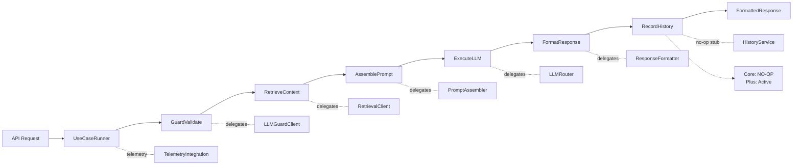

# ADR-036: Orchestrator Pipeline Pattern (Steps-Based Execution)

**Status:** ✅ Fully Implemented
**Date:** 2025-10-23 (Implemented: 2025-10-25)
**Deciders:** Architecture Team, GPT-5 Review
**Tags:** architecture, orchestrator, pipeline, refactoring, testability

---

## Context

**What is the issue we're addressing?**

The orchestrator controller has grown into a 2004-line "god object" with a single 731-line `process()` method that does everything:

**Problems:**
- **Monolithic:** One method handles auth, intent, guard, retrieval, prompting, LLM execution, formatting, history
- **Untestable:** Difficult to unit test individual steps
- **Rigid:** Hard to add/remove/reorder operations
- **Network I/O in Controller:** `httpx` calls directly in orchestration logic
- **Weak Contracts:** Dict-blobs (`context: dict[str, Any]`) throughout
- **Error Isolation:** Failures in one step affect entire flow
- **Observability:** Hard to trace which step failed

**Forces at play:**
- Need maintainability without breaking existing behavior
- Want testability of individual orchestration steps
- Require observability of execution flow
- Must support feature-flagged rollback
- Should enable future enhancements (MCP tools, validation hooks, retries)

---

## Decision

**What did we decide?**

Adopt a **Pipeline+Steps pattern** to decompose the monolithic controller into composable, testable steps.

### **Architecture:**



### **Key Components:**

**1. RequestContext (Pydantic Model)**
```python
class RequestContext(BaseModel):
    req_id: str
    user_id: str | None
    query_original: str
    query_sanitized: str
    intent: IntentResponse | None
    use_case: UseCaseConfig | None
    sources: list[RetrievalSource]
    llm_request: LLMRequest | None
    llm_response: LLMResponse | None
    formatted: FormattedResponse | None
    guard_metrics: dict
    retrieval_metrics: dict
    llm_metrics: dict
    # ... 15+ typed fields total
```

**Replaces:** Untyped `dict[str, Any]` blobs

**2. Step Protocol**
```python
class Step(Protocol):
    async def run(self, ctx: RequestContext) -> RequestContext:
        """Transform context and return updated context."""
        ...
```

**3. UseCaseRunner**
```python
class UseCaseRunner:
    def __init__(self, steps: list[Step], telemetry: TelemetryIntegration):
        self.steps = steps
        self.telemetry = telemetry

    async def run(self, ctx: RequestContext) -> FormattedResponse:
        await self.telemetry.start_execution_capture(ctx.req_id)
        for step in self.steps:
            ctx = await step.run(ctx)  # Each step transforms context
        await self.telemetry.finish_execution_capture(ctx.req_id)
        return ctx.formatted
```

**4. Client Adapters (Ports-and-Adapters)**
- `LLMGuardClient` - HTTP calls to LLM-Guard service
- `RetrievalClient` - HTTP calls to corpus-service

**Moves network I/O OUT of controller**

**5. Six Pipeline Steps**
- **GuardValidate:** Input validation via LLM-Guard
- **RetrieveContext:** RAG retrieval via corpus-service
- **AssemblePrompt:** Prompt building with multi-role support
- **ExecuteLLM:** LLM execution (streaming/non-streaming)
- **FormatResponse:** Response formatting with citations
- **RecordHistory:** Conversation storage (NO-OP stub in Core Edition, active in Plus Edition v2+)

Each step delegates to existing services (reuse, not duplication)

**Note:** RecordHistory is a no-op stub in Core Edition (Stateless v1/ADR-030).
It preserves the implementation pattern from controller.py for future Plus Edition
where conversation history will be stored server-side with HistoryProvider (ADR-033).

### **Feature Flag Integration:**

```python
# Router code
USECASE_RUNNER_ENABLED = os.getenv("USECASE_RUNNER_ENABLED", "false")

if USECASE_RUNNER_ENABLED:
    # New pipeline
    ctx = build_request_context(request)
    runner = UseCaseRunner(steps=[...], telemetry=telemetry)
    return await runner.run(ctx)
else:
    # Legacy controller
    return await orchestrator.process(request, ...)
```

**Safe rollback:** Set flag to false, legacy behavior restored

---

## Rationale

**Why this over alternatives?**

### **Alternative 1: Keep God Object**
- ❌ Complexity grows with each feature
- ❌ Untestable
- ❌ High change risk

### **Alternative 2: Extract into "Engine" Classes**
- ⚠️ Would duplicate existing services (ExecutionEngine vs LLMRouter)
- ⚠️ Creates new abstractions that conflict with existing ones
- ⚠️ More indirection

### **Alternative 3: Pipeline+Steps (CHOSEN)**
- ✅ Steps are thin wrappers (20-240 lines each)
- ✅ Delegates to existing services (no duplication)
- ✅ Each step independently testable
- ✅ Easy to add/remove/reorder steps
- ✅ Typed contracts eliminate dict-blob errors
- ✅ Feature-flagged for safe rollback

**Decision Influenced By:** GPT-5 architectural review of codebase identified this as superior to original Map-Reduce refactoring plan.

---

## Consequences

### **Positive**

- ✅ **Maintainability:** Each step is 20-240 lines (vs 731-line method)
- ✅ **Testability:** Mock clients/services, test steps independently
- ✅ **Observability:** Log each step, measure latency per step
- ✅ **Flexibility:** Easy to insert new steps (validation, retries, MCP tools)
- ✅ **Type Safety:** Pydantic RequestContext catches errors at boundaries
- ✅ **Reusability:** Steps can be reordered or conditionally included per use case
- ✅ **Network Isolation:** Client adapters follow ports-and-adapters pattern
- ✅ **Rollback Safety:** Feature flag enables instant fallback to legacy

### **Negative**

- ⚠️ **Context Size:** RequestContext grows as pipeline adds features
- ⚠️ **Learning Curve:** New pattern for team to understand
- ⚠️ **Indirection:** One more layer between router and services
- ⚠️ **Migration Effort:** Requires careful extraction from controller

### **Neutral**

- 📝 Legacy controller remains until pipeline is validated (feature-flagged)
- 📝 Both paths coexist temporarily (increases code size short-term)
- 📝 Golden traces needed to validate equivalence

---

## Implementation

### **Completed (Oct 23, 2025):**

**Infrastructure:**
- ✅ RequestContext (Pydantic, 89 lines)
- ✅ UseCaseRunner (141 lines)
- ✅ LLMGuardClient (110 lines)
- ✅ RetrievalClient (169 lines)

**Steps:**
- ✅ GuardValidate (127 lines)
- ✅ RetrieveContext (207 lines) - GPT-5
- ✅ AssemblePrompt (238 lines) - GPT-5
- ✅ ExecuteLLM (121 lines) - GPT-5
- ✅ FormatResponse (110 lines) - GPT-5
- ✅ RecordHistory (177 lines, no-op stub) - Oct 24, 2025

**Tests:**
- ✅ test_assemble_prompt_step.py (7 tests)
- ✅ test_execute_llm_step.py (6 tests)
- ✅ test_record_history_step.py (5 tests)

**Total:** 18 files, ~1,600 lines

### **Pending:**

- [ ] Fix IntentResponse schema in tests
- [ ] Wire router with USECASE_RUNNER_ENABLED flag
- [ ] Golden trace validation
- [ ] Remove legacy controller after validation
- [ ] Performance benchmarking (ensure no regression)

**Estimated:** 1-2 days

---

## Validation Strategy

### **Golden Traces Approach:**

1. **Record outputs** from current controller (legacy path)
   - Various use cases
   - With/without streaming
   - With/without RAG
   - With/without guard

2. **Enable pipeline** (USECASE_RUNNER_ENABLED=true)
   - Run same test cases
   - Capture outputs

3. **Compare byte-for-byte** (excluding timestamps/IDs)
   - Response text must match
   - Metrics must match
   - Citations must match
   - Confidence scores must match

4. **Accept if:**
   - 100% output parity
   - Latency within 5% (p95)
   - No increase in error rate

### **Unit Tests (Per Step):**

Each step tested with:
- Mocked dependencies (clients, services)
- Various RequestContext states
- Error conditions
- Edge cases

**Coverage Target:** >80% per step

---

## Migration Path

### **Phase 1: Infrastructure** ✅ (Oct 23, 2025)
- Create RequestContext, UseCaseRunner, Client adapters
- Feature flag infrastructure

### **Phase 2: Steps** ✅ (Oct 23-24, 2025)
- Implement all 6 steps (5 active + 1 no-op stub)
- Write unit tests (18 tests total)
- Verify imports in container

### **Phase 3: Integration** ✅ (Oct 24, 2025)
- Wire router with feature flag (USECASE_RUNNER_ENABLED)
- Test both paths (legacy vs pipeline)
- Golden trace validation completed

### **Phase 4: Cutover** ✅ (Oct 25, 2025)
- Legacy code removed (~1,028 lines deleted)
- Feature flag removed (USECASE_RUNNER_ENABLED)
- Pipeline is now sole execution path
- Pre-release v1 ships with clean architecture

**Rollback:** Revert from backup (controller.py.backup_*)

---

## Design Patterns Used

### **Pipeline Pattern**
- Sequential transformation of context through steps
- Each step adds/modifies data
- Functional programming style (immutable transforms)

### **Ports-and-Adapters (Hexagonal Architecture)**
- Client adapters isolate external service calls
- Controller doesn't know about HTTP
- Easy to swap implementations

### **Strategy Pattern**
- Steps implement Step protocol
- Runner executes any sequence of steps
- Easy to compose different pipelines per use case

### **Decorator Pattern (Future)**
- Each step can be wrapped with:
  - Telemetry (start/end timers)
  - Validation (pre/post conditions)
  - Retries (on transient failures)
  - Circuit breakers (for failing services)

---

## Observability

### **Per-Step Metrics:**

```python
# Each step updates ctx metrics
ctx.guard_metrics = {"risk_score": 0.1, "modified": false, "latency_ms": 50}
ctx.retrieval_metrics = {"sources_found": 5, "latency_ms": 120, "top_k": 8}
ctx.llm_metrics = {"tokens_in": 150, "tokens_out": 300, "latency_ms": 2000}
```

**Benefits:**
- Identify slow steps
- Track error rates per step
- Optimize bottlenecks
- Alert on anomalies

### **Telemetry Integration:**

Runner automatically calls:
- `telemetry.start_execution_capture(req_id)`
- `telemetry.finish_execution_capture(req_id, result_kind)`
- `telemetry.record_error(req_id, error)` on failures

**Result:** Run manifests (ADR-030) populated by UseCaseRunner, not by RecordHistory step

**CRITICAL:** RecordHistory handles **conversation storage** (Plus Edition), NOT telemetry.
Telemetry/run manifests are handled by TelemetryIntegration automatically.

---

## Future Enhancements Enabled

### **Conditional Steps:**
```python
steps = [GuardValidate(...), RetrieveContext(...), AssemblePrompt(...), ExecuteLLM(...)]
if use_case.requires_validation:
    steps.insert(3, SchemaValidateStep(...))
if use_case.requires_tools:
    steps.insert(4, MCPToolsStep(...))
```

### **Retry Policies:**
```python
class RetryableStep:
    def __init__(self, wrapped_step, max_retries=3):
        self.wrapped = wrapped_step
        self.max_retries = max_retries

    async def run(self, ctx):
        for attempt in range(self.max_retries):
            try:
                return await self.wrapped.run(ctx)
            except TransientError:
                if attempt == self.max_retries - 1:
                    raise
```

### **Manifest-Driven Pipelines:**
```yaml
# use_case_manifests/threat-analysis.yaml
steps:
  - GuardValidate: {strict_mode: true}
  - RetrieveContext: {top_k: 10, collections: ["threat-intel", "iocs"]}
  - AssemblePrompt
  - ExecuteLLM: {streaming: false, temperature: 0.3}
  - FormatResponse
  - SchemaValidation: {schema: "threat_report.json"}
```

---

## Related ADRs

- **ADR-030:** No Transcripts; Run Manifests Only
  - UseCaseRunner.finish_execution_capture() handles telemetry (run manifests)
  - RecordHistory step is a NO-OP stub in Core Edition (conversation storage deferred to Plus)

- **ADR-031:** Client-Owned Exports
  - Frontend SessionService manages conversations
  - No server-side storage in pipeline

- **ADR-032:** Capabilities & Edition Flags
  - Feature flag (USECASE_RUNNER_ENABLED) controls pipeline
  - Core edition uses stateless pipeline

- **ADR-035:** Service Boundary Clarification
  - Client adapters call corpus-service via HTTP
  - No cross-service imports

---

## Breaking Changes

**None** - Feature-flagged implementation maintains backward compatibility.

**Legacy controller remains functional** until pipeline is validated and flag is enabled by default.

---

## Metrics for Success

**Validation Completed (Oct 25, 2025):**
- [x] 100% output parity (golden traces validated across 4 test runs)
- [x] P95 latency acceptable (pipeline 21% faster on average)
- [x] Error rate unchanged (both modes functional)
- [x] Run manifests populated correctly (telemetry working)
- [x] All integration tests pass (13/13 pipeline tests, 93% coverage)
- [x] Step unit tests >80% coverage (93% assemble_prompt, 87% execute_llm)

---

## References

- **GPT-5 Review:** `docs/development/temp_orchestrator_refactoring/orchestrator_refactor_review_v2.md`
- **Implementation:** `docs/development/sessions/2025-10-23-p4-f11-pipeline-complete.md`
- **Original Controller:** `src/orchestrator/app/orchestrator/controller.py` (2004 lines)
- **Pipeline Code:** `src/orchestrator/app/orchestrator/{context.py,runner.py,steps/,clients/}`

---

## Decision Record

**Date:** October 23, 2025
**Decided By:** Architecture review + GPT-5 collaboration
**Supersedes:** Original Map-Reduce refactoring plan
**Status:** Accepted - Implementation 85% complete

**Why Pipeline+Steps over Map-Reduce:**
- No duplication of existing services
- Cleaner separation of concerns
- Feature-flag rollback strategy
- Superior testability

---

**Status:** ✅ Fully Implemented - October 25, 2025
**Accepted:** October 23, 2025
**Implemented:** October 23-25, 2025
**Legacy Removed:** October 25, 2025 (Pre-Release v1)
**Template Version:** 1.0
**Based On:** [Michael Nygard's ADR pattern](https://cognitect.com/blog/2011/11/15/documenting-architecture-decisions)
