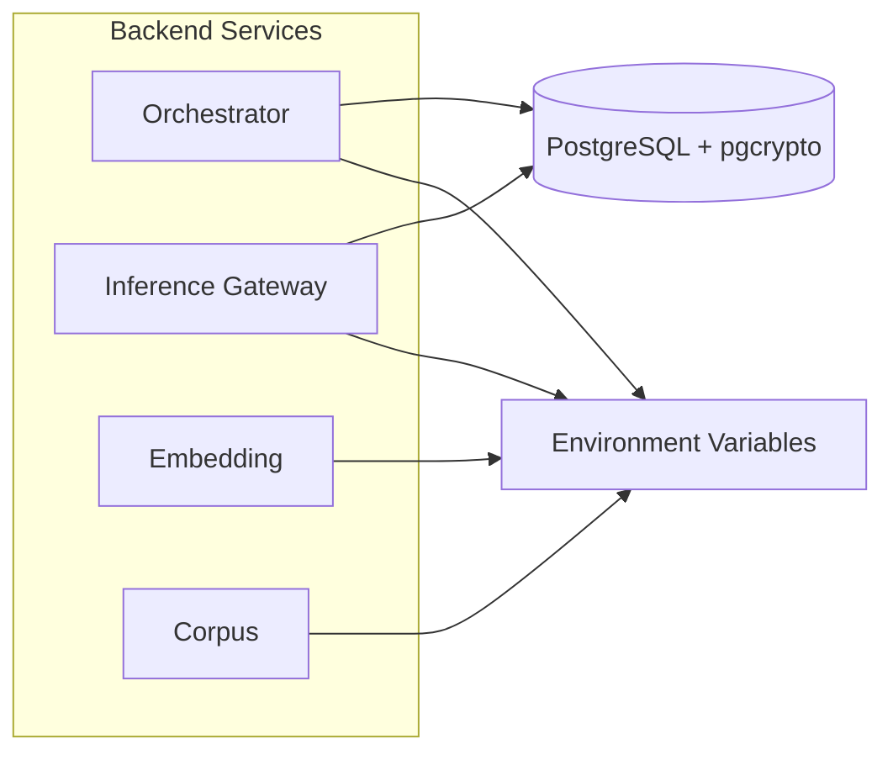
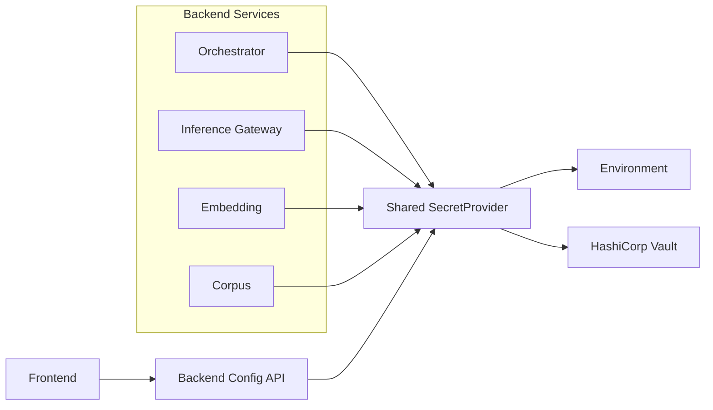

# ADR-061: HashiCorp Vault Secrets Integration

**Status:** Proposed
**Date:** 2026-02-03
**Deciders:** Security Team, Backend Team, Platform Team
**Tags:** security, secrets, vault, configuration, incremental-rollout

---

## Context

**What is the issue we're addressing?**

The AI Operations Platform currently manages secrets through multiple mechanisms:

- **Environment variables:** JWT secret, database password, Qdrant API key, OpenAI/LLM keys, service tokens, and tool encryption keys are loaded from env (see [config/env/env.template](config/env/env.template)).
- **PostgreSQL + pgcrypto:** Tool credentials in `tool_secrets` (orchestrator) and provider API keys in `gateway_providers.api_key_encrypted` (inference-gateway) are stored encrypted in the database with application-managed keys from env.

ADR-051 (Provider Secrets and Service-to-Service Auth) chose PostgreSQL for provider secrets "for department scale" and explicitly left open: "Can upgrade to Vault in Phase 6 (enterprise hardening) if needed."

We need a single, documented direction for centralising secrets: better auditability, rotation support, and alignment with enterprise and air-gapped deployments. Implementation will be **planned and incremental**; this ADR does not mandate immediate implementation.

**Forces:**

- **Incremental rollout:** No big-bang; adoption must be phased and reversible.
- **Backend and frontend in scope:** Backend (Python/FastAPI) will consume secrets; the frontend (Angular) does not hold secrets directly—only non-secret config (e.g. API base URL) that may be build-time or backend-served.
- **Existing centralisation:** The shared module already centralises config ([src/shared/config/](src/shared/config/)), auth ([src/shared/auth/](src/shared/auth/)), and DB ([src/shared/db/connection.py](src/shared/db/connection.py)); any secret resolution should align with this.
- **Air-gapped and security:** Deployment must support air-gapped environments ([docs/operations/AIR_GAPPED_DEPLOYMENT.md](docs/operations/AIR_GAPPED_DEPLOYMENT.md)); no dependency on public cloud for secret storage.

---

## Decision

We **adopt HashiCorp Vault** as the designated secrets store for the platform, with rollout planned and incremental. No immediate implementation is required; this ADR defines the target architecture and integration points.

### 1. Vault as the Designated Secrets Store

- All new and migrated secrets will target Vault (KV engine and/or dynamic secrets as appropriate).
- Existing env and DB-stored secrets remain valid until phased cutover; Vault is additive.

### 2. Shared Module as the Backend Gateway to Vault

**The shared module will be the single gateway to Vault for all Python backend services.**

- Introduce a **SecretProvider** abstraction (e.g. protocol with `get_secret(path_or_key: str) -> str`) in shared. **Semantics:** `EnvSecretProvider` interprets the argument as an environment variable name (e.g. `JWT_SECRET`). When `SECRET_PROVIDER=vault`, the shared layer maps config keys (e.g. `JWT_SECRET`) to Vault paths via a key-to-path map or convention; callers pass the key and shared resolves the path.
- Two implementations: **EnvSecretProvider** (current behaviour: read from `os.environ`) and **VaultSecretProvider** (e.g. via HVAC or Vault API).
- The config loader (or a small secret resolver used by it) will, when `SECRET_PROVIDER=vault`, resolve known secret keys (e.g. `JWT_SECRET`, `POSTGRES_PASSWORD`) through this provider instead of env. **Vault is enabled when `SECRET_PROVIDER=vault`;** use this single switch (no separate `VAULT_ENABLED`).
- No direct Vault dependency in individual services—only shared depends on the Vault client; services continue to use shared config and DB as today.

This aligns with ADR-051’s suggested "Future Vault Integration" (SecretProvider protocol and config-driven selection). **Relationship to ADR-051:** Shared's gateway offers Env + Vault for *resolution* only. Provider secrets that today live in PostgreSQL (e.g. `gateway_providers.api_key_encrypted`) can remain in the DB with their encryption key supplied from Vault (Option B in the Integration Points table); no shared **PostgresSecretProvider** is required for that. A third implementation (e.g. reading secrets from DB via shared) can be added later if needed.

### 3. Frontend and Secrets

- The frontend does **not** integrate with Vault directly. It has no stored secrets; auth uses tokens obtained via the login flow.
- "Frontend" in the context of secrets means: (a) backend APIs that already use shared (and thus will use the shared SecretProvider when enabled), and (b) optional backend endpoint that serves **non-secret** config (e.g. API URL) that may be sourced from config backed by Vault. Any "frontend" secrets are therefore backend-managed and can be sourced from Vault in the backend.

### 4. Integration Points

All touchpoints where Vault (or the Vault-backed abstraction) must eventually integrate are enumerated below so that future work is scoped and traceable.

---

## Integration Points

The following table and notes list every place that must eventually integrate with Vault or the shared SecretProvider abstraction.

| Area | Location | Secret(s) / Use |
| ------ | --------- | ----------------- |
| **Shared config** | [src/shared/config/loader.py](src/shared/config/loader.py) | Database password, Qdrant API key, JWT secret, embedding/retrieval tokens and keys. Loader currently reads only env; must support resolving these secret keys from the SecretProvider (Vault when enabled). |
| **Shared DB** | [src/shared/db/connection.py](src/shared/db/connection.py) | Uses `load_database_config()` (password in config). Integration: config loader resolves DB password from SecretProvider when Vault is enabled. |
| **Shared auth** | [src/shared/auth/](src/shared/auth/) (manager, base) | JWT secret from config. Resolved via config loader or shared secret resolver. |
| **Orchestrator** | [src/orchestrator/app/services/secrets_manager.py](src/orchestrator/app/services/secrets_manager.py) | `TOOL_SECRETS_KEY` from env; encrypts `tool_secrets`. Either Vault provides `TOOL_SECRETS_KEY` or tool secrets are stored in Vault KV. |
| **Orchestrator** | Various routers (e.g. collection_management, admin_gateway_*) | `CORPUS_SVC_URL`, `GATEWAY_URL` (URLs); `GATEWAY_SERVICE_TOKEN` is a secret (S2S). Token can be resolved from Vault. |
| **Inference Gateway** | [src/inference-gateway/app/services/provider_manager.py](src/inference-gateway/app/services/provider_manager.py) | Provider API keys from `gateway_providers.api_key_encrypted`. Option A: read from Vault KV by path (e.g. `secret/data/gateway/providers/openai`). Option B: keep DB storage and only store the encryption key in Vault. |
| **Inference Gateway** | Admin API (e.g. [src/inference-gateway/app/routers/admin.py](src/inference-gateway/app/routers/admin.py)) | Writes provider API keys; must write to Vault or to DB with key from Vault. |
| **Embedding** | [src/embedding/app/config/models.py](src/embedding/app/config/models.py), shared loader | `OPENAI_API_KEY` / LLM keys. Resolve via shared config or service-specific Vault path. |
| **Corpus** | [src/corpus_svc/app/repositories/vector_repository.py](src/corpus_svc/app/repositories/vector_repository.py) | `QDRANT_*` and possibly embedding token. Today config/env; switch to SecretProvider-backed config. |
| **LLM Guard** | [src/llm_guard_svc/app/guard.py](src/llm_guard_svc/app/guard.py) | `LLM_GUARD_MODELS_PATH` (path, not secret); any future API keys if added. |
| **Bootstrap / deploy** | [config/env/env.template](config/env/env.template), ops scripts | Initial secrets (e.g. `POSTGRES_PASSWORD`, `JWT_SECRET`) for first-run or CI. Document: inject from Vault at deploy time (e.g. Vault agent, init container, or env from Vault CLI). |
| **Frontend** | [src/frontend-angular/src/environments/](src/frontend-angular/src/environments/), [auth.service.ts](src/frontend-angular/src/app/core/auth/auth.service.ts) | No stored secrets; `API_BASE_URL` / `apiBaseUrl` can remain build-time or be served by backend (e.g. `/api/v1/config`). Optional: backend reads config from Vault and exposes only safe fields. |

**Note:** No code change is required in the frontend for Vault; the Frontend row is listed for completeness.

**Refactoring note:** Services that today read env directly (e.g. [src/orchestrator/app/orchestrator/llm_client.py](src/orchestrator/app/orchestrator/llm_client.py) with `OPENAI_API_KEY`, [src/embedding/app/providers/openai.py](src/embedding/app/providers/openai.py)) should over time obtain secrets via shared config or the shared secret resolver so that "use Vault" is a single switch in shared.

---

## Should the Shared Module Be the Gateway to Vault?

**Recommendation: Yes, for the backend.**

- **Single abstraction:** All backend services already use shared config, DB, and auth. A single secret-resolution layer in shared avoids each service integrating Vault independently.
- **Consistent behaviour:** Caching, fallback to env, and error handling (e.g. fail-fast vs degrade) can be defined once.
- **Alignment with ADR-051:** The SecretProvider pattern and config-driven selection belong in shared.
- **Frontend:** The gateway for the frontend is not a TypeScript Vault client; it is backend APIs and optional backend-served config. "Shared as gateway" applies to backend; frontend is covered by backend using shared.

**What to add in shared (when implementing):**

- **SecretProvider** protocol: e.g. `get_secret(path_or_key: str) -> str` with optional TTL/caching.
- **EnvSecretProvider** and **VaultSecretProvider** implementations.
- Config loader (or secret resolver used by it) that, when `SECRET_PROVIDER=vault`, resolves known secret keys through the provider.
- Only shared depends on the Vault client; services do not.

---

## Architecture (Current vs Target)

**Current:** Services read secrets from env and/or DB (pgcrypto).

**Target:** Services obtain secrets only via shared; shared talks to env or Vault.

---

## Alternatives Considered

### Option 1: Keep Current Model (Env + pgcrypto only)

**Description:** Continue using environment variables and PostgreSQL with pgcrypto for all secrets; no Vault.

**Pros:**

- No new infrastructure or code.
- Already works for department scale (per ADR-051).

**Cons:**

- No central audit trail for secret access; rotation and compliance are harder at enterprise scale.
- Secrets in env and in DB with app-managed keys increase operational and security burden as the platform grows.

**Why Rejected:** We want a documented path to central secrets, auditability, and rotation for enterprise and air-gapped deployments. This ADR does not remove the current model immediately but sets the direction.

### Option 2: Each Service Integrates Vault Independently

**Description:** Each service (orchestrator, inference-gateway, embedding, corpus, etc.) has its own Vault client and policies.

**Pros:**

- Maximum flexibility per service.

**Cons:**

- Duplicated integration logic, caching, and error handling; inconsistent behaviour; more surface area for misconfiguration and security mistakes.

**Why Rejected:** Shared as a single gateway reduces duplication and ensures consistent behaviour (see Decision).

### Option 3: Another Secret Manager (e.g. AWS Secrets Manager, Azure Key Vault)

**Description:** Use a cloud-native or other secret manager with the same abstraction in shared.

**Pros:**

- Tight integration with a specific cloud; managed service.

**Cons:**

- Not self-hosted; not suitable for air-gapped or multi-cloud without an abstraction. If we add an abstraction anyway, Vault is multi-cloud, self-hostable, and supports air-gap.

**Why Rejected:** Vault was chosen for multi-cloud, self-hosted, and air-gapped alignment; the same SecretProvider abstraction could later support other backends if required.

---

## Consequences

### Positive Consequences

- **Single direction:** Clear adoption of Vault with incremental rollout.
- **Scoped work:** Integration points are enumerated; implementers know where to plug in.
- **Shared as gateway:** One abstraction, one place for caching, fallback, and observability.
- **Frontend clarity:** No Vault in the browser; frontend continues to use backend APIs and optional backend-served config.
- **Air-gap compatible:** Vault runs inside the boundary; no external dependency for secret storage.
- **Future rotation and audit:** Vault supports versioning, dynamic secrets, and audit logging.

### Negative Consequences

- **Operational dependency:** When Vault is enabled, availability of Vault affects startup or secret resolution; mitigation: fallback to env and caching (see below).
- **Implementation effort:** Phased rollout requires changes in shared and in each integration point; mitigated by doing it incrementally behind `SECRET_PROVIDER` / feature flags.

### Risks and Mitigations

| Risk | Severity | Mitigation |
| ------ | --------- | ------------ |
| Vault unavailable at startup | Medium | Resolve secrets at startup with fallback to env when `SECRET_PROVIDER=env` or Vault unreachable; cache resolved values. |
| Secret leakage in logs | High | Continue ADR-048 (Secure Logging); never log secret values; observability only for metrics (e.g. resolve latency, cache hit). |
| Overprivileged Vault policies | Medium | Document least-privilege policies per path; review in implementation phase. |
| Local dev friction | Low | Default to `SECRET_PROVIDER=env`; no Vault required for local development. |

---

## Dimensions (Detailed Considerations)

### Authentication to Vault

- **AppRole** is recommended for machine identity (services, init containers).
- **Kubernetes auth** may be used when running on K8s.
- **Token** auth is acceptable for agents or CI; document short-lived tokens and renewal where applicable.

### Caching and Availability

- Avoid per-request Vault calls. Resolve secrets at startup and cache in process, or use lazy load with TTL.
- When `SECRET_PROVIDER=env` or Vault is disabled/unreachable, fall back to env so that existing deployments keep working.

### Rollout Strategy (Phased)

1. **Bootstrap/deploy:** Inject secrets from Vault at deploy time (e.g. Vault agent, init container); no app code change.
2. **Shared layer:** Add SecretProvider and config-loader integration for a subset of secrets (e.g. JWT, DB password).
3. **Orchestrator:** TOOL_SECRETS_KEY and/or tool secrets via Vault.
4. **Inference Gateway:** Provider API keys (Vault KV or encryption key from Vault).
5. **Remaining services:** Embedding, corpus, LLM Guard as needed.

Each phase is controlled by `SECRET_PROVIDER=env` (default) or `SECRET_PROVIDER=vault`, or by a feature flag where applicable.

### Air-Gapped Deployment

- Vault runs inside the air-gapped boundary; no dependency on public cloud.
- Document that Vault can be deployed alongside the stack and that agents/init containers use Vault on the same network.

### Rotation

- Vault KV versioning and/or dynamic secrets can support rotation.
- For existing flows (tool_secrets, gateway_providers), document whether keys will be rotated in Vault with app reload or remain manual with values stored in Vault; implementation plan will detail this.

### Security

- Least privilege: Vault policies per path.
- Audit: Use Vault audit log; no secrets in application logs (ADR-048).
- Minimal env: Only Vault address and auth (e.g. AppRole id/secret), not the application secrets themselves.

### Testing

- Unit tests mock the SecretProvider.
- Integration tests may use Vault dev server or test container.
- Local dev can run with `SECRET_PROVIDER=env` and no Vault.

### Observability

- Metrics: e.g. secret resolve latency, cache hit, Vault errors.
- Structured logs without secret values.

---

## Implementation Notes

**When implementing (future work):**

- **New in shared:** e.g. `src/shared/secrets/` (or under `src/shared/config/`) with protocol, `env_provider.py`, `vault_provider.py`, and a factory based on `SECRET_PROVIDER`.
- **Changes:** [src/shared/config/loader.py](src/shared/config/loader.py) (optional resolution from secret provider for sensitive keys), [src/shared/db/connection.py](src/shared/db/connection.py) (no change if config already holds resolved password), [src/orchestrator/app/services/secrets_manager.py](src/orchestrator/app/services/secrets_manager.py), inference-gateway provider load/save paths, embedding/corpus config loading.
- **Migration:** Existing env and DB-stored secrets remain valid; Vault is additive until per-secret or per-service cutover.
- **Dependencies:** Add `hvac` (or equivalent) only in shared’s requirements; keep it optional (e.g. optional dependency group or lazy import of `hvac`) so that `SECRET_PROVIDER=env` deployments do not require Vault libraries.

---

## References

- **ADR-051:** Provider Secrets and Service-to-Service Auth – current secret storage and "Future Vault Integration" strategy.
- **ADR-049:** Unified Authentication and Security – JWT and shared auth; where JWT secret is consumed.
- **ADR-048:** Secure Logging Redaction – no secret leakage in logs.
- [config/env/env.template](config/env/env.template) – canonical list of env vars (many are secrets).
- [docs/operations/AIR_GAPPED_DEPLOYMENT.md](docs/operations/AIR_GAPPED_DEPLOYMENT.md) – air-gap constraints.
- HashiCorp Vault: [AppRole](https://developer.hashicorp.com/vault/docs/auth/approle), [KV engine](https://developer.hashicorp.com/vault/docs/secrets/kv), [Deployment](https://developer.hashicorp.com/vault/docs/platform).

---

## Status Updates

*None yet.*

---

**Template Version:** 1.0
**Based On:** [Michael Nygard's ADR pattern](https://cognitect.com/blog/2011/11/15/documenting-architecture-decisions)
