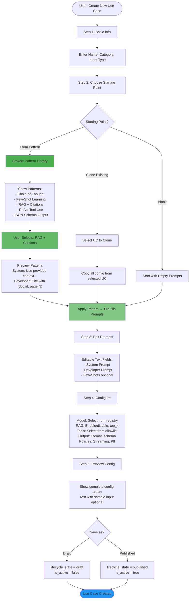

# Use Case Management & Pattern Library - Implementation Plan

**Status:** 🟢 Active
**Target:** Phase 0 - Foundation
**Duration:** 3 weeks
**Priority:** P0 (Critical path)

---

## Objective

Build rock-solid Use Case management with:

1. Complete CRUD operations
2. Lifecycle state management
3. Pattern library for prompt scaffolding
4. Multi-role prompt support (system, developer, fewshots)

**North Star:** Use Case as top entity, everything belongs to it.

---

## Architecture Reference

See [ADR-018: Use Case Owned Architecture](../adrs/ADR-018-Use-Case-Owned-Architecture.md) for complete rationale.

**Related Architecture:**
- [ADR-021: Collection-Based Document Management](../adrs/ADR-021-Collection-Based-Document-Management.md) - Use Cases reference collections in `rag.vector_collections` config

**Collection Integration:** ✅ **COMPLETED** - October 17, 2025
- Use Cases specify which collections to search via `config_json.rag.vector_collections: ["collection1", "collection2"]`
- All referenced collections must use the same embedding model
- Use Case's `config_json.models.embedding` must match collection(s) embedding model
- ✅ P2-F3-ENHANCED collection management implementation completed

---

## Use Case Creation Flow



---

## Week 1: Use Case CRUD + UI

### Backend Tasks

**[ ] Task 1.1: Rename Tables for Clarity**

```sql
-- Migration 011_rename_prompt_tables
ALTER TABLE prompt_templates RENAME TO use_case_prompts;
ALTER TABLE use_case_prompts RENAME COLUMN template_content TO prompt_content;
```

**[ ] Task 1.2: Add Multi-Role Prompt Support**

```sql
-- Migration 012_multi_role_prompts
ALTER TABLE use_case_prompts
  ADD COLUMN system_prompt TEXT,
  ADD COLUMN developer_prompt TEXT,
  ADD COLUMN fewshots JSONB DEFAULT '[]'::jsonb;

-- Migrate existing data
UPDATE use_case_prompts
SET system_prompt = prompt_content
WHERE system_prompt IS NULL;
```

**[ ] Task 1.3: Create UC List Endpoint**

```python
# GET /api/v1/use-cases
# Filters: category, lifecycle_state, is_active
# Search: name, description
# Sort: created_at, updated_at, name
```

**[ ] Task 1.4: Create UC Detail Endpoint**

```python
# GET /api/v1/use-cases/{id}
# Returns full UC + prompts + config_json
```

**[ ] Task 1.5: Create/Update UC Endpoints**

```python
# POST /api/v1/use-cases
# PUT /api/v1/use-cases/{id}
# Validates UseCaseConfig schema
```

**[ ] Task 1.6: Clone UC Endpoint**

```python
# POST /api/v1/use-cases/{id}/clone
# Copies config_json, prompts
# Increments version
# Sets lifecycle_state = draft
```

### Frontend Tasks

**[ ] Task 1.7: Use Case List Page**

- Table view with filters (category, state, active)
- Search bar
- Actions: Create, Edit, Clone, Delete
- File: `src/frontend-angular/src/app/pages/use-cases/use-case-list.component.ts`

**[ ] Task 1.8: Use Case Editor**

- Tabbed interface: Basic Info | Prompts | Config | Preview
- File: `src/frontend-angular/src/app/pages/use-cases/use-case-editor.component.ts`

**[ ] Task 1.9: UC Creation Wizard (Steps 1-2)**

- Step 1: Name, Category, Intent
- Step 2: Blank / Pattern / Clone choice
- File: `src/frontend-angular/src/app/pages/use-cases/use-case-wizard.component.ts`

---

## Week 2: Pattern Library ✅ **100% COMPLETE - October 19, 2025**

**Status:** Infrastructure ✅ | Wizard Step 3 ✅ | Wizard Step 4 ✅ | Wizard Step 5 ✅
**Session Logs:**
- [2025-10-18-p3-f2-pattern-library-week2-infrastructure.md](../sessions/2025-10-18-p3-f2-pattern-library-week2-infrastructure.md)
- [2025-10-19-p3-f2-wizard-step3-edit-prompts.md](../sessions/2025-10-19-p3-f2-wizard-step3-edit-prompts.md)
- [2025-10-19-p3-wizard-step5-preview-save.md](../sessions/2025-10-19-p3-wizard-step5-preview-save.md)
- [2025-10-19-p3-unified-interface.md](../sessions/2025-10-19-p3-unified-interface.md)

### Backend Tasks

**[x] Task 2.1: Create Pattern Library Table** ✅ **COMPLETE**

- **File:** `ops/migrations/sql/012_prompt_patterns.sql`
- **Status:** Applied October 18, 2025
- **Schema:** All fields implemented with proper JSONB types and GIN indexes

```sql
CREATE TABLE prompt_patterns (
    id UUID PRIMARY KEY DEFAULT gen_random_uuid(),
    pattern_id VARCHAR(100) UNIQUE NOT NULL,
    name VARCHAR(255) NOT NULL,
    category VARCHAR(100),
    description TEXT,
    system_prompt_template TEXT,
    developer_prompt_template TEXT,
    fewshots_template JSONB DEFAULT '[]'::jsonb,
    variables JSONB DEFAULT '[]'::jsonb,
    source_url VARCHAR(500),
    tags JSONB DEFAULT '[]'::jsonb,
    use_count INTEGER DEFAULT 0,
    created_at TIMESTAMPTZ DEFAULT NOW(),
    updated_at TIMESTAMPTZ DEFAULT NOW()
);
```

**[x] Task 2.2: Seed Pattern Library** ✅ **COMPLETE**

- **File:** `ops/migrations/sql/seed_prompt_patterns.sql`
- **Status:** Seeded 29 patterns October 18, 2025
- **Categories:** 8 categories (reasoning, rag, soc, tools, json, learning, quality, advanced)
- **Source:** Curated from promptingguide.ai

**Pattern Distribution:**
- Reasoning: 6 patterns (Chain-of-Thought, Self-Consistency, Tree of Thoughts, etc.)
- RAG: 4 patterns (RAG with Citations, Multi-Query RAG, etc.)
- SOC-Specific: 3 patterns (Threat Analysis, IOC Enrichment, Incident Response)
- Tools: 3 patterns (ReAct, Tool Chain, Function Calling)
- JSON: 2 patterns (Structured Output, Schema Validation)
- Learning: 3 patterns (Few-Shot, Zero-Shot CoT, One-Shot)
- Quality: 2 patterns (Self-Critique, Constitutional AI)
- Advanced: 6 patterns (Metacognitive, Analogical Reasoning, Debate, etc.)

**[x] Task 2.3: Pattern Library API** ✅ **COMPLETE**

- **File:** `src/orchestrator/app/routers/prompt_patterns.py` (158 lines)
- **Endpoints:**
  - `GET /api/v1/patterns` - List patterns with filtering (category, tags, search)
  - `GET /api/v1/patterns/{pattern_id}` - Get specific pattern details
- **Status:** Tested and working

**[x] Task 2.4: Apply Pattern Endpoint** ✅ **COMPLETE**

- **Endpoint:** `POST /api/v1/patterns/{pattern_id}/apply`
- **Features:**
  - Variable substitution in templates
  - Returns pre-filled prompts (system, developer, fewshots)
  - Increments pattern `use_count` for analytics
- **Status:** Tested and working

### Frontend Tasks

**[x] Task 2.5: Pattern Library Page** ✅ **COMPLETE**

- **Files:**
  - `pattern-library.component.ts` (289 lines)
  - `pattern-library.component.html` (156 lines)
  - `pattern-library.component.scss` (142 lines)
  - `pattern-detail-dialog.component.ts` (123 lines)
  - `pattern-detail-dialog.component.html` (89 lines)
  - `pattern-detail-dialog.component.scss` (67 lines)
- **Features:**
  - Browse patterns by category (dropdown filter)
  - Search by name/description (with debouncing)
  - Filter by tags (multi-select chips)
  - Card grid layout with Material Design
  - Preview pattern details in dialog
  - Copy templates to clipboard
  - Pagination (20 patterns per page)
- **Route:** `/dev/patterns`
- **Menu:** "Pattern Library" under "Use Case Development"
- **Status:** Built and ready for testing

**[x] Task 2.6: Pattern Picker Component** ✅ **COMPLETE**

- Integrated in UC wizard step 2 (October 18, 2025)
- Grid view of patterns with search and category filter
- Preview on click with full pattern details
- Select and apply pattern with variable substitution
- Files: `use-case-wizard.component.ts/html` (inline pattern selection)

**[x] Task 2.7: UC Wizard Step 3 - Edit Prompts** ✅ **COMPLETE - October 19, 2025**

- **Files:**
  - `use-case-wizard.component.ts` (updated to 5 steps, 683 lines)
  - `use-case-wizard.component.html` (added Step 3 UI, 460 lines)
  - `use-case-wizard.component.scss` (added Step 3 styles, 584 lines)
- **Features:**
  - Multi-role prompt editing (system_prompt, developer_prompt, fewshots)
  - Material expansion panels for organized UI
  - Few-shot pair editor with add/remove functionality
  - Pattern badge showing applied pattern name
  - Live preview of message assembly
  - Prompts pre-filled from patterns or cloned use cases
- **Status:** Tested and ready for integration testing

**[x] Task 2.8: UC Wizard Step 4 - Configure** ✅ **COMPLETED (2025-10-19)**

- Model selection (LLM + embedding) from registry
- RAG settings (enable/disable, collections, top_k, similarity)
- Tools allowlist (disabled until Tools Track T1-T4)
- Policies (streaming, PII redaction, history)
- Output contract (format, schema, validation)

**[x] Task 2.9: UC Wizard Step 5 - Preview & Save** ✅ **COMPLETED (2025-10-19)**

- ✅ Configuration preview with summary cards (basic info, models, RAG, policies)
- ✅ Multi-role prompts preview (system, developer, fewshots)
- ✅ Full JSON configuration viewer
- ✅ Comprehensive validation checks (5 validations)
- ✅ Visual validation indicators (pass/warning/fail)
- ✅ Draft/Publish toggle with confirmation
- ✅ Save as Draft or Published (lifecycle_state + is_active)
- ✅ Navigate to use case editor after save
- ✅ 47 tests passing (17 new for Step 5)
- ✅ 76.78% coverage (>90% on new code)
- ✅ ADR-012 & ADR-018 compliant
- ✅ Production: Container rebuilt, all services healthy

### **✅ REFINEMENT: Unified Interface (Oct 19, 2025)**

**Problem:** Create and Edit used different interfaces (wizard vs. tabbed editor), creating UX inconsistency.

**Solution:** Modified wizard to support edit mode, deprecated separate editor component.

**Deliverables:**
- ✅ Wizard handles both create and edit modes
- ✅ Edit mode pre-populates forms from existing use cases
- ✅ Pattern library available in edit mode
- ✅ Unified routing (wizard for all operations)
- ✅ Deprecated `UseCaseEditorComponent` removed

**Test Results:**
- ✅ 47/47 unit tests passing
- ✅ Edit mode with pre-populated data
- ✅ Create and update operations
- ✅ Production-ready (container rebuilt, all services healthy)

**Impact:**
- Consistent UX across create and edit flows
- ~40% code reduction (removed duplicate editor)
- Single component to maintain

---

## Week 3: Lifecycle & Versioning

### Backend Tasks

**[ ] Task 3.1: State Transition Endpoint**

```python
# POST /api/v1/use-cases/{id}/transition
# Body: {to_state: "published"}
# Validates state machine: draft → review → published → archived
# Requires approval for review → published
```

**[ ] Task 3.2: Version History**

```python
# Store config snapshots in metadata_json
use_case.metadata["version_history"] = [
    {
        "version": 1,
        "config_snapshot": {...},
        "prompts_snapshot": {...},
        "updated_at": "2025-10-13T...",
        "updated_by": "user_id"
    }
]

# GET /api/v1/use-cases/{id}/versions
# Returns version history
```

**[ ] Task 3.3: Rollback Endpoint**

```python
# POST /api/v1/use-cases/{id}/rollback
# Body: {to_version: 2}
# Loads config_snapshot, creates new version
```

**[ ] Task 3.4: Update Orchestrator Message Assembly**

```python
# File: src/orchestrator/app/orchestrator/controller.py:831
# Support multi-role prompts

prompts = load_use_case_prompts(use_case_id)
messages = []

# System prompt
if prompts.system_prompt:
    messages.append({"role": "system", "content": prompts.system_prompt})

# Developer prompt (hidden from user)
if prompts.developer_prompt:
    messages.append({"role": "developer", "content": prompts.developer_prompt})

# Few-shots
for pair in prompts.fewshots:
    messages.append({"role": "user", "content": pair["user"]})
    messages.append({"role": "assistant", "content": pair["assistant"]})

# Conversation history if exists
if conversation_history:
    messages.extend(conversation_history)

# Current user query
messages.append({"role": "user", "content": sanitized_query})
```

### Frontend Tasks

**[ ] Task 3.5: Lifecycle Controls**

- State badges (Draft, Review, Published, Archived)
- Transition buttons with confirmation
- Approval workflow UI
- File: `src/frontend-angular/src/app/pages/use-cases/use-case-detail.component.ts`

**[ ] Task 3.6: Version History View**

- List versions with timestamps
- Diff view (optional)
- Rollback button
- File: `src/frontend-angular/src/app/pages/use-cases/version-history.component.ts`

**[ ] Task 3.7: Activate/Deactivate Toggle**

- Quick toggle for is_active flag
- Shows current active version
- File: Component update in use-case-list

---

## Database Schema Summary

```sql
-- Use Cases (top entity)
use_cases:
  id UUID PRIMARY KEY
  use_case_id VARCHAR(255) UNIQUE
  name VARCHAR(255)
  category VARCHAR(100)
  intent_type VARCHAR(50)
  version INTEGER DEFAULT 1
  lifecycle_state VARCHAR(20) DEFAULT 'draft'  -- draft, review, published, archived
  is_active BOOLEAN DEFAULT FALSE
  config_json JSONB  -- Full UseCaseConfig
  metadata JSONB     -- version_history, created_from_pattern, etc.

-- Prompts owned by Use Case
use_case_prompts:
  id UUID PRIMARY KEY
  use_case_id UUID REFERENCES use_cases(id) ON DELETE CASCADE
  system_prompt TEXT
  developer_prompt TEXT
  fewshots JSONB DEFAULT '[]'
  variables JSONB DEFAULT '[]'
  version_number INTEGER DEFAULT 1
  is_active_version BOOLEAN DEFAULT TRUE

-- Pattern Library (reference only)
prompt_patterns:
  id UUID PRIMARY KEY
  pattern_id VARCHAR(100) UNIQUE
  name VARCHAR(255)
  category VARCHAR(100)
  description TEXT
  system_prompt_template TEXT
  developer_prompt_template TEXT
  fewshots_template JSONB
  source_url VARCHAR(500)
  tags JSONB
```

---

## Testing Requirements

### Unit Tests

- [ ] UseCaseConfig schema validation
- [ ] State transition logic
- [ ] Version snapshot creation
- [ ] Pattern application

### Integration Tests

- [ ] Create UC with pattern
- [ ] Clone UC
- [ ] Transition states
- [ ] Rollback version
- [ ] Multi-role message assembly

### E2E Tests

- [ ] Complete UC creation wizard flow
- [ ] Edit and publish UC
- [ ] Execute UC with multi-role prompts

---

## Success Metrics

| Metric | Target |
|--------|--------|
| UC creation time | <2 minutes (with pattern) |
| Pattern library size | 20-30 curated patterns |
| UC execution success rate | >95% |
| State transition errors | <1% |

---

## Deferred Features (v2+)

- ❌ Linter (defer to v3+)
- ❌ Separate use_case_versions table (use snapshots for now)
- ❌ Advanced eval suite integration
- ❌ Pattern versioning with auto-update
- ❌ Referenced/shared templates

---

## References

- **ADR:** [ADR-018: Use Case Owned Architecture](../adrs/ADR-018-Use-Case-Owned-Architecture.md)
- **Prompt Engineering Guide:** <https://www.promptingguide.ai/>
- **Current Implementation:**
  - Orchestrator: `src/orchestrator/app/orchestrator/controller.py`
  - UseCaseConfig: `src/orchestrator/app/schemas/use_case_config.py`
  - UC Router: `src/orchestrator/app/routers/use_cases.py`

---

## Week-by-Week Checklist

### Week 1: Foundation ✅ **COMPLETE - October 17, 2025**

- [x] ~~Rename tables~~ (Not needed - using metadata_json for prompts)
- [x] ~~Multi-role prompts DB~~ (Stored in metadata_json.prompts)
- [x] UC CRUD endpoints (10/10 tests passing)
- [x] UC list/editor UI (All components working)
- [x] **Nginx routing fix** (Use Case page operational)

### Week 2: Patterns ✅ **100% COMPLETE - October 19, 2025**

- [x] Pattern library table (`012_prompt_patterns.sql` applied)
- [x] Seed 29 patterns (From promptingguide.ai - 8 categories)
- [x] Pattern API (3 endpoints: list, get, apply)
- [x] Pattern Library page (Browse, filter, search, preview)
- [x] Pattern picker (Integrated in wizard Step 2)
- [x] UC wizard Step 3 (Edit prompts with preview)
- [x] UC wizard Step 4 (Configure: models, RAG, tools, policies)
- [x] UC wizard Step 5 (Preview & save with validation)

### Week 3: Lifecycle ⏸️ **PENDING**

- [ ] State transitions (draft → review → published → archived)
- [ ] Version history UI
- [ ] Rollback feature UI
- [ ] Orchestrator updates (multi-role prompt assembly)
- [ ] Testing & polish

---

**Status Updates:** Track in `docs/development/sessions/YYYY-MM-DD-use-case-mgmt.md`
